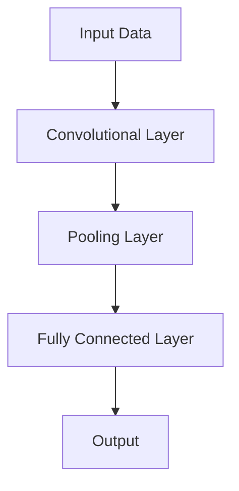

The pursuit of extreme performance and reliability in neural architectures has become a cornerstone of modern artificial intelligence (AI) and machine learning (ML) research. As models grow in complexity and scale, the need for optimized architectures that can handle vast amounts of data while maintaining accuracy and reducing latency has never been more pressing. This article delves into the strategies, patterns, and cutting-edge techniques for optimizing neural architectures, ensuring they are not only highly performant but also dependable and efficient.

## Introduction to Neural Architecture Optimization
Neural architecture optimization is a multifaceted field that involves designing and refining neural networks to achieve specific goals, such as improved accuracy, faster inference times, or better reliability. This process can be approached from various angles, including the manual design of architectures, the use of automated machine learning (AutoML) techniques, and the application of knowledge distillation for model compression.


## Understanding the Basics of Neural Networks
Before diving into optimization strategies, it's essential to understand the basic components and operations of neural networks. A typical neural network consists of layers of interconnected nodes or "neurons," which process inputs and produce outputs based on learned weights and biases. The flow of data through a neural network can be complex, involving various operations such as convolution, pooling, and fully connected layers.



## Strategies for Optimizing Neural Architectures
Several strategies can be employed to optimize neural architectures, including but not limited to:
- **Model Pruning:** Removing redundant or unnecessary weights and connections to reduce computational complexity.
- **Knowledge Distillation:** Transferring knowledge from a large, pre-trained model (the teacher) to a smaller model (the student), enabling the student to learn from the teacher's outputs.
- **Quantization:** Representing model weights and activations using lower precision data types (e.g., integers instead of floating-point numbers) to reduce memory usage and increase inference speed.

## Advanced Techniques for Extreme Performance
For achieving extreme performance, researchers and practitioners often turn to more advanced techniques, such as:
- **Parallelization and Distributed Training:** Splitting the training process across multiple GPUs or machines to significantly reduce training time.
- **Mixed Precision Training:** Utilizing different precision levels for different parts of the training process to balance speed and accuracy.
- **Efficient Neural Network Architectures:** Designing models from the ground up with efficiency in mind, such as MobileNet and ShuffleNet, which are optimized for mobile and embedded devices.

```mermaid
flowchart TD
    id["Data"] -->|Split| id1["GPU1"], id2["GPU2"], id3["GPU3"]
    id1 -->|Process| id4["Model Update"]
    id2 -->|Process| id4
    id3 -->|Process| id4
    id4 -->|Sync| id5["Updated Model"]
```

## Ensuring Reliability in Neural Architectures
Reliability in neural architectures is crucial, especially in applications where safety and accuracy are paramount, such as healthcare and autonomous vehicles. Techniques to enhance reliability include:
- **Redundancy:** Implementing duplicate components or pathways to ensure continued function in case of failure.
- **Error Detection and Correction:** Incorporating mechanisms to detect and correct errors during inference, such as checksums or error-correcting codes.
- **Robustness to Adversarial Attacks:** Designing models that are resilient to adversarial examples, which are inputs designed to cause the model to make a mistake.

> **Note:** Ensuring the reliability of neural networks is an active area of research, with new methods and standards being developed to address the unique challenges posed by complex, deep learning models.

## Visual Insights Gallery
## Visual Insights Gallery
The following images provide a visual representation of concepts related to optimizing neural architectures:


## Summary and Conclusion
Optimizing neural architectures for extreme performance and reliability is a complex, multidisciplinary challenge that requires a deep understanding of both the theoretical foundations of neural networks and the practical considerations of real-world applications. By leveraging strategies such as model pruning, knowledge distillation, and parallelization, alongside advanced techniques like mixed precision training and efficient neural network architectures, it's possible to push the boundaries of what is achievable with AI and ML. As the field continues to evolve, the importance of reliability, efficiency, and performance will only continue to grow, driving innovation and leading to breakthroughs in areas previously thought unimaginable.

## FAQ
- **Q: What is the primary goal of neural architecture optimization?**
  A: The primary goal is to improve the performance, efficiency, and reliability of neural networks.
- **Q: How does model pruning contribute to optimization?**
  A: Model pruning removes unnecessary weights and connections, reducing computational complexity and improving inference speed.
- **Q: What is knowledge distillation, and how is it used?**
  A: Knowledge distillation is a technique where a smaller model (the student) learns from a larger, pre-trained model (the teacher), enabling the student to achieve similar performance with fewer parameters.