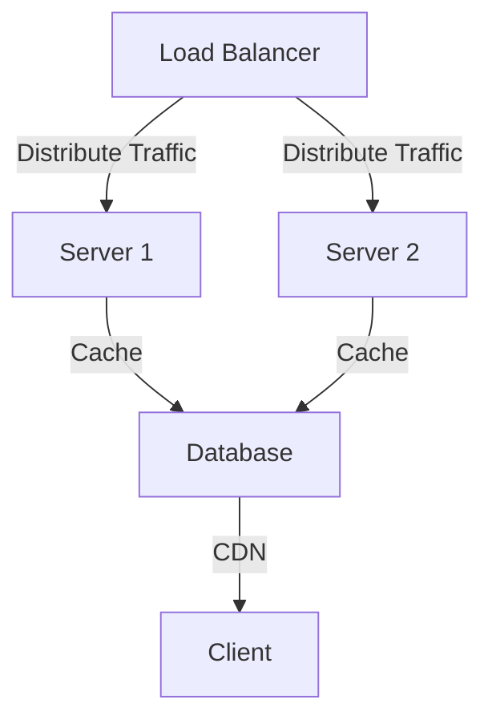
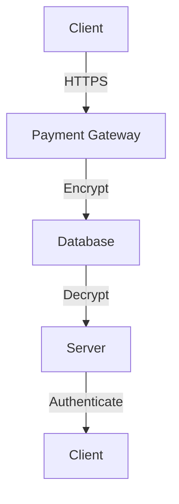

In the fast-paced world of fintech, a payment gateway's performance and reliability can make or break a business. A slow or unreliable payment processing system can lead to frustrated customers, lost sales, and a damaged reputation. In this article, we will explore the strategies and techniques for optimizing a payment gateway for extreme performance and reliability.

## Table of Contents
1. [Introduction to Payment Gateways](#introduction-to-payment-gateways)
2. [Architecture for High-Performance Payment Gateways](#architecture-for-high-performance-payment-gateways)
3. [Security Considerations for Payment Gateways](#security-considerations-for-payment-gateways)
4. [Optimizing Payment Gateway Performance](#optimizing-payment-gateway-performance)
5. [Reliability and Fault Tolerance](#reliability-and-fault-tolerance)

## Introduction to Payment Gateways
A payment gateway is a critical component of any e-commerce platform, enabling businesses to accept online payments from customers. It acts as a bridge between the merchant's website and the payment processor, facilitating secure and efficient transactions.

## Architecture for High-Performance Payment Gateways
To achieve extreme performance and reliability, a payment gateway's architecture must be carefully designed. This includes:
* Load balancing to distribute incoming traffic across multiple servers
* Auto-scaling to adjust capacity based on demand
* Caching to reduce database queries and improve response times
* Content delivery networks (CDNs) to minimize latency and improve user experience

## Security Considerations for Payment Gateways
Security is a top priority for payment gateways, as they handle sensitive customer information and financial data. Some key security considerations include:
* Implementing robust encryption and secure socket layer (SSL) certificates
* Conducting regular security audits and penetration testing
* Complying with industry standards and regulations, such as PCI-DSS
* Using secure protocols for communication between servers and clients

## Optimizing Payment Gateway Performance
To optimize payment gateway performance, several strategies can be employed:
* Using high-performance databases and caching mechanisms
* Implementing efficient payment processing algorithms
* Minimizing network latency and optimizing server configuration
* Conducting regular performance testing and monitoring
> **Tip:** Use a combination of caching mechanisms, such as Redis and Memcached, to improve performance and reduce database queries.

## Reliability and Fault Tolerance
Reliability and fault tolerance are critical for payment gateways, as downtime or errors can result in lost sales and revenue. Some strategies for achieving high reliability and fault tolerance include:
* Implementing redundant systems and failover mechanisms
* Conducting regular backups and disaster recovery planning
* Using load balancing and auto-scaling to distribute traffic and adjust capacity
* Monitoring system performance and errors in real-time
> **Warning:** Failure to implement robust reliability and fault tolerance measures can result in significant financial losses and reputational damage.

## Visual Insights Gallery
Below are some visual insights into the world of payment gateways and fintech:

## Summary and Conclusion
In conclusion, optimizing a payment gateway for extreme performance and reliability requires careful consideration of architecture, security, performance, and reliability. By implementing robust security measures, optimizing performance, and ensuring high reliability and fault tolerance, businesses can provide a seamless and secure payment experience for their customers.

## FAQ
Q: What is a payment gateway?
A: A payment gateway is a component of an e-commerce platform that enables businesses to accept online payments from customers.
Q: What are some key security considerations for payment gateways?
A: Some key security considerations include implementing robust encryption and secure socket layer (SSL) certificates, conducting regular security audits and penetration testing, and complying with industry standards and regulations.
Q: How can I optimize the performance of my payment gateway?
A: To optimize payment gateway performance, use high-performance databases and caching mechanisms, implement efficient payment processing algorithms, minimize network latency, and conduct regular performance testing and monitoring.