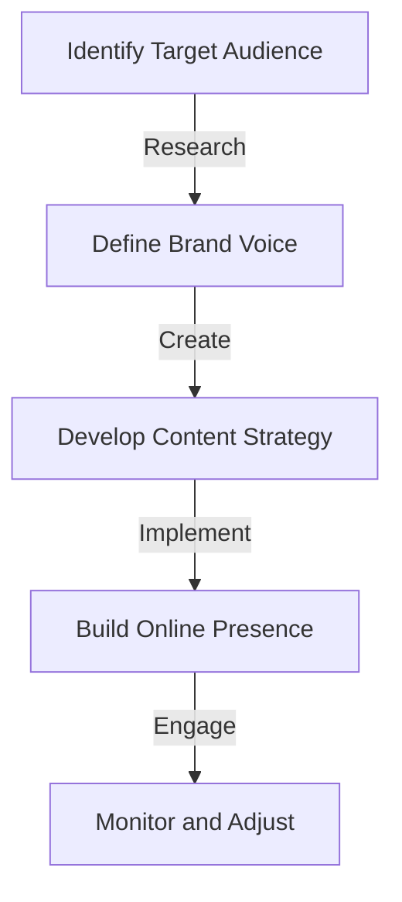
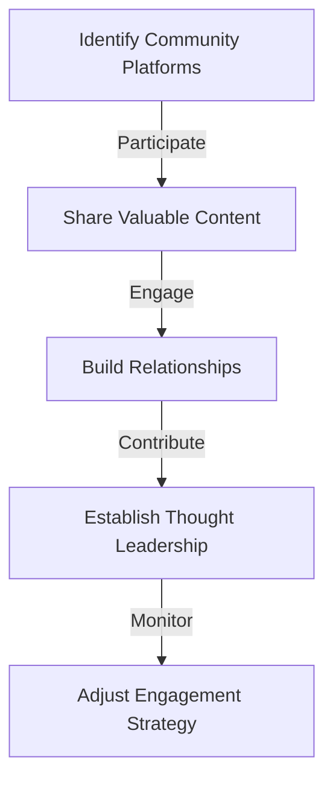

In today's fast-paced, interconnected world, having a strong personal brand is crucial for career success, especially for remote professionals. A well-crafted personal brand can open doors to new opportunities, establish you as a thought leader in your industry, and increase your earning potential. However, building a personal brand that stands out from the crowd requires more than just a professional online presence. It demands a strategic approach to optimizing your brand for extreme performance and reliability.

## Table of Contents
1. [Introduction to Personal Branding](#introduction-to-personal-branding)
2. [Assessing Your Current Brand](#assessing-your-current-brand)
3. [Defining Your Unique Value Proposition](#defining-your-unique-value-proposition)
4. [Building a Professional Online Presence](#building-a-professional-online-presence)
5. [Content Strategy for Personal Branding](#content-strategy-for-personal-branding)
6. [Engagement and Community Building](#engagement-and-community-building)
7. [Measuring and Optimizing Performance](#measuring-and-optimizing-performance)
8. [Visual Insights Gallery](#visual-insights-gallery)
9. [Conclusion](#conclusion)
10. [FAQ](#faq)

## Introduction to Personal Branding

Personal branding is the process of creating and maintaining a unique image, reputation, and set of values that distinguish you from others in your industry. It's about showcasing your skills, expertise, and personality in a way that resonates with your target audience and helps you achieve your career goals.

## Assessing Your Current Brand
Before you can optimize your personal brand, you need to understand where you currently stand. Take an honest look at your online presence, including your social media profiles, website or blog, and any other platforms where you have a presence. Ask yourself:
- What are my strengths and weaknesses?
- What values do I want to convey through my brand?
- What sets me apart from others in my industry?

## Defining Your Unique Value Proposition

Your Unique Value Proposition (UVP) is the core of your personal brand. It's a statement that clearly communicates your value to your target audience. To define your UVP, consider the following:
```markdown
| Aspect | Description |
| --- | --- |
| Skills | What are your key skills and areas of expertise? |
| Experience | What experience do you have that is relevant to your target audience? |
| Personality | What personality traits do you want to highlight in your brand? |
| Values | What values do you want to convey through your brand? |
```
> **Tip:** Your UVP should be concise, clear, and focused on the benefits you offer to your audience.

## Building a Professional Online Presence

A professional online presence is essential for establishing credibility and trust with your target audience. This includes:
- A professional website or blog that showcases your skills, experience, and expertise
- Active social media profiles that align with your brand values and UVP
- A consistent visual brand identity across all online platforms



## Content Strategy for Personal Branding

A well-planned content strategy is critical for showcasing your expertise and building your personal brand. Consider the following:
- **Blog Posts:** Share your insights and knowledge on topics relevant to your industry.
- **Social Media:** Engage with your audience, share valuable content, and participate in relevant conversations.
- **Video Content:** Utilize platforms like YouTube or Vimeo to share your expertise through video.

## Engagement and Community Building

Engaging with your audience and building a community around your personal brand is vital for its growth and success. This can be achieved through:
- Responding to comments and messages in a timely and professional manner
- Hosting webinars, workshops, or online events
- Participating in and contributing to online communities related to your industry



## Measuring and Optimizing Performance

To ensure your personal brand is performing optimally, you need to measure its success regularly. This can be done by:
- Tracking website analytics and social media metrics
- Conducting regular brand audits
- Gathering feedback from your audience

> **Note:** Use the data collected to adjust your strategy and optimize your brand's performance.

## Visual Insights Gallery
## Visual Insights Gallery


## Conclusion
Optimizing your personal brand for extreme performance and reliability requires a deep understanding of your current brand, a clear definition of your unique value proposition, and a strategic approach to building your online presence, content strategy, engagement, and performance measurement. By following the insights and strategies outlined in this post, you can elevate your personal brand to achieve greater success in your career.

## FAQ
1. **Q: What is personal branding?**
   - A: Personal branding is the process of creating and maintaining a unique image, reputation, and set of values that distinguish you from others in your industry.
2. **Q: Why is having a professional online presence important?**
   - A: A professional online presence is crucial for establishing credibility and trust with your target audience, and it serves as the foundation of your personal brand.
3. **Q: How do I measure the success of my personal brand?**
   - A: You can measure the success of your personal brand by tracking website analytics, social media metrics, conducting regular brand audits, and gathering feedback from your audience.