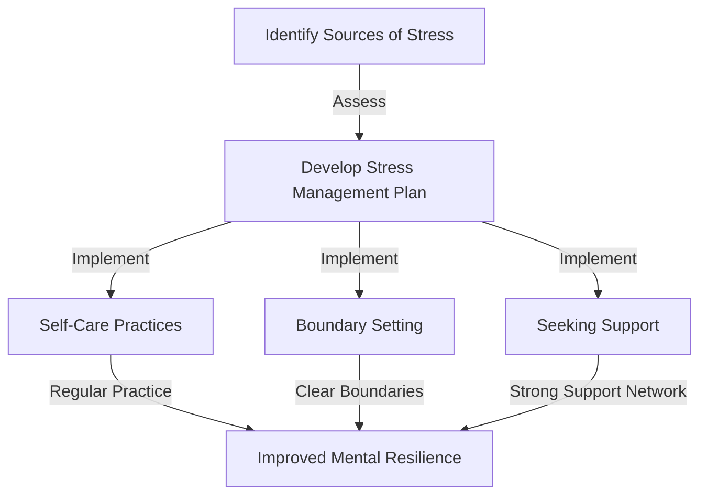
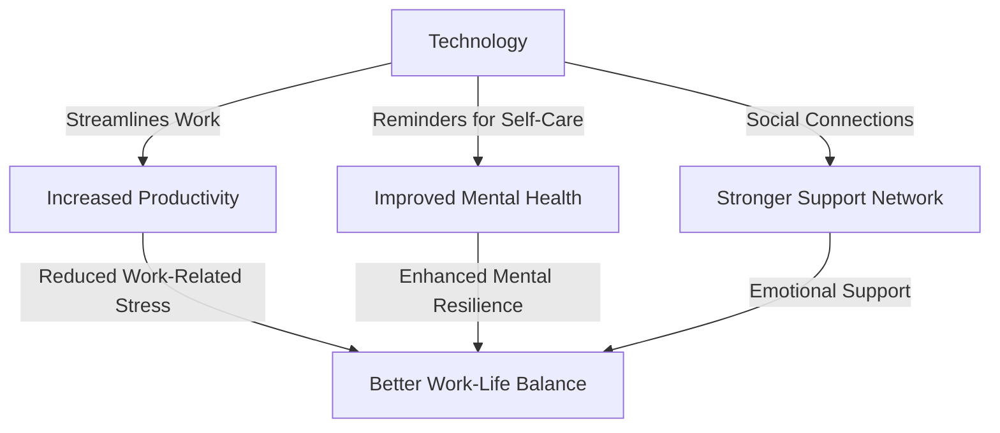

In today's fast-paced world, maintaining optimal mental health and wellness is crucial for achieving extreme performance and reliability in both personal and professional spheres. The blurred lines between work and personal life, especially with the rise of remote work, have made it increasingly challenging to manage stress effectively. This article delves into the intricacies of stress management, providing actionable strategies and insights for individuals seeking to enhance their mental resilience and perform at their best.

## Understanding Stress and Its Impact
Stress is a natural response to demands or pressures that exceed an individual's ability to cope. Chronic stress can lead to burnout, a state of emotional, mental, and physical exhaustion caused by excessive and prolonged stress. It's essential to recognize the signs of burnout, which include chronic fatigue, cynicism, and reduced performance.


## Identifying Sources of Stress
To manage stress effectively, it's crucial to identify its sources. Common stressors include work overload, lack of control, poor work-life balance, and lack of social support. For remote workers, additional stressors may include social isolation, difficulty in disconnecting from work, and technological issues.

```markdown
| Source of Stress | Description |
| --- | --- |
| Work Overload | Excessive workload, tight deadlines |
| Lack of Control | Limited autonomy, micromanagement |
| Poor Work-Life Balance | Difficulty separating work and personal life |
| Lack of Social Support | Limited social interactions, feeling isolated |
```

## Strategies for Stress Management
Effective stress management involves a combination of self-care practices, boundary setting, and seeking support. Here are some actionable strategies:

### Self-Care Practices
Engage in regular physical activity, practice mindfulness and meditation, and ensure adequate sleep. A healthy diet rich in fruits, vegetables, and whole grains also supports mental health.

### Boundary Setting
Establish clear boundaries between work and personal life. For remote workers, this may involve creating a dedicated workspace and setting regular working hours.

### Seeking Support
Build and maintain a support network of colleagues, friends, and family. Don't hesitate to seek professional help if experiencing overwhelming stress or burnout.



## The Role of Technology in Stress Management
Technology can be both a source of stress and a tool for stress management. Utilize technology to streamline work processes, set reminders for self-care activities, and stay connected with support networks.



## Visual Insights Gallery
Stress management is a multifaceted concept that benefits from visual representations. Here are some images that provide additional insights:


## Conclusion
Optimizing stress management is essential for achieving extreme performance and reliability. By understanding the sources of stress, implementing effective strategies, and leveraging technology, individuals can enhance their mental resilience and overall well-being. Remember, stress management is a personal and ongoing process that requires commitment, patience, and support.

## FAQ
- Q: What are the common signs of burnout?
  A: Chronic fatigue, cynicism, and reduced performance are common signs of burnout.
- Q: How can technology help in stress management?
  A: Technology can streamline work processes, remind individuals to practice self-care, and facilitate social connections.
- Q: Why is boundary setting important for remote workers?
  A: Boundary setting helps remote workers separate their work and personal life, reducing the risk of burnout and improving work-life balance.