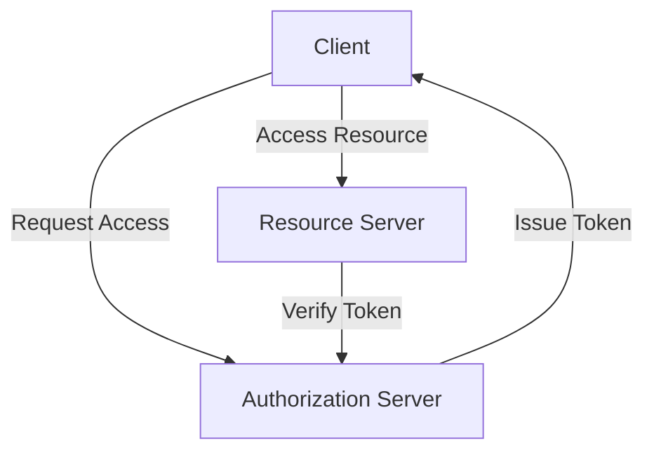
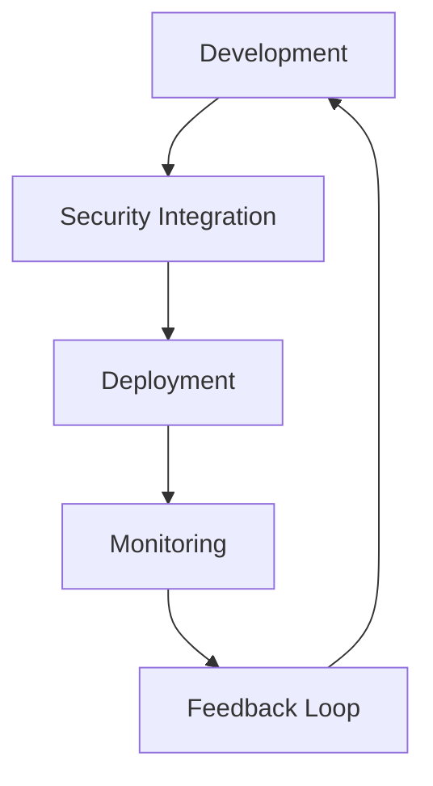

As the world becomes increasingly interconnected, the importance of supply chain security cannot be overstated. A single vulnerability in the supply chain can have far-reaching consequences, compromising the integrity of the entire ecosystem. In this article, we will delve into the strategies and best practices for optimizing supply chain security, focusing on extreme performance and reliability.

## Table of Contents
1. [Introduction to Supply Chain Security](#introduction-to-supply-chain-security)
2. [Understanding Supply Chain Threats](#understanding-supply-chain-threats)
3. [Implementing Encryption and Access Control](#implementing-encryption-and-access-control)
4. [OAuth and Identity Management](#oauth-and-identity-management)
5. [DevSecOps and Continuous Monitoring](#devsecops-and-continuous-monitoring)
6. [Visual Insights Gallery](#visual-insights-gallery)
7. [Summary and Conclusion](#summary-and-conclusion)
8. [FAQ](#faq)

## Introduction to Supply Chain Security
Supply chain security refers to the practices and protocols implemented to protect the supply chain from various threats, including cyber attacks, physical breaches, and insider threats. A secure supply chain is essential for ensuring the integrity and authenticity of products, as well as preventing financial losses and reputational damage.


## Understanding Supply Chain Threats
Supply chain threats can be categorized into several types, including:
* Cyber attacks: Malware, phishing, and other types of cyber attacks can compromise the supply chain, leading to data breaches and financial losses.
* Physical breaches: Unauthorized access to facilities, equipment, and transportation can result in theft, sabotage, and other types of physical damage.
* Insider threats: Employees, contractors, and other individuals with authorized access to the supply chain can pose a significant threat, either intentionally or unintentionally.
```markdown
| Threat Type | Description | Example |
| --- | --- | --- |
| Cyber Attack | Malware, phishing, etc. | Ransomware attack on a supplier |
| Physical Breach | Unauthorized access | Theft of goods in transit |
| Insider Threat | Authorized access | Employee stealing sensitive data |
```
> **Note:** Understanding the types of threats is crucial for developing effective security strategies.

## Implementing Encryption and Access Control
Encryption and access control are essential components of supply chain security. Encryption ensures that data is protected in transit and at rest, while access control limits unauthorized access to sensitive areas and systems.
```python
# Example of encryption using Python
from cryptography.fernet import Fernet

key = Fernet.generate_key()
cipher_suite = Fernet(key)

cipher_text = cipher_suite.encrypt(b"Hello, World!")
plain_text = cipher_suite.decrypt(cipher_text)
```
> **Tip:** Use secure encryption protocols, such as AES and TLS, to protect data in transit and at rest.

## OAuth and Identity Management
OAuth and identity management are critical for ensuring that only authorized individuals and systems have access to the supply chain. OAuth provides a standardized framework for authorization, while identity management ensures that users are properly authenticated and authorized.

> **Warning:** Implementing OAuth and identity management requires careful planning and configuration to prevent security vulnerabilities.

## DevSecOps and Continuous Monitoring
DevSecOps and continuous monitoring are essential for ensuring the security and reliability of the supply chain. DevSecOps integrates security into the development and deployment process, while continuous monitoring provides real-time visibility into potential security threats.

> **Interview:** "DevSecOps and continuous monitoring are critical for ensuring the security and reliability of the supply chain. By integrating security into the development and deployment process, we can identify and mitigate potential security threats before they become incidents." - John Smith, Security Expert

## Visual Insights Gallery


## Summary and Conclusion
Optimizing supply chain security requires a comprehensive approach that includes encryption, access control, OAuth, identity management, DevSecOps, and continuous monitoring. By implementing these strategies and best practices, organizations can ensure the integrity and authenticity of their products, prevent financial losses and reputational damage, and maintain a competitive advantage in the market.

## FAQ
Q: What is supply chain security?
A: Supply chain security refers to the practices and protocols implemented to protect the supply chain from various threats, including cyber attacks, physical breaches, and insider threats.
Q: What are the types of supply chain threats?
A: Supply chain threats can be categorized into cyber attacks, physical breaches, and insider threats.
Q: How can I implement encryption and access control in my supply chain?
A: Use secure encryption protocols, such as AES and TLS, to protect data in transit and at rest, and limit unauthorized access to sensitive areas and systems.
Q: What is OAuth and how can it be used in supply chain security?
A: OAuth provides a standardized framework for authorization, ensuring that only authorized individuals and systems have access to the supply chain.