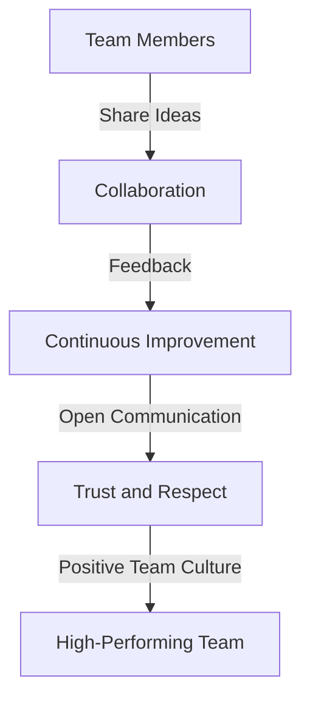
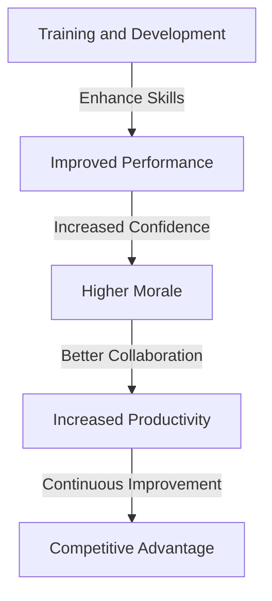

In today's fast-paced and competitive business landscape, creating a high-performing team is crucial for driving success. A well-crafted team culture can make all the difference in achieving extreme performance and reliability. As a leader, it's essential to understand the importance of optimizing team culture and implement strategies to foster a positive, productive, and efficient work environment.

## Table of Contents
1. [Introduction to Team Culture](#introduction-to-team-culture)
2. [Building a Strong Team Foundation](#building-a-strong-team-foundation)
3. [Fostering Open Communication and Collaboration](#fostering-open-communication-and-collaboration)
4. [Encouraging Continuous Learning and Improvement](#encouraging-continuous-learning-and-improvement)
5. [Implementing Effective Feedback and Recognition](#implementing-effective-feedback-and-recognition)
6. [Visual Insights Gallery](#visual-insights-gallery)
7. [Conclusion and FAQ](#conclusion-and-faq)

## Introduction to Team Culture

Team culture refers to the shared values, norms, and practices that define a team's identity and guide its behavior. A positive team culture can boost morale, motivation, and productivity, while a negative culture can lead to conflict, burnout, and turnover. As a leader, it's essential to recognize the impact of team culture on performance and reliability.

> **Note:** A strong team culture is built on trust, respect, and open communication. It's the foundation upon which high-performing teams are built.

## Building a Strong Team Foundation

Building a strong team foundation requires a clear understanding of the team's purpose, values, and goals. It's essential to establish a shared vision and mission that aligns with the organization's overall objectives. This foundation provides the basis for decision-making, collaboration, and communication.

```markdown
| **Team Foundation Elements** | **Description** |
| --- | --- |
| Purpose | Defines the team's reason for existence |
| Values | Guides the team's behavior and decision-making |
| Goals | Outlines the team's objectives and targets |
```

## Fostering Open Communication and Collaboration

Open communication and collaboration are critical components of a high-performing team. It's essential to create an environment where team members feel comfortable sharing their thoughts, ideas, and concerns. This can be achieved through regular team meetings, feedback sessions, and social events.



## Encouraging Continuous Learning and Improvement

Continuous learning and improvement are essential for staying ahead of the competition. It's crucial to provide team members with opportunities for growth and development, such as training programs, workshops, and conferences. This not only enhances their skills and knowledge but also boosts morale and motivation.



## Implementing Effective Feedback and Recognition

Effective feedback and recognition are vital for motivating team members and driving performance. It's essential to provide regular feedback that is constructive, specific, and timely. Recognition and rewards can also be used to motivate team members and reinforce positive behavior.

> **Tip:** Use a feedback framework that includes specific examples, behaviors, and outcomes to provide constructive feedback.

## Visual Insights Gallery
## Visual Insights Gallery


## Conclusion and FAQ
In conclusion, optimizing team culture is critical for achieving extreme performance and reliability. By building a strong team foundation, fostering open communication and collaboration, encouraging continuous learning and improvement, and implementing effective feedback and recognition, leaders can create a positive and productive work environment.

### FAQ
1. **Q: What is team culture, and why is it important?**
   A: Team culture refers to the shared values, norms, and practices that define a team's identity and guide its behavior. A positive team culture can boost morale, motivation, and productivity, while a negative culture can lead to conflict, burnout, and turnover.
2. **Q: How can I build a strong team foundation?**
   A: Building a strong team foundation requires a clear understanding of the team's purpose, values, and goals. Establish a shared vision and mission that aligns with the organization's overall objectives.
3. **Q: What are some strategies for fostering open communication and collaboration?**
   A: Regular team meetings, feedback sessions, and social events can help create an environment where team members feel comfortable sharing their thoughts, ideas, and concerns.
4. **Q: Why is continuous learning and improvement important?**
   A: Continuous learning and improvement are essential for staying ahead of the competition. Provide team members with opportunities for growth and development to enhance their skills and knowledge.
5. **Q: How can I implement effective feedback and recognition?**
   A: Provide regular feedback that is constructive, specific, and timely. Use a feedback framework that includes specific examples, behaviors, and outcomes to provide constructive feedback. Recognition and rewards can also be used to motivate team members and reinforce positive behavior.