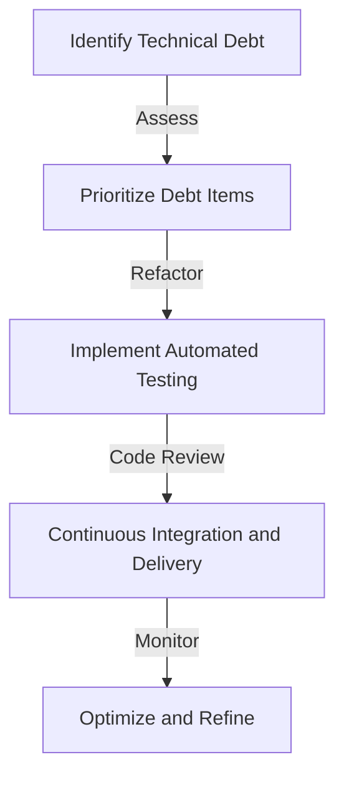
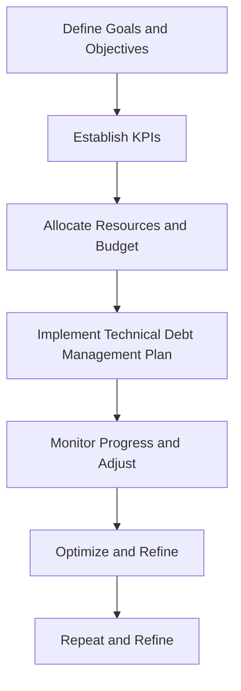

In the fast-paced world of software development, technical debt is an inevitable reality that can make or break a company's ability to scale and innovate. As a leader in the tech industry, it's essential to understand the concept of technical debt, its implications, and most importantly, how to optimize it for extreme performance and reliability.

## Introduction to Technical Debt
Technical debt refers to the cost of implementing quick fixes or workarounds that need to be revisited later. It's a common phenomenon in software development, where teams prioritize rapid deployment over perfect code. However, if left unmanaged, technical debt can lead to a plethora of issues, including performance degradation, reliability problems, and even security vulnerabilities.


## Understanding the Consequences of Technical Debt
The consequences of technical debt can be far-reaching and devastating. Some of the most significant risks include:
* Decreased system performance and responsiveness
* Increased risk of errors and downtime
* Higher maintenance costs and complexity
* Reduced ability to innovate and adapt to changing market conditions
* Potential security vulnerabilities and data breaches
> **Warning:** Ignoring technical debt can lead to a vicious cycle of quick fixes and workarounds, ultimately resulting in a system that's difficult to maintain, scale, or secure.

## Assessing and Prioritizing Technical Debt
To optimize technical debt, it's essential to assess and prioritize it effectively. This involves:
* Identifying areas of high technical debt
* Evaluating the business impact of each debt item
* Prioritizing debt items based on their severity and business value
* Creating a roadmap for addressing technical debt
```markdown
| Debt Item | Severity | Business Value | Priority |
| --- | --- | --- | --- |
| Refactor legacy code | High | Medium | High |
| Implement automated testing | Medium | High | Medium |
| Optimize database queries | Low | Low | Low |
```
## Strategies for Optimizing Technical Debt
Several strategies can help optimize technical debt, including:
* **Refactoring:** Breaking down complex code into smaller, more manageable pieces
* **Automated testing:** Implementing automated tests to ensure code quality and reliability
* **Code reviews:** Conducting regular code reviews to identify and address technical debt
* **Continuous integration and delivery:** Implementing CI/CD pipelines to streamline development and deployment


## Implementing a Technical Debt Management Plan
Implementing a technical debt management plan involves:
* Establishing clear goals and objectives
* Defining key performance indicators (KPIs)
* Allocating resources and budget
* Monitoring progress and adjusting the plan as needed


## Visual Insights Gallery
## Visual Insights Gallery


## Summary and Conclusion
Optimizing technical debt is crucial for achieving extreme performance and reliability in software development. By understanding the consequences of technical debt, assessing and prioritizing it effectively, and implementing strategies for optimization, leaders can create a culture of technical excellence and innovation. Remember, technical debt is an inevitable reality, but with the right approach, it can be managed and even become a catalyst for growth and success.

## Frequently Asked Questions
1. What is technical debt?
Technical debt refers to the cost of implementing quick fixes or workarounds that need to be revisited later.
2. How do I prioritize technical debt?
Prioritize technical debt based on its severity and business value, and create a roadmap for addressing it.
3. What are some strategies for optimizing technical debt?
Strategies include refactoring, automated testing, code reviews, and continuous integration and delivery.
4. How do I implement a technical debt management plan?
Establish clear goals and objectives, define KPIs, allocate resources and budget, and monitor progress and adjust the plan as needed.