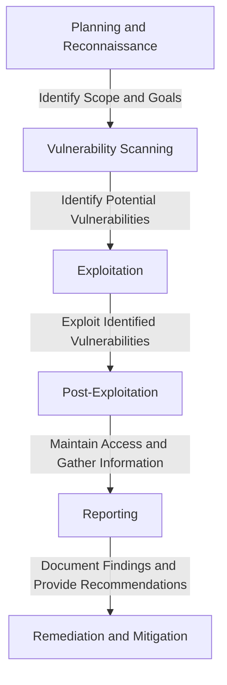
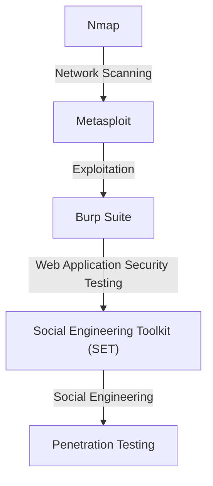

Penetration testing is a crucial aspect of ensuring the security and integrity of backend systems. As a backend engineer, it's essential to understand the principles and methodologies of penetration testing to identify vulnerabilities and strengthen your application's defenses. In this article, we'll delve into the world of penetration testing, exploring its importance, types, and methodologies, as well as providing a comprehensive guide for backend engineers.

## Table of Contents
1. [Introduction to Penetration Testing](#introduction-to-penetration-testing)
2. [Types of Penetration Testing](#types-of-penetration-testing)
3. [Penetration Testing Methodologies](#penetration-testing-methodologies)
4. [Tools and Techniques for Penetration Testing](#tools-and-techniques-for-penetration-testing)
5. [Case Study: Penetration Testing for OAuth-Based Systems](#case-study-penetration-testing-for-oauth-based-systems)
6. [Best Practices for Backend Engineers](#best-practices-for-backend-engineers)
7. [Visual Insights Gallery](#visual-insights-gallery)
8. [Summary and Conclusion](#summary-and-conclusion)
9. [FAQ](#faq)

## Introduction to Penetration Testing
Penetration testing, also known as pen testing or ethical hacking, is the process of simulating a cyber attack on a computer system, network, or web application to assess its security vulnerabilities. The goal of penetration testing is to identify weaknesses and vulnerabilities that an attacker could exploit, and to provide recommendations for remediation and mitigation.


## Types of Penetration Testing
There are several types of penetration testing, including:
* **Network Penetration Testing**: focuses on identifying vulnerabilities in network devices, such as routers, firewalls, and switches.
* **Web Application Penetration Testing**: focuses on identifying vulnerabilities in web applications, such as SQL injection, cross-site scripting (XSS), and cross-site request forgery (CSRF).
* **Cloud Penetration Testing**: focuses on identifying vulnerabilities in cloud-based systems, such as Amazon Web Services (AWS), Microsoft Azure, and Google Cloud Platform (GCP).
* **Social Engineering Penetration Testing**: focuses on identifying vulnerabilities in human behavior, such as phishing, spear phishing, and pretexting.
```markdown
| Type | Description |
| --- | --- |
| Network | Identifies vulnerabilities in network devices |
| Web Application | Identifies vulnerabilities in web applications |
| Cloud | Identifies vulnerabilities in cloud-based systems |
| Social Engineering | Identifies vulnerabilities in human behavior |
```
## Penetration Testing Methodologies
Penetration testing methodologies typically involve the following steps:
1. **Planning and Reconnaissance**: identifying the scope and goals of the penetration test, and gathering information about the target system.
2. **Vulnerability Scanning**: using automated tools to identify potential vulnerabilities in the target system.
3. **Exploitation**: attempting to exploit identified vulnerabilities to gain access to the target system.
4. **Post-Exploitation**: attempting to maintain access to the target system, and gathering sensitive information.
5. **Reporting**: documenting the findings and providing recommendations for remediation and mitigation.

## Tools and Techniques for Penetration Testing
Some common tools and techniques used in penetration testing include:
* **Nmap**: a network scanning tool used to identify open ports and services.
* **Metasploit**: a penetration testing framework used to exploit vulnerabilities and gain access to target systems.
* **Burp Suite**: a web application security testing tool used to identify vulnerabilities in web applications.
* **Social Engineering Toolkit (SET)**: a tool used to perform social engineering attacks, such as phishing and spear phishing.

## Case Study: Penetration Testing for OAuth-Based Systems
OAuth is an authorization framework that allows users to grant third-party applications limited access to their resources on another service provider's website, without sharing their login credentials. However, OAuth-based systems can be vulnerable to attacks, such as:
* **Authorization Code Interception**: an attacker intercepts the authorization code and uses it to obtain an access token.
* **Access Token Leak**: an attacker obtains an access token and uses it to access protected resources.
To penetrate an OAuth-based system, an attacker could use tools such as:
* **Burp Suite**: to intercept and manipulate HTTP requests and responses.
* **OAuth 2.0 Toolkit**: to simulate OAuth 2.0 flows and identify vulnerabilities.
> **Note:** Penetration testing for OAuth-based systems requires a deep understanding of the OAuth protocol and its vulnerabilities.
## Best Practices for Backend Engineers
To ensure the security of backend systems, backend engineers should follow best practices, such as:
* **Implementing secure authentication and authorization mechanisms**, such as OAuth and JWT.
* **Validating and sanitizing user input**, to prevent SQL injection and cross-site scripting (XSS) attacks.
* **Using secure protocols for communication**, such as HTTPS and TLS.
* **Regularly updating and patching dependencies**, to prevent vulnerabilities in third-party libraries.
> **Tip:** Use a web application security scanner, such as OWASP ZAP, to identify vulnerabilities in your backend system.

## Visual Insights Gallery


## Summary and Conclusion
Penetration testing is a crucial aspect of ensuring the security and integrity of backend systems. By understanding the principles and methodologies of penetration testing, backend engineers can identify vulnerabilities and strengthen their application's defenses. Remember to follow best practices, such as implementing secure authentication and authorization mechanisms, validating and sanitizing user input, using secure protocols for communication, and regularly updating and patching dependencies.

## FAQ
Q: What is penetration testing?
A: Penetration testing, also known as pen testing or ethical hacking, is the process of simulating a cyber attack on a computer system, network, or web application to assess its security vulnerabilities.
Q: What are the types of penetration testing?
A: There are several types of penetration testing, including network penetration testing, web application penetration testing, cloud penetration testing, and social engineering penetration testing.
Q: What are some common tools and techniques used in penetration testing?
A: Some common tools and techniques used in penetration testing include Nmap, Metasploit, Burp Suite, and Social Engineering Toolkit (SET).