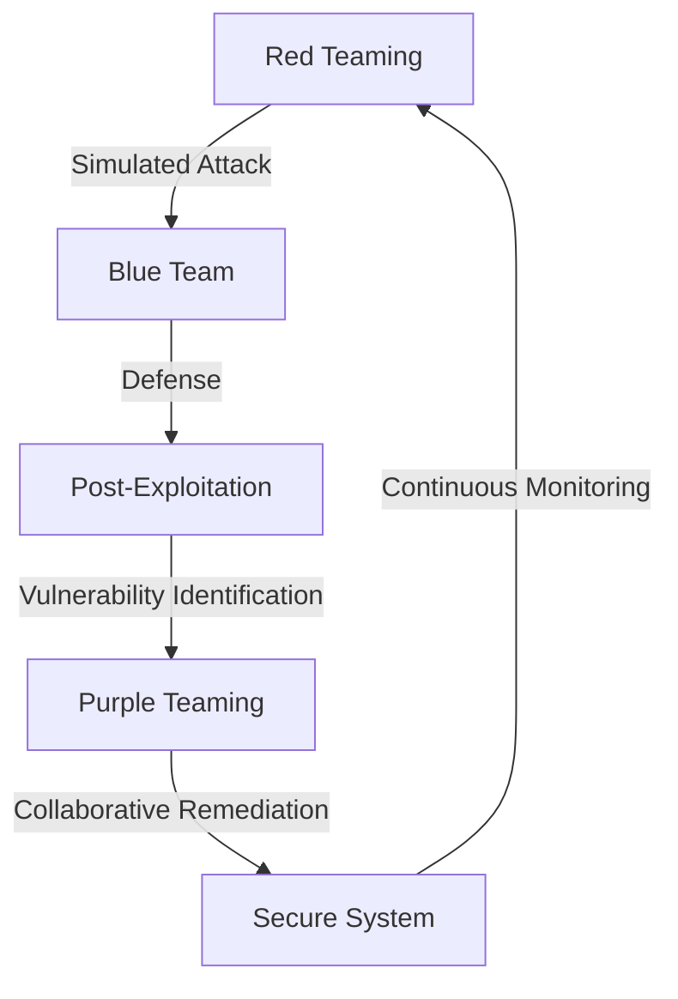
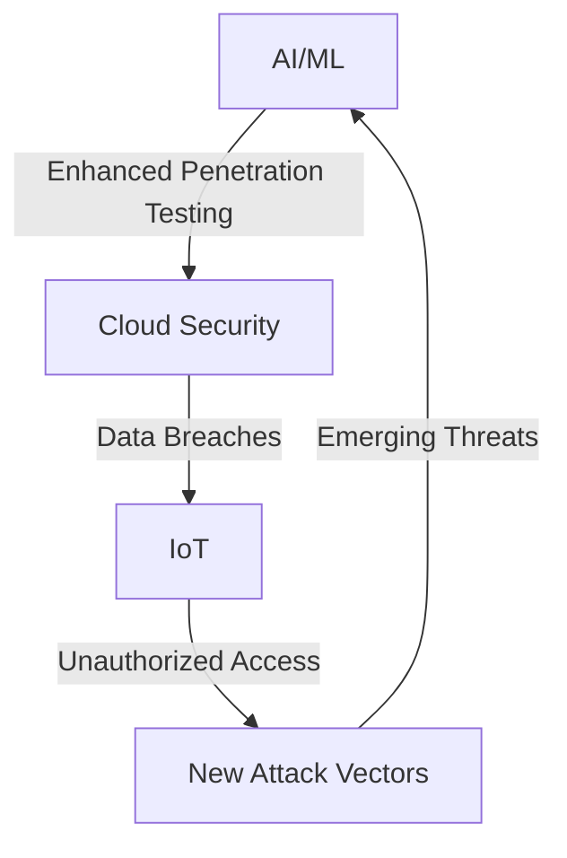

## Part 2: Advanced Penetration Testing for Backend Engineers
### Introduction to Advanced Penetration Testing
In the first part of this series, we introduced the fundamentals of penetration testing for backend engineers. In this article, we will delve deeper into advanced penetration testing techniques, exploring edge cases and deeper architecture. We will examine real-world case studies, new trends, and emerging threats in the cybersecurity landscape.

### Advanced Penetration Testing Methodologies
Advanced penetration testing methodologies involve a more nuanced and sophisticated approach to identifying vulnerabilities. This includes:
* **Red Teaming**: A simulated attack on an organization's security posture, designed to test the effectiveness of its defenses.
* **Purple Teaming**: A collaborative approach to penetration testing, where the red team (attackers) and blue team (defenders) work together to identify and remediate vulnerabilities.
* **Bug Bounty Programs**: Crowdsourced penetration testing, where organizations invite ethical hackers to identify vulnerabilities in their systems.

### Real-World Case Studies
Let's examine a real-world case study of a penetration test on a cloud-based e-commerce platform:
* **Case Study**: A cloud-based e-commerce platform was vulnerable to a SQL injection attack, allowing an attacker to access sensitive customer data. The penetration test identified the vulnerability and provided recommendations for remediation, including input validation and parameterized queries.

### Emerging Trends and Threats
The cybersecurity landscape is constantly evolving, with new threats and trends emerging daily. Some of the most significant emerging trends and threats include:
* **Artificial Intelligence (AI) and Machine Learning (ML)**: AI and ML can be used to enhance penetration testing, but they also introduce new vulnerabilities and attack vectors.
* **Internet of Things (IoT)**: The increasing number of connected devices has created new attack surfaces and vulnerabilities.
* **Cloud Security**: Cloud-based systems introduce new security challenges, including data breaches and unauthorized access.

### Best Practices for Advanced Penetration Testing
To stay ahead of emerging threats and trends, backend engineers should follow best practices for advanced penetration testing, including:
* **Continuous Monitoring**: Regularly monitor systems and networks for vulnerabilities and anomalies.
* **Collaboration**: Work with other teams, including red teams and bug bounty programs, to identify and remediate vulnerabilities.
* **Staying Up-to-Date**: Stay current with the latest threats, trends, and technologies to ensure effective penetration testing.

## Visual Insights Gallery
* [Penetration Testing Lifecycle](https://picsum.photos/seed/penetration-testing-lifecycle/800/400)
* [Advanced Penetration Testing Methodologies](https://picsum.photos/seed/advanced-penetration-testing-methodologies/800/400)
* [Emerging Trends and Threats in Cybersecurity](https://picsum.photos/seed/emerging-trends-and-threats/800/400)
* [Best Practices for Advanced Penetration Testing](https://picsum.photos/seed/best-practices-for-advanced-penetration-testing/800/400)
* [Real-World Case Studies in Penetration Testing](https://picsum.photos/seed/real-world-case-studies/800/400)