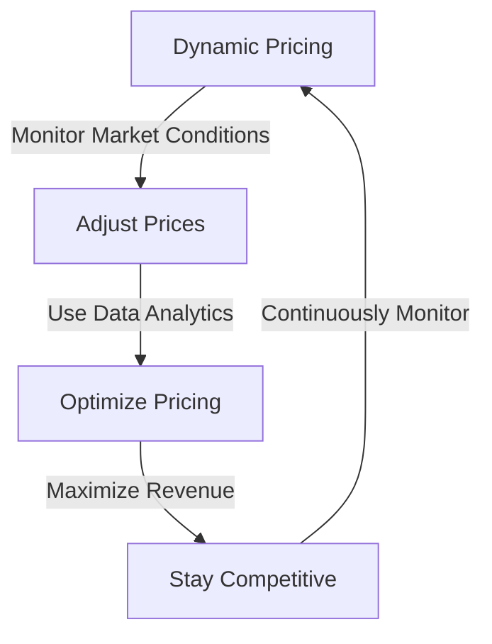

In the competitive business landscape, pricing is a crucial aspect that can significantly impact revenue and profitability. A well-crafted pricing strategy can help companies maximize their earnings, while a poorly designed one can leave money on the table. In this article, we will delve into the world of pricing strategies, exploring the most effective approaches that businesses can use to optimize their pricing and stay ahead of the competition.

## Table of Contents
1. [Introduction to Pricing Strategies](#introduction-to-pricing-strategies)
2. [Value-Based Pricing](#value-based-pricing)
3. [Competitive Pricing](#competitive-pricing)
4. [Dynamic Pricing](#dynamic-pricing)
5. [Pricing Strategy Implementation](#pricing-strategy-implementation)
6. [Visual Insights Gallery](#visual-insights-gallery)
7. [Conclusion](#conclusion)
8. [FAQ](#faq)

## Introduction to Pricing Strategies
Pricing strategies are plans or approaches that businesses use to determine the prices of their products or services. These strategies can be based on various factors, including production costs, market conditions, customer demand, and competition. A good pricing strategy should balance the need to maximize revenue with the need to stay competitive and attract customers.

## Value-Based Pricing
Value-based pricing is a strategy that involves setting prices based on the perceived value of a product or service to the customer. This approach takes into account the unique features, benefits, and quality of the offering, as well as the customer's willingness to pay. Value-based pricing can be an effective way to differentiate a product or service and charge a premium price.

## Competitive Pricing
Competitive pricing involves setting prices based on the prices of similar products or services offered by competitors. This approach can help businesses stay competitive and attract price-sensitive customers. However, it can also lead to a race to the bottom, where companies sacrifice profit margins to undercut their competitors.

## Dynamic Pricing
Dynamic pricing is a strategy that involves adjusting prices in real-time based on changing market conditions, such as demand, supply, and competition. This approach can help businesses optimize their pricing and maximize revenue. Dynamic pricing is commonly used in industries such as hospitality, transportation, and retail.

## Pricing Strategy Implementation
Implementing a pricing strategy requires careful planning and consideration of various factors, including production costs, market conditions, customer demand, and competition. Businesses should also continuously monitor their pricing strategy and make adjustments as needed to stay competitive and maximize revenue.
> **Tip:** Businesses should regularly review their pricing strategy to ensure it is aligned with their overall business goals and objectives.

## Visual Insights Gallery
## Visual Insights Gallery
The following images provide a visual representation of pricing strategies and their implementation:

## Conclusion
Pricing strategies are a critical aspect of business operations, and companies should carefully consider their approach to pricing to maximize revenue and stay competitive. By understanding the different pricing strategies, including value-based pricing, competitive pricing, and dynamic pricing, businesses can develop an effective pricing strategy that meets their unique needs and goals.

## FAQ
1. **What is the most effective pricing strategy?**
The most effective pricing strategy depends on the business and its goals. Value-based pricing, competitive pricing, and dynamic pricing are all effective approaches, but the best strategy will depend on the specific market, product, or service.
2. **How often should a business review its pricing strategy?**
A business should regularly review its pricing strategy to ensure it is aligned with its overall business goals and objectives. This can be done quarterly, semi-annually, or annually, depending on the business and market conditions.
3. **What are the benefits of dynamic pricing?**
Dynamic pricing can help businesses optimize their pricing and maximize revenue. It allows companies to adjust prices in real-time based on changing market conditions, such as demand, supply, and competition.