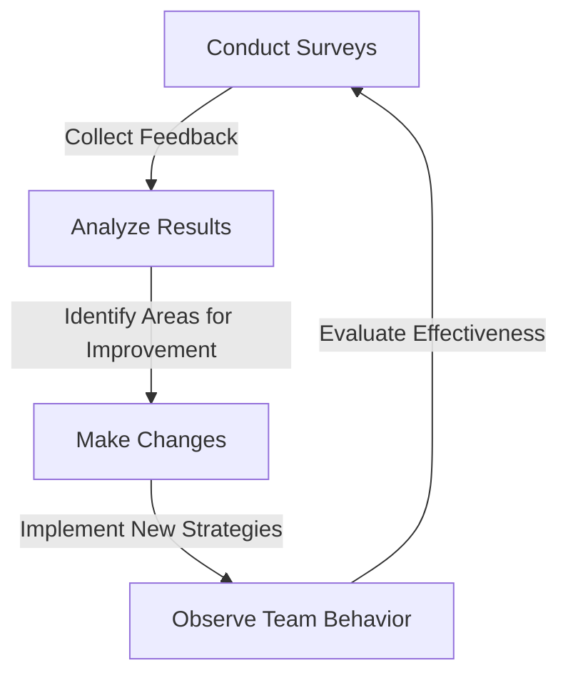
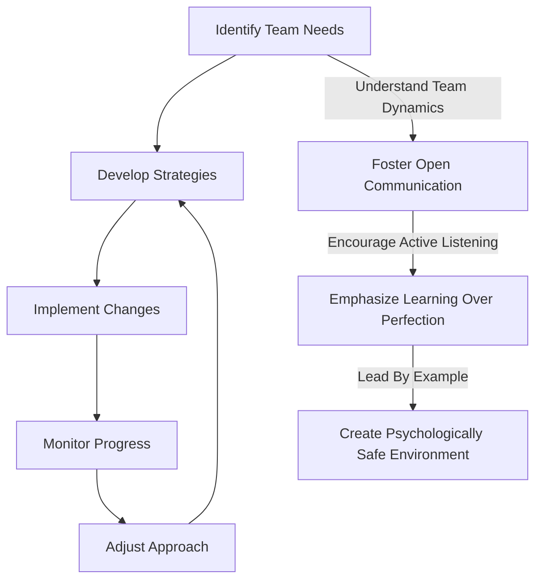

In the fast-paced and ever-evolving world of software development, teams are constantly under pressure to deliver high-quality products and features quickly. However, this pressure can often lead to a culture of fear, where team members are hesitant to speak up, share their ideas, or admit mistakes. This is where psychological safety comes in – a crucial aspect of team dynamics that can make or break a team's success.

## Introduction to Psychological Safety
Psychological safety refers to the feeling of being comfortable sharing one's thoughts, ideas, and concerns without fear of reprisal or judgment. It's about creating an environment where team members feel valued, respected, and supported, allowing them to take risks, learn from their mistakes, and grow both personally and professionally.


## The Importance of Psychological Safety in Software Teams
In software teams, psychological safety is essential for fostering a culture of innovation, creativity, and collaboration. When team members feel safe to share their ideas and opinions, they are more likely to:
* Speak up when they notice a problem or have a suggestion for improvement
* Take ownership of their work and be accountable for their actions
* Collaborate with their colleagues to find solutions to complex problems
* Learn from their mistakes and use them as opportunities for growth
```markdown
| Benefit | Description |
| --- | --- |
| Improved Communication | Team members are more likely to share their thoughts and ideas |
| Increased Collaboration | Team members work together to find solutions to complex problems |
| Enhanced Creativity | Team members feel comfortable sharing their ideas and opinions |
| Better Error Handling | Team members are more likely to speak up when they notice a problem |
```
## Creating a Psychologically Safe Environment
Creating a psychologically safe environment requires effort and dedication from team leaders and members alike. Here are some strategies to help you get started:
* Lead by example: Demonstrate vulnerability and openness yourself, and encourage your team members to do the same
* Foster an open-door policy: Encourage team members to speak up and share their concerns without fear of reprisal
* Practice active listening: Listen attentively to your team members and respond thoughtfully
* Emphasize learning over perfection: Focus on learning from mistakes rather than punishing them
```markdown
```class TeamLeader:
    def __init__(self):
        self.team_members = []

    def add_team_member(self, member):
        self.team_members.append(member)

    def create_psychologically_safe_environment(self):
        # Lead by example
        self.demonstrate_vulnerability()

        # Foster an open-door policy
        self.encourage_open_communication()

        # Practice active listening
        self.listen_attentively()

        # Emphasize learning over perfection
        self.focus_on_learning()
```
## Measuring Psychological Safety
Measuring psychological safety can be challenging, but there are several ways to do so. Here are a few strategies:
* Conduct regular surveys: Ask team members about their feelings of psychological safety and use the feedback to make improvements
* Hold focus groups: Bring team members together to discuss their experiences and concerns
* Observe team behavior: Pay attention to how team members interact with each other and whether they seem comfortable sharing their ideas and opinions

## Implementing Psychological Safety in Your Team
Implementing psychological safety in your team requires a multifaceted approach. Here's a high-level overview of the process:

## Overcoming Challenges to Psychological Safety
Overcoming challenges to psychological safety requires persistence, dedication, and a willingness to adapt. Here are some common challenges and strategies for overcoming them:
* Resistance to change: Encourage team members to share their concerns and address them openly
* Lack of trust: Foster a culture of transparency and accountability
* Fear of failure: Emphasize learning from mistakes and using them as opportunities for growth
> **Tip:** Be patient and consistent in your efforts to create a psychologically safe environment. It takes time and effort to build trust and foster a culture of openness and vulnerability.

## Visual Insights Gallery
Here are some additional visual insights into psychological safety in software teams:


## Summary and Conclusion
Psychological safety is a critical aspect of software team dynamics, and it's essential for fostering a culture of innovation, creativity, and collaboration. By creating a psychologically safe environment, team leaders can encourage team members to share their ideas and opinions, take risks, and learn from their mistakes. Remember to lead by example, foster an open-door policy, practice active listening, and emphasize learning over perfection. With persistence, dedication, and a willingness to adapt, you can overcome challenges to psychological safety and create a high-performing team.

## FAQ
* Q: What is psychological safety, and why is it important in software teams?
A: Psychological safety refers to the feeling of being comfortable sharing one's thoughts, ideas, and concerns without fear of reprisal or judgment. It's essential for fostering a culture of innovation, creativity, and collaboration in software teams.
* Q: How can I create a psychologically safe environment in my team?
A: You can create a psychologically safe environment by leading by example, fostering an open-door policy, practicing active listening, and emphasizing learning over perfection.
* Q: What are some common challenges to psychological safety, and how can I overcome them?
A: Common challenges to psychological safety include resistance to change, lack of trust, and fear of failure. You can overcome these challenges by encouraging team members to share their concerns, fostering a culture of transparency and accountability, and emphasizing learning from mistakes.