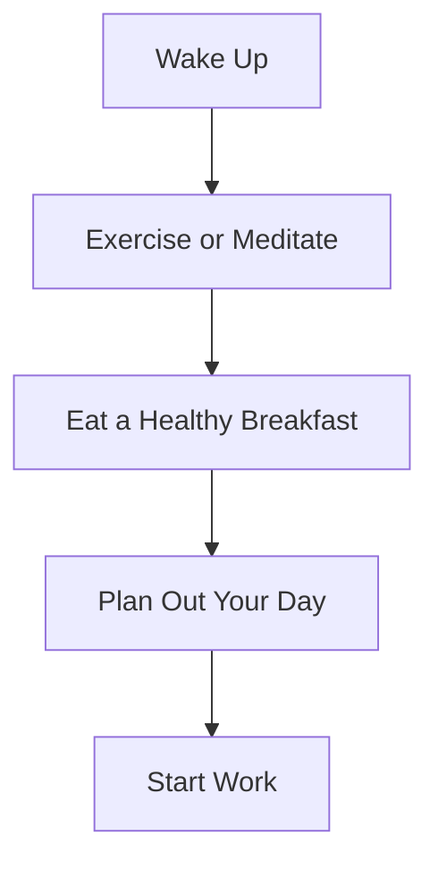
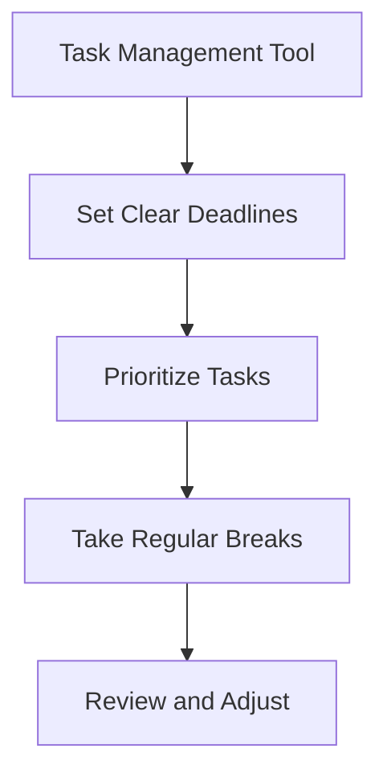

As a remote developer, staying productive and maintaining a high level of focus can be challenging. Without the structure of an office environment, it's easy to get distracted and lose track of your goals. However, with the right routine and strategies, you can overcome these challenges and achieve your full potential. In this article, we'll explore the importance of building a high-focus routine as a remote developer and provide actionable tips to help you get started.

## Table of Contents
1. [Introduction to Remote Developer Productivity](#introduction-to-remote-developer-productivity)
2. [Creating a Dedicated Workspace](#creating-a-dedicated-workspace)
3. [Establishing a Morning Routine](#establishing-a-morning-routine)
4. [Prioritizing Tasks and Managing Time](#prioritizing-tasks-and-managing-time)
5. [Minimizing Distractions and Staying Focused](#minimizing-distractions-and-staying-focused)
6. [Visual Insights Gallery](#visual-insights-gallery)
7. [Conclusion and FAQ](#conclusion-and-faq)

## Introduction to Remote Developer Productivity

As a remote developer, you have the freedom to work from anywhere, at any time. However, this flexibility can also be a curse. Without a traditional office environment, it's easy to fall into bad habits and struggle with productivity. To overcome these challenges, it's essential to create a routine that promotes high focus and productivity. This includes setting clear goals, establishing a dedicated workspace, and minimizing distractions.

## Creating a Dedicated Workspace

One of the most critical aspects of remote developer productivity is creating a dedicated workspace. This can be a home office, a co-working space, or even a local coffee shop. The key is to have a dedicated area that is free from distractions and interruptions. When setting up your workspace, consider the following:
* Invest in a comfortable and ergonomic chair
* Use a large monitor or multiple screens
* Ensure good lighting and ventilation
* Minimize clutter and keep your workspace organized

```markdown
| Workspace Element | Description |
| --- | --- |
| Comfortable Chair | Invest in a high-quality, ergonomic chair to reduce back pain and improve focus |
| Large Monitor | Use a large monitor or multiple screens to increase productivity and reduce eye strain |
| Good Lighting | Ensure good lighting and ventilation to promote a healthy work environment |
```

## Establishing a Morning Routine

Establishing a morning routine is essential for remote developer productivity. This can include exercise, meditation, or simply enjoying a cup of coffee. The key is to create a routine that sets a positive tone for the day and helps you stay focused. Consider the following:
* Wake up at the same time every day
* Exercise or meditate to clear your mind
* Eat a healthy breakfast to fuel your body
* Plan out your day and set clear goals



## Prioritizing Tasks and Managing Time

Prioritizing tasks and managing time is critical for remote developer productivity. This includes using tools like Trello or Asana to manage your tasks, as well as setting clear deadlines and milestones. Consider the following:
* Use a task management tool to organize your work
* Set clear deadlines and milestones
* Prioritize tasks based on importance and urgency
* Take regular breaks to stay focused and avoid burnout



## Minimizing Distractions and Staying Focused

Minimizing distractions and staying focused is essential for remote developer productivity. This includes turning off notifications, using a website blocker, and creating a quiet and comfortable work environment. Consider the following:
* Turn off notifications and minimize social media
* Use a website blocker to avoid distractions
* Create a quiet and comfortable work environment
* Take regular breaks to stay focused and avoid burnout

> **Note:** Minimizing distractions is critical for remote developer productivity. By creating a quiet and comfortable work environment, you can stay focused and achieve your goals.

## Visual Insights Gallery
## Visual Insights Gallery


## Conclusion and FAQ
In conclusion, building a high-focus routine as a remote developer is critical for achieving success. By creating a dedicated workspace, establishing a morning routine, prioritizing tasks, and minimizing distractions, you can stay focused and productive. Remember to take regular breaks, use task management tools, and set clear deadlines and milestones.

### FAQ
1. **What is the most important aspect of remote developer productivity?**
The most important aspect of remote developer productivity is creating a dedicated workspace that is free from distractions and interruptions.
2. **How can I minimize distractions and stay focused?**
To minimize distractions and stay focused, turn off notifications, use a website blocker, and create a quiet and comfortable work environment.
3. **What is the best way to prioritize tasks and manage time?**
The best way to prioritize tasks and manage time is to use a task management tool, set clear deadlines and milestones, and prioritize tasks based on importance and urgency.