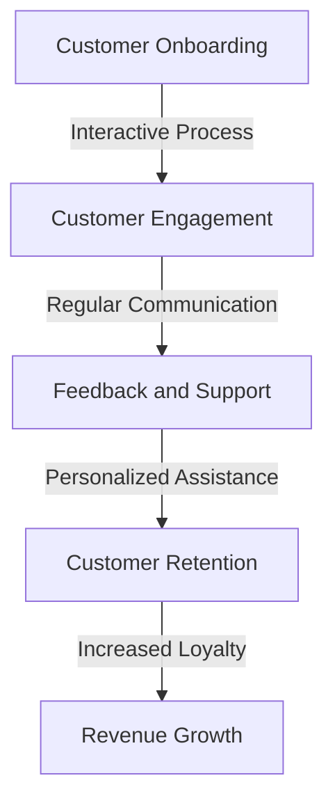
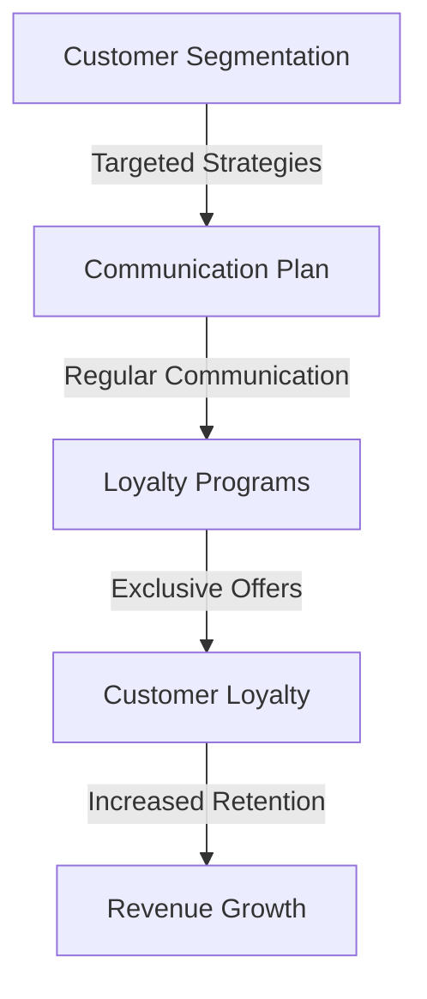

In the competitive world of Software as a Service (SaaS), customer retention is crucial for the long-term success of any business. SaaS companies face a constant challenge in reducing churn rates, which can significantly impact revenue and growth. This article provides actionable strategies and insights to help SaaS businesses develop effective customer retention plans, minimizing churn and maximizing customer lifetime value.

## Table of Contents
1. [Understanding SaaS Churn](#understanding-saas-churn)
2. [Identifying Churn Triggers](#identifying-churn-triggers)
3. [Strategies for Churn Reduction](#strategies-for-churn-reduction)
4. [Implementing a Customer Retention Plan](#implementing-a-customer-retention-plan)
5. [Monitoring and Optimizing](#monitoring-and-optimizing)

## Understanding SaaS Churn

SaaS churn refers to the rate at which customers stop using a SaaS product or service over a certain period. It's a critical metric for SaaS companies, as high churn rates can lead to significant revenue losses and hinder business growth. To develop effective churn reduction strategies, it's essential to understand the reasons behind customer churn.

> **Note:** Common reasons for SaaS churn include poor customer support, lack of product value, and inadequate onboarding processes.

## Identifying Churn Triggers

Identifying churn triggers is crucial for developing targeted retention strategies. Some common churn triggers include:
* Poor user experience
* Limited product functionality
* Inadequate customer support
* High pricing
* Lack of engagement

```markdown
| Churn Trigger | Description |
| --- | --- |
| Poor User Experience | Difficult navigation, slow loading times, or unresponsive design |
| Limited Product Functionality | Insufficient features or capabilities to meet customer needs |
| Inadequate Customer Support | Unresponsive or unhelpful support team, long response times |
| High Pricing | Perceived high costs or poor value for money |
| Lack of Engagement | Infrequent communication, no regular updates or feedback |
```

## Strategies for Churn Reduction

To reduce SaaS churn, companies can implement the following strategies:
* **Improve customer support**: Provide multichannel support, ensure prompt response times, and offer personalized assistance.
* **Enhance product value**: Continuously develop and update the product to meet evolving customer needs, and offer flexible pricing plans.
* **Streamline onboarding**: Develop interactive and engaging onboarding processes to ensure customers understand the product's value and functionality.
* **Foster customer engagement**: Regularly communicate with customers, solicit feedback, and provide exclusive offers or rewards.



## Implementing a Customer Retention Plan

Implementing a customer retention plan requires a structured approach. The following steps can help:
1. **Define customer segments**: Identify high-value customers and develop targeted retention strategies.
2. **Develop a communication plan**: Establish regular communication channels and ensure prompt response times.
3. **Offer loyalty programs**: Provide exclusive offers, rewards, or discounts to loyal customers.
4. **Monitor customer feedback**: Continuously solicit feedback and use it to improve the product and services.



## Monitoring and Optimizing

To ensure the effectiveness of churn reduction strategies, it's essential to continuously monitor and optimize the customer retention plan. This includes:
* **Tracking key metrics**: Monitor churn rates, customer satisfaction, and revenue growth.
* **Analyzing customer feedback**: Use customer feedback to identify areas for improvement and optimize the product and services.
* **Adjusting strategies**: Refine and adjust churn reduction strategies based on customer feedback and metric analysis.

## Visual Insights Gallery


## Summary/Conclusion
Reducing SaaS churn requires a comprehensive approach that involves understanding customer needs, identifying churn triggers, and implementing targeted retention strategies. By developing a customer-centric approach, improving customer support, and enhancing product value, SaaS companies can minimize churn and maximize customer lifetime value.

## FAQ
Q: What is SaaS churn, and why is it important?
A: SaaS churn refers to the rate at which customers stop using a SaaS product or service. It's essential to reduce churn to maintain revenue and growth.
Q: What are common reasons for SaaS churn?
A: Common reasons for SaaS churn include poor customer support, lack of product value, and inadequate onboarding processes.
Q: How can SaaS companies reduce churn?
A: SaaS companies can reduce churn by improving customer support, enhancing product value, streamlining onboarding, and fostering customer engagement.