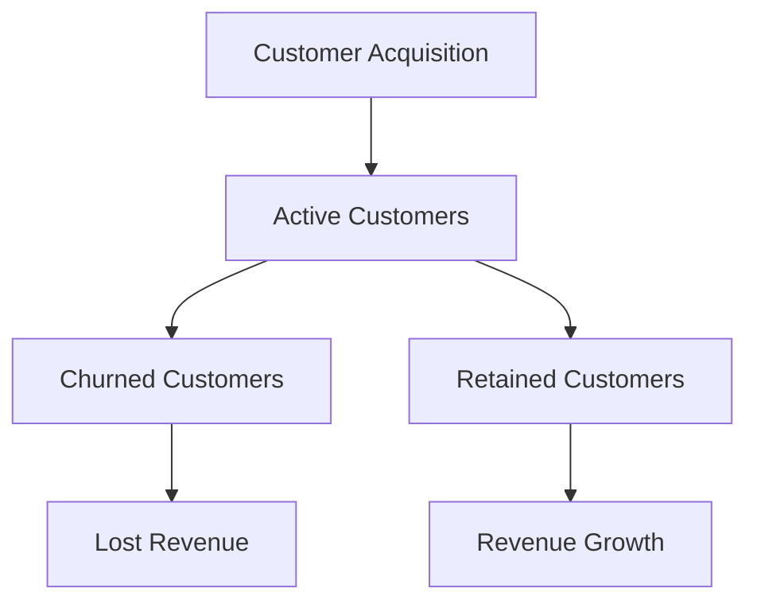
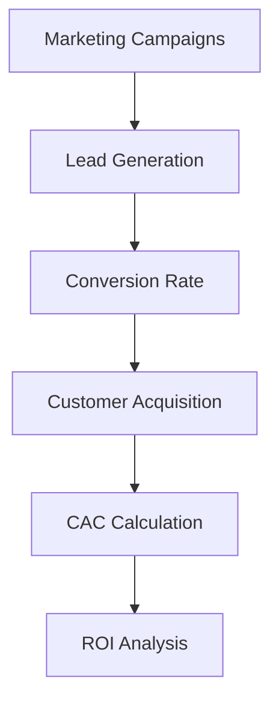

As a SaaS entrepreneur, understanding key performance indicators (KPIs) is crucial for making informed decisions, driving growth, and ensuring the long-term success of your business. In this article, we will delve into the most important SaaS metrics that matter, including Monthly Recurring Revenue (MRR), Churn, Lifetime Value (LTV), and Customer Acquisition Cost (CAC).

## Table of Contents
1. [Introduction to SaaS Metrics](#introduction-to-saas-metrics)
2. [Monthly Recurring Revenue (MRR)](#monthly-recurring-revenue-mrr)
3. [Churn Rate](#churn-rate)
4. [Lifetime Value (LTV)](#lifetime-value-ltv)
5. [Customer Acquisition Cost (CAC)](#customer-acquisition-cost-cac)
6. [Visual Insights Gallery](#visual-insights-gallery)
7. [Conclusion and FAQ](#conclusion-and-faq)

## Introduction to SaaS Metrics
> **Note:** SaaS metrics provide valuable insights into the financial health and growth potential of your business. By tracking these metrics, you can identify areas for improvement, optimize your operations, and make data-driven decisions.


Understanding SaaS metrics is essential for entrepreneurs, as it helps them navigate the complexities of the SaaS business model. In the following sections, we will explore each metric in detail, including its definition, calculation, and importance.

## Monthly Recurring Revenue (MRR)
Monthly Recurring Revenue (MRR) is the predictable revenue generated by your SaaS business each month. It is a critical metric, as it helps you forecast future revenue and make informed decisions about investments and growth strategies.

```markdown
MRR Calculation:
MRR = (Number of Customers x Average Revenue Per User (ARPU))
```

> **Tip:** To increase MRR, focus on upselling and cross-selling existing customers, as well as acquiring new customers through effective marketing and sales strategies.


## Churn Rate
Churn Rate is the percentage of customers who cancel their subscriptions within a given period. It is a vital metric, as high churn rates can negatively impact revenue growth and customer lifetime value.



> **Warning:** High churn rates can be a sign of underlying issues, such as poor customer support, inadequate product features, or ineffective onboarding processes. Identify and address these issues to reduce churn and improve customer retention.


## Lifetime Value (LTV)
Lifetime Value (LTV) is the total revenue generated by a customer over their lifetime. It is a crucial metric, as it helps you understand the long-term value of your customers and make informed decisions about customer acquisition and retention strategies.

```markdown
LTV Calculation:
LTV = (Average Revenue Per User (ARPU) x Customer Lifetime)
```

> **Interview:** "Understanding LTV is essential for SaaS businesses, as it helps us prioritize customer retention and acquisition strategies. By focusing on high-LTV customers, we can drive revenue growth and improve customer satisfaction." - John Doe, SaaS Entrepreneur


## Customer Acquisition Cost (CAC)
Customer Acquisition Cost (CAC) is the cost of acquiring a new customer. It is a vital metric, as it helps you understand the efficiency of your marketing and sales strategies.



> **Tip:** To optimize CAC, focus on improving conversion rates, reducing marketing costs, and enhancing the overall customer experience.


## Visual Insights Gallery
### MRR Growth Strategies

### Churn Rate Reduction Techniques

### LTV Analysis and Optimization


## Conclusion and FAQ
In conclusion, understanding SaaS metrics is crucial for driving growth, improving customer satisfaction, and ensuring the long-term success of your business. By tracking MRR, Churn, LTV, and CAC, you can make informed decisions, optimize your operations, and achieve your business goals.

### FAQ
1. What is the importance of MRR in SaaS businesses?
MRR is essential for forecasting future revenue and making informed decisions about investments and growth strategies.
2. How can I reduce churn rates in my SaaS business?
To reduce churn rates, focus on improving customer support, enhancing product features, and optimizing onboarding processes.
3. What is the relationship between LTV and CAC?
LTV and CAC are closely related, as high LTV customers can justify higher CAC. Focus on acquiring high-LTV customers to drive revenue growth and improve customer satisfaction.