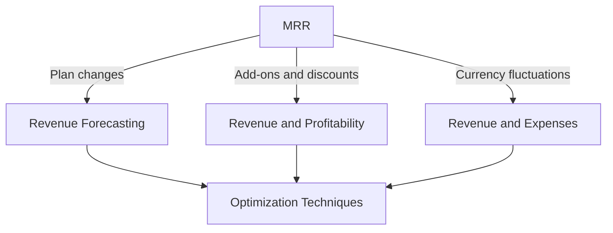
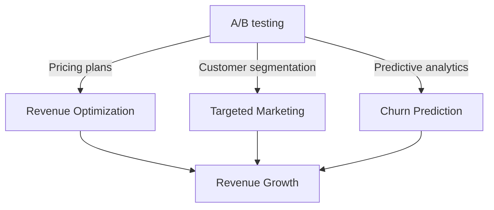

## Introduction to Advanced SaaS Metrics
As a SaaS entrepreneur, understanding advanced SaaS metrics is crucial for optimizing your business, identifying edge cases, and making data-driven decisions. In this article, we will explore advanced topics related to Monthly Recurring Revenue (MRR), Churn, Lifetime Value (LTV), and Customer Acquisition Cost (CAC), including edge cases, architecture, and optimization techniques.

## Edge Cases in SaaS Metrics
Edge cases are unusual or exceptional scenarios that can significantly impact your SaaS business. Understanding these edge cases is essential for developing a robust and scalable business model. Some common edge cases in SaaS metrics include:

* **Plan changes**: When customers upgrade or downgrade their plans, it can affect MRR and revenue forecasting.
* **Add-ons and discounts**: Offering add-ons or discounts can impact revenue and profitability.
* **Currency fluctuations**: Changes in currency exchange rates can affect revenue and expenses.

### Mermaid.js Diagram: Edge Cases in SaaS Metrics

## Architecture for SaaS Metrics
A well-designed architecture is essential for tracking and analyzing SaaS metrics. This includes:

* **Data warehousing**: Storing data in a centralized warehouse for easy access and analysis.
* **ETL (Extract, Transform, Load) processes**: Automating data extraction, transformation, and loading for efficient data management.
* **Data visualization tools**: Using tools like Tableau, Power BI, or D3.js to create interactive and informative dashboards.

## Optimization Techniques for SaaS Metrics
Optimizing SaaS metrics is crucial for improving revenue, reducing churn, and increasing customer satisfaction. Some optimization techniques include:

* **A/B testing**: Testing different pricing plans, features, or marketing strategies to identify the most effective approach.
* **Customer segmentation**: Segmenting customers based on behavior, demographics, or firmographics to develop targeted marketing campaigns.
* **Predictive analytics**: Using machine learning algorithms to predict customer churn, revenue, and other key metrics.

### Mermaid.js Diagram: Optimization Techniques for SaaS Metrics

## Real-World Case Studies
Real-world case studies can provide valuable insights into the application of advanced SaaS metrics. For example:

* **Zoom**: Zoom, a video conferencing platform, used data analytics to optimize its pricing plans and reduce churn.
* **Slack**: Slack, a team collaboration platform, used customer segmentation to develop targeted marketing campaigns and improve customer satisfaction.

## Visual Insights Gallery
### MRR Growth Rate

### Churn Rate Analysis

### LTV to CAC Ratio

## Conclusion and FAQ
In conclusion, advanced SaaS metrics are essential for optimizing your business, identifying edge cases, and making data-driven decisions. By understanding edge cases, architecture, and optimization techniques, you can improve revenue, reduce churn, and increase customer satisfaction.