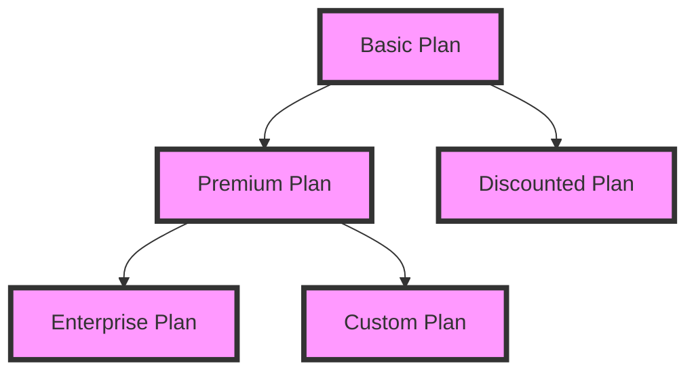

As a SaaS founder, reaching your first customer is a significant milestone, but it's just the beginning. The real challenge lies in scaling your business to achieve substantial revenue growth. In this article, we'll explore the strategies and tactics required to take your SaaS from its initial traction to $100,000 in monthly recurring revenue (MRR).

## Table of Contents
1. [Understanding Your Customer Acquisition Funnel](#understanding-your-customer-acquisition-funnel)
2. [Building a Scalable Sales Process](#building-a-scalable-sales-process)
3. [Optimizing Your Pricing Strategy](#optimizing-your-pricing-strategy)
4. [Delivering Exceptional Customer Experience](#delivering-exceptional-customer-experience)
5. [Measuring and Analyzing Performance](#measuring-and-analyzing-performance)

## Understanding Your Customer Acquisition Funnel

To scale your SaaS, it's essential to understand your customer acquisition funnel. This includes awareness, interest, consideration, and conversion. By analyzing each stage, you can identify bottlenecks and optimize your marketing and sales efforts.

## Building a Scalable Sales Process

A scalable sales process is critical to achieving high MRR. This involves streamlining your sales cycle, leveraging automation, and ensuring consistent communication with leads and customers.

> **Tip:** Implement a sales CRM to track interactions, manage pipelines, and analyze performance.

## Optimizing Your Pricing Strategy

Your pricing strategy plays a significant role in scaling your SaaS. It's essential to balance revenue goals with customer affordability and perceived value. Consider tiered pricing, discounts for long-term commitments, and flexible plans to accommodate different customer segments.

## Delivering Exceptional Customer Experience

Providing an exceptional customer experience is vital to retaining customers, reducing churn, and driving revenue growth. Focus on delivering high-quality support, continuously gathering feedback, and iterating on your product to meet evolving customer needs.

> **Warning:** Neglecting customer experience can lead to high churn rates, negative reviews, and significant revenue loss.

## Measuring and Analyzing Performance

To scale your SaaS effectively, it's crucial to measure and analyze key performance metrics, such as customer acquisition cost, customer lifetime value, and monthly recurring revenue. Use data-driven insights to inform strategic decisions, optimize operations, and drive growth.

| Metric | Description | Target |
| --- | --- | --- |
| CAC | Customer acquisition cost | ≤ $100 |
| CLV | Customer lifetime value | ≥ $1,000 |
| MRR | Monthly recurring revenue | ≥ $100,000 |

## Visual Insights Gallery

## Summary/Conclusion
Scaling your SaaS from the first customer to $100,000 in MRR requires a deep understanding of your customer acquisition funnel, a scalable sales process, an optimized pricing strategy, exceptional customer experience, and data-driven decision-making. By focusing on these key areas and continuously iterating on your approach, you can achieve substantial revenue growth and establish a successful SaaS business.

## FAQ
Q: What is the most critical factor in scaling a SaaS business?
A: Understanding your customer acquisition funnel and optimizing your sales process are crucial to scaling a SaaS business.
Q: How do I determine the optimal pricing strategy for my SaaS?
A: Analyze your target market, competition, and customer segments to determine the optimal pricing strategy for your SaaS.
Q: What is the importance of delivering exceptional customer experience in SaaS?
A: Delivering exceptional customer experience is vital to retaining customers, reducing churn, and driving revenue growth in SaaS.