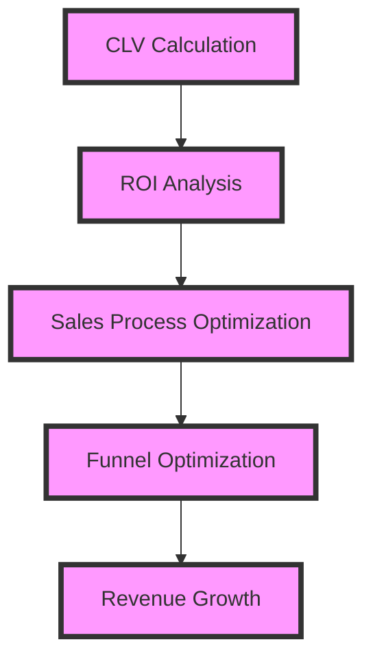
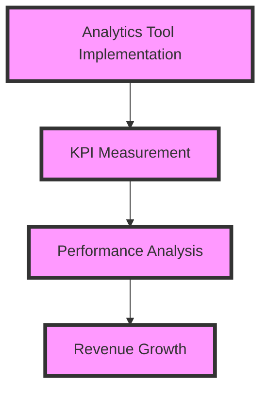

## Part 2: Advanced Strategies for Scaling Your SaaS to $100k MRR

In the first part of this series, we explored the foundational strategies for scaling your SaaS from its initial traction to $100,000 in monthly recurring revenue (MRR). In this article, we'll delve into advanced edge-cases and deeper architecture, providing you with the expertise to overcome complex challenges and achieve substantial revenue growth.

## Advanced Customer Acquisition Funnel Optimization
To further optimize your customer acquisition funnel, it's essential to analyze advanced metrics and implement data-driven decisions. This includes calculating your customer lifetime value (CLV), measuring your return on investment (ROI) for each marketing channel, and identifying areas for improvement in your sales process.

## Building a Predictive Sales Process
A predictive sales process leverages data and analytics to forecast sales performance and identify areas for improvement. This includes implementing sales forecasting tools, analyzing sales metrics, and developing a sales strategy based on data-driven insights.

By building a predictive sales process, you can optimize your sales efforts, reduce uncertainty, and achieve more accurate sales forecasts.

## Advanced Pricing Strategy Optimization
Optimizing your pricing strategy is critical to achieving substantial revenue growth. This includes analyzing your pricing tiers, measuring the effectiveness of your pricing strategy, and identifying areas for improvement.

## Delivering Exceptional Customer Experience at Scale
Delivering exceptional customer experience is critical to achieving substantial revenue growth. This includes implementing customer success programs, measuring customer satisfaction, and identifying areas for improvement.

By delivering exceptional customer experience, you can increase customer loyalty, reduce churn, and achieve more substantial revenue growth.

## Measuring and Analyzing Performance at Scale
Measuring and analyzing performance is critical to achieving substantial revenue growth. This includes implementing analytics tools, measuring key performance indicators (KPIs), and identifying areas for improvement.

## Visual Insights Gallery
The following images provide additional insights into advanced strategies for scaling your SaaS to $100k MRR:
* 
* 
* 