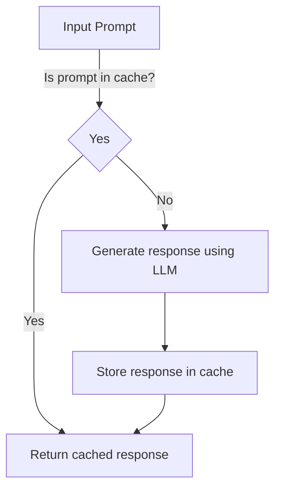
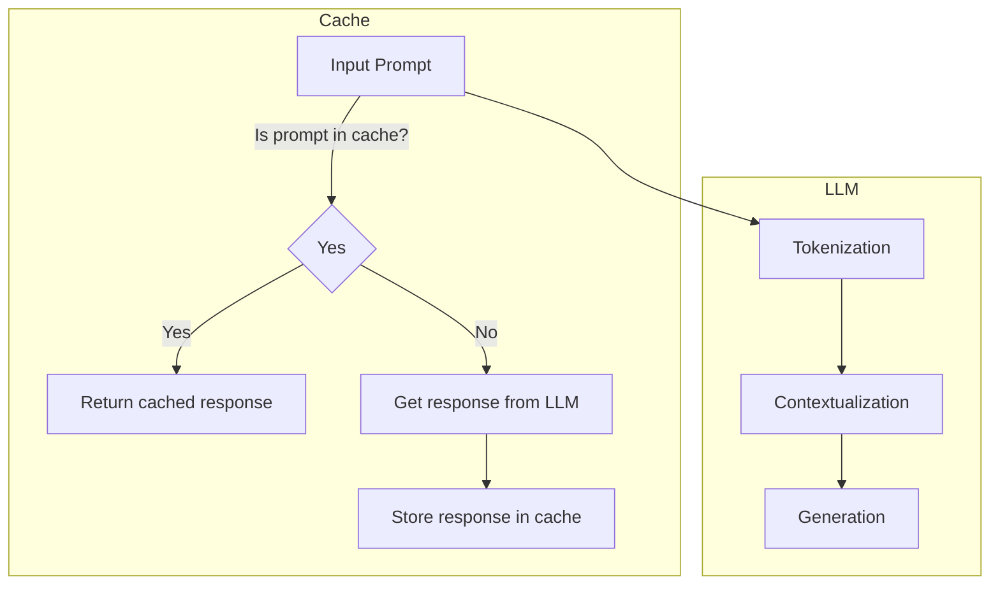

A large language model (LLM) can generate human-like text based on the input it receives, but its performance can be hindered by slower response times. Implementing a semantic cache can significantly improve the efficiency of LLMs by storing and reusing previously computed results.

## Introduction to Semantic Caching
Semantic caching is a technique used to store the results of expensive function calls and return the cached result when the same inputs occur again. This approach is particularly useful for LLMs, which often rely on complex computations to generate responses.


## Understanding LLM Response Generation
LLMs generate responses based on the input prompt, context, and their training data. The response generation process involves several steps, including:
1. **Tokenization**: breaking down the input prompt into individual tokens.
2. **Contextualization**: generating contextualized representations of the input tokens.
3. **Generation**: generating the response based on the contextualized representations.
```python
import torch
from transformers import AutoModelForSeq2SeqLM, AutoTokenizer

# Initialize the model and tokenizer
model = AutoModelForSeq2SeqLM.from_pretrained("t5-base")
tokenizer = AutoTokenizer.from_pretrained("t5-base")

# Define a function to generate a response
def generate_response(prompt):
    # Tokenize the input prompt
    inputs = tokenizer(prompt, return_tensors="pt")
    
    # Generate the response
    outputs = model.generate(**inputs)
    
    # Decode the response
    response = tokenizer.decode(outputs[0], skip_special_tokens=True)
    
    return response
```

## Implementing a Semantic Cache
To implement a semantic cache for LLMs, you can use a dictionary to store the input prompts and their corresponding responses. When a new input prompt is received, the cache is checked to see if a response already exists. If a response is found, it is returned immediately; otherwise, the LLM generates a new response, which is then stored in the cache.
```python
class SemanticCache:
    def __init__(self):
        self.cache = {}
        
    def get_response(self, prompt):
        if prompt in self.cache:
            return self.cache[prompt]
        else:
            response = generate_response(prompt)
            self.cache[prompt] = response
            return response
```
> **Note:** The `generate_response` function is used to generate a response when a prompt is not found in the cache.

## Flow Diagram of Semantic Cache Implementation


## Architecture of Semantic Cache Implementation


## Visual Insights Gallery
## Visual Insights Gallery


## Summary/Conclusion
In this article, we explored the concept of semantic caching and its application to large language models. By implementing a semantic cache, we can significantly improve the efficiency of LLMs by storing and reusing previously computed results. This approach can lead to faster response times and improved overall performance.

## FAQ
1. **What is semantic caching?**
   - Semantic caching is a technique used to store the results of expensive function calls and return the cached result when the same inputs occur again.
2. **How does semantic caching improve LLM performance?**
   - Semantic caching improves LLM performance by reducing the number of times the LLM needs to generate a response from scratch, resulting in faster response times.
3. **What are the benefits of using a semantic cache?**
   - The benefits of using a semantic cache include improved response times, reduced computational overhead, and increased efficiency.