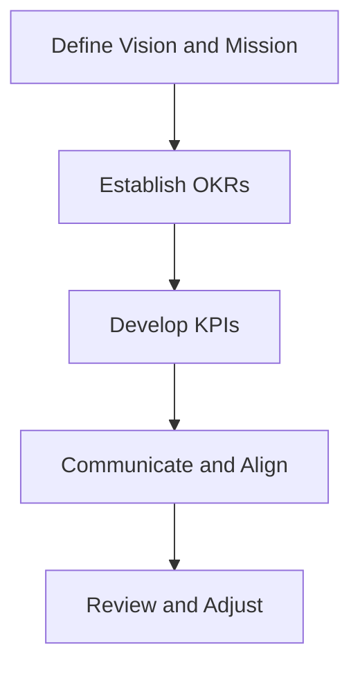

In the fast-paced world of engineering organizations, setting clear goals is crucial for success. Without a clear direction, teams can become lost, and efforts can be scattered. This is where OKRs (Objectives and Key Results) and KPIs (Key Performance Indicators) come in – two powerful tools that help engineering organizations stay focused and achieve their objectives.

## Table of Contents
1. [Introduction to OKRs and KPIs](#introduction-to-okrs-and-kpis)
2. [Understanding OKRs](#understanding-okrs)
3. [Understanding KPIs](#understanding-kpis)
4. [Implementing OKRs and KPIs in Engineering Orgs](#implementing-okrs-and-kpis-in-engineering-orgs)
5. [Best Practices for Setting OKRs and KPIs](#best-practices-for-setting-okrs-and-kpis)
6. [Visual Insights Gallery](#visual-insights-gallery)
7. [Conclusion](#conclusion)
8. [FAQ](#faq)

## Introduction to OKRs and KPIs

OKRs and KPIs are two essential components of a goal-setting framework. OKRs help define what needs to be achieved, while KPIs measure progress toward those objectives. By using OKRs and KPIs together, engineering organizations can create a clear roadmap for success.

> **Note:** OKRs and KPIs are not mutually exclusive. In fact, they complement each other, with OKRs providing the "what" and KPIs providing the "how."

## Understanding OKRs

OKRs is a goal-setting framework used by teams and individuals to define and track objectives and their measurable outcomes. The framework consists of two parts:
* **Objectives**: Concise, inspirational, and challenging statements that define what needs to be achieved.
* **Key Results**: Quantifiable and measurable outcomes that indicate progress toward the objective.

```markdown
### Example of an OKR
Objective: Improve Customer Satisfaction
Key Results:
- Increase customer retention rate by 20% within the next 6 months
- Reduce average response time to customer inquiries by 30% within the next 3 months
```

## Understanding KPIs

KPIs are quantifiable measures used to evaluate the success of an organization, employee, or process in achieving its objectives. KPIs provide a way to measure progress, identify areas for improvement, and make data-driven decisions.

```markdown
### Example of a KPI
KPI: Customer Retention Rate
Description: The percentage of customers who continue to use the product or service over a given period.
Target: 85%
```

## Implementing OKRs and KPIs in Engineering Orgs

Implementing OKRs and KPIs in engineering organizations requires a structured approach. The following steps can help:
1. **Define the vision and mission**: Clearly articulate the organization's purpose, values, and long-term goals.
2. **Establish OKRs**: Set objectives and key results that align with the organization's vision and mission.
3. **Develop KPIs**: Create key performance indicators that measure progress toward the OKRs.
4. **Communicate and align**: Share the OKRs and KPIs with the team, and ensure everyone understands their role in achieving the objectives.



## Best Practices for Setting OKRs and KPIs

To get the most out of OKRs and KPIs, follow these best practices:
* **Make OKRs ambitious and inspirational**: Challenge the team to achieve something significant.
* **Keep KPIs simple and relevant**: Focus on a few key metrics that truly matter.
* **Regularly review and adjust**: Continuously evaluate progress and make adjustments as needed.


## Visual Insights Gallery


## Conclusion
Setting clear goals is essential for engineering organizations to achieve success. By using OKRs and KPIs together, teams can create a roadmap for success and stay focused on what matters most. Remember to make OKRs ambitious and inspirational, keep KPIs simple and relevant, and regularly review and adjust to ensure continuous progress.

## FAQ
1. **What is the difference between OKRs and KPIs?**
OKRs define what needs to be achieved, while KPIs measure progress toward those objectives.
2. **How often should OKRs and KPIs be reviewed and adjusted?**
Regularly, ideally on a quarterly basis, to ensure continuous progress and alignment with the organization's vision and mission.
3. **Can OKRs and KPIs be used together?**
Yes, OKRs and KPIs complement each other, with OKRs providing the "what" and KPIs providing the "how."