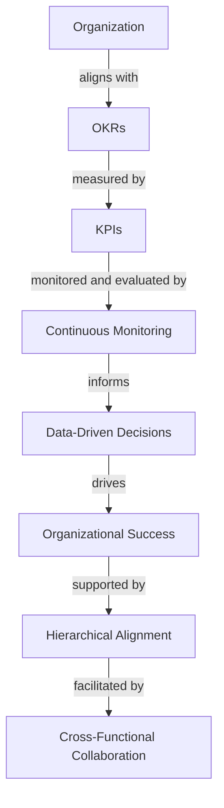

## Introduction to Advanced OKRs and KPIs

In the first part of this series, we explored the fundamentals of OKRs and KPIs for engineering organizations. Now, we'll delve into the advanced concepts, edge cases, and architectural considerations for implementing these goal-setting frameworks.

## Edge Cases in OKRs and KPIs
When implementing OKRs and KPIs, engineering organizations may encounter various edge cases that require special consideration. These include:
* **Conflicting Objectives**: When multiple teams or departments have conflicting objectives, it's essential to prioritize and align them to ensure overall organizational success.
* **Measuring Intangible Outcomes**: When outcomes are intangible or difficult to measure, it's crucial to establish proxy metrics or alternative evaluation methods.
* **Dealing with Uncertainty**: In situations where uncertainty is high, OKRs and KPIs must be adaptable and flexible to accommodate changing circumstances.

## Architecting OKRs and KPIs for Scalability
To ensure the long-term success of OKRs and KPIs, engineering organizations must architect their implementation for scalability. This involves:
* **Hierarchical Alignment**: Aligning OKRs and KPIs across different levels of the organization, from individual contributors to executive leadership.
* **Cross-Functional Collaboration**: Fostering collaboration between teams and departments to ensure that OKRs and KPIs are aligned and supportive of overall organizational goals.
* **Continuous Monitoring and Evaluation**: Regularly monitoring and evaluating OKRs and KPIs to identify areas for improvement and make data-driven decisions.

### Mermaid.js Diagram: OKRs and KPIs Architecture

## Real-World Applications of Advanced OKRs and KPIs
Several organizations have successfully implemented advanced OKRs and KPIs to drive their engineering teams' success. For example:
* **Google**: Uses OKRs to set ambitious, inspiring objectives that align with the company's overall mission and vision.
* **Amazon**: Employs a robust KPI framework to measure progress toward its objectives, using metrics such as customer satisfaction and revenue growth.
* **Microsoft**: Has implemented a hybrid approach, combining OKRs and KPIs to drive its engineering teams' success and align with the company's overall strategy.

## Best Practices for Advanced OKRs and KPIs
When implementing advanced OKRs and KPIs, engineering organizations should follow these best practices:
* **Establish Clear Goals and Objectives**: Ensure that OKRs and KPIs are aligned with the organization's overall mission, vision, and strategy.
* **Foster a Culture of Transparency and Accountability**: Encourage open communication and transparency across teams and departments to ensure that everyone is working toward the same objectives.
* **Continuously Monitor and Evaluate**: Regularly review and assess OKRs and KPIs to identify areas for improvement and make data-driven decisions.

## Visual Insights Gallery
To further illustrate the concepts and best practices discussed in this article, we've included the following visual insights:
* 
* 
* 

## Conclusion
In this article, we've explored the advanced concepts of OKRs and KPIs, including edge cases, architecture, and real-world applications. By following the best practices and guidelines outlined here, engineering organizations can create a robust goal-setting framework that drives success and aligns with their overall strategy.

## FAQ
For additional information and answers to frequently asked questions, please refer to our FAQ section.

## Visual Insights Gallery
### Image 1: OKRs and KPIs Alignment

### Image 2: Cross-Functional Collaboration

### Image 3: Continuous Monitoring and Evaluation
