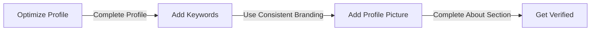
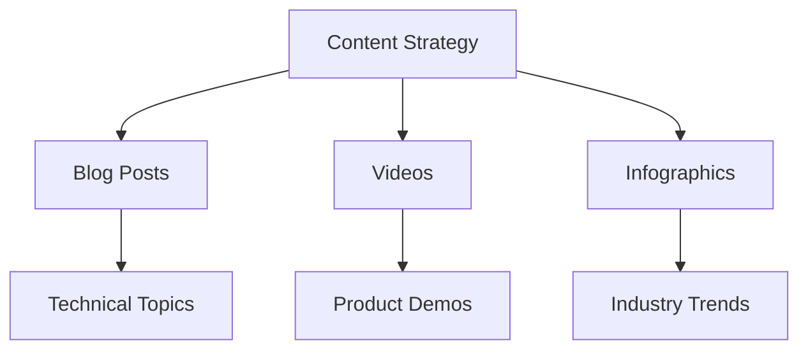

In today's digital landscape, having a strong online presence is crucial for any brand, especially those in the technical industry. LinkedIn, with its over 700 million users, offers a unique opportunity for technical brands to establish themselves as thought leaders, build their professional network, and drive business growth. In this article, we'll delve into the strategies and best practices for growing a technical brand on LinkedIn.

## Table of Contents
1. [Introduction to LinkedIn Marketing](#introduction-to-linkedin-marketing)
2. [Optimizing Your LinkedIn Profile](#optimizing-your-linkedin-profile)
3. [Content Strategy for Technical Brands](#content-strategy-for-technical-brands)
4. [Engagement and Community Building](#engagement-and-community-building)
5. [Measuring Success and Analytics](#measuring-success-and-analytics)

## Introduction to LinkedIn Marketing

LinkedIn marketing is a subset of social media marketing focused specifically on the LinkedIn platform. It involves creating and sharing content, engaging with your audience, and using LinkedIn's advertising capabilities to reach your target audience. For technical brands, LinkedIn offers a unique opportunity to connect with professionals and businesses in their industry.

```markdown
### Benefits of LinkedIn Marketing for Technical Brands
- Establish thought leadership
- Build professional network
- Drive business growth
- Targeted advertising
```

## Optimizing Your LinkedIn Profile

Your LinkedIn profile is the first point of contact for many potential customers, partners, and employees. Optimizing your profile is crucial to making a good impression and establishing your brand identity.

> **Tip:** Use keywords relevant to your industry in your profile to improve visibility in LinkedIn searches.



## Content Strategy for Technical Brands

Your content strategy should be tailored to your target audience and aligned with your business goals. For technical brands, this often involves creating informative, educational content that showcases their expertise and provides value to their audience.



## Engagement and Community Building

Engagement and community building are critical components of a successful LinkedIn marketing strategy. This involves responding to comments and messages, participating in relevant groups, and creating content that encourages engagement.

> **Note:** Use LinkedIn's polling feature to spark conversations and gather feedback from your audience.

## Measuring Success and Analytics

To measure the success of your LinkedIn marketing efforts, you need to track key metrics such as engagement rates, website traffic, and lead generation.

```markdown
### Key Metrics to Track
- Engagement rate
- Website traffic
- Lead generation
- Conversion rate
```

## Visual Insights Gallery


## Summary/Conclusion
Growing a technical brand on LinkedIn requires a strategic approach to profile optimization, content creation, engagement, and analytics. By following the best practices outlined in this article, technical brands can establish themselves as thought leaders, build their professional network, and drive business growth.

## FAQ
1. **What is the best way to optimize my LinkedIn profile?**
Optimizing your LinkedIn profile involves completing your profile, adding keywords, using consistent branding, and adding a profile picture.
2. **What type of content should I create for my technical brand?**
Your content strategy should be tailored to your target audience and aligned with your business goals. This often involves creating informative, educational content that showcases your expertise and provides value to your audience.
3. **How do I measure the success of my LinkedIn marketing efforts?**
To measure the success of your LinkedIn marketing efforts, you need to track key metrics such as engagement rates, website traffic, and lead generation.