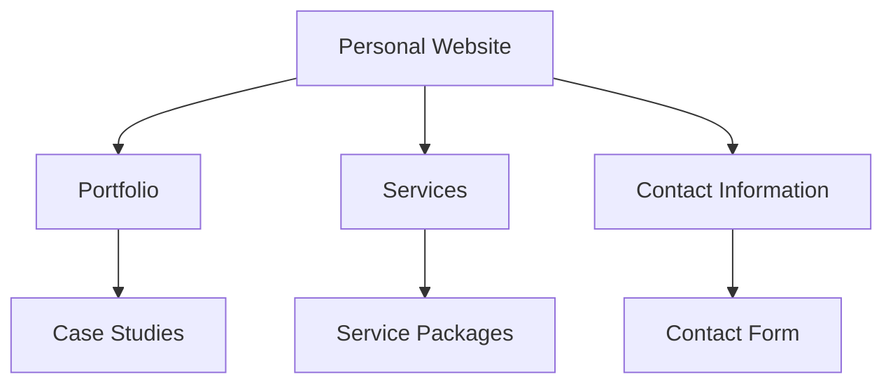
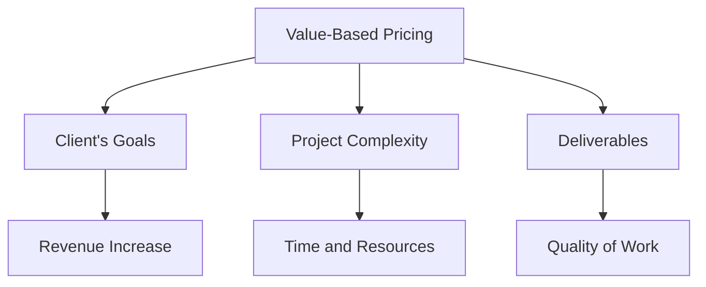

# The $100k Freelancer Blueprint: Moving from Upwork to Direct Clients
As a freelancer, making the leap from freelance platforms like Upwork to working directly with high-paying clients can be a game-changer. Not only can it significantly increase your earnings, but it also allows for more flexibility, better project selection, and the potential to build long-term relationships with clients. However, successfully transitioning requires a strategic approach. In this article, we'll outline the blueprint for achieving $100,000 or more as a freelancer by moving beyond platforms and securing direct clients.

## Table of Contents
1. [Understanding Your Value Proposition](#understanding-your-value-proposition)
2. [Building a Professional Online Presence](#building-a-professional-online-presence)
3. [Developing a Client Acquisition Strategy](#developing-a-client-acquisition-strategy)
4. [Pricing Strategies for High-Paying Clients](#pricing-strategies-for-high-paying-clients)
5. [Effective Client Management](#effective-client-management)
6. [Scaling Your Freelance Business](#scaling-your-freelance-business)

## Understanding Your Value Proposition

Before making the transition, it's crucial to understand what sets you apart from others in your field. Your value proposition is essentially the unique benefit that you offer to your clients. This could be expertise in a specific area, the ability to deliver high-quality work quickly, or excellent communication skills. Identifying your strengths and what problems you can solve for clients is key to attracting and retaining high-paying clients.

```markdown
### Identifying Your Unique Selling Points (USPs)
- **Expertise**: Highlight any specialized knowledge or certifications.
- **Experience**: Showcase past projects, especially those with successful outcomes.
- **Testimonials**: Use feedback from previous clients to demonstrate your reliability and quality of work.
```

## Building a Professional Online Presence

Having a professional online presence is vital for attracting direct clients. This typically starts with a personal website that showcases your portfolio, services, and contact information. Ensure that your website is modern, easy to navigate, and optimized for search engines (SEO).



## Developing a Client Acquisition Strategy

Acquiring direct clients involves proactive outreach, networking, and sometimes, a bit of creativity. Strategies can include attending industry events, leveraging social media for professional networking, and offering free consultations to potential clients.

```markdown
### Strategies for Client Acquisition
| Strategy | Description |
| --- | --- |
| Networking | Attend conferences, join professional groups. |
| Social Media | Utilize LinkedIn, Twitter for professional networking. |
| Free Consultations | Offer initial consultations to demonstrate expertise. |
```

## Pricing Strategies for High-Paying Clients

Pricing your services correctly is crucial when targeting high-paying clients. It's essential to understand the value you bring to the client and price your services accordingly. Consider using a value-based pricing model, where the price is determined by the value the client receives from your work.



## Effective Client Management

Managing clients effectively is key to retaining them and securing referrals. This involves clear communication, setting realistic expectations, and delivering high-quality work on time. Tools like project management software can help streamline the process.

```markdown
### Best Practices for Client Management
- **Clear Communication**: Regular updates and open channels.
- **Project Management Tools**: Utilize tools like Trello, Asana for organization.
- **Feedback Loops**: Encourage and act on client feedback.
```

## Scaling Your Freelance Business

As your freelance business grows, you may need to scale your operations to handle more clients and larger projects. This could involve outsourcing certain tasks, hiring other freelancers to work with you, or investing in more advanced tools and software.

## Visual Insights Gallery
### Freelance Workspace

### Professional Networking

### Client Meeting


## Summary/Conclusion
Transitioning from freelance platforms to working directly with high-paying clients requires a thoughtful and strategic approach. By understanding your value proposition, building a professional online presence, developing a client acquisition strategy, pricing your services effectively, managing clients well, and scaling your business as needed, you can achieve your goal of becoming a $100,000 freelancer.

## FAQ
- **Q: How long does it take to transition from freelance platforms to direct clients?**
  A: The transition time can vary significantly depending on your current network, the demand for your services, and how aggressively you pursue direct clients.
- **Q: What are the most effective strategies for acquiring direct clients?**
  A: Effective strategies include professional networking, offering free consultations, and leveraging social media for professional outreach.
- **Q: How do I determine my pricing for high-paying clients?**
  A: Consider using a value-based pricing model that takes into account the value your work brings to the client, the complexity of the project, and the quality of deliverables.