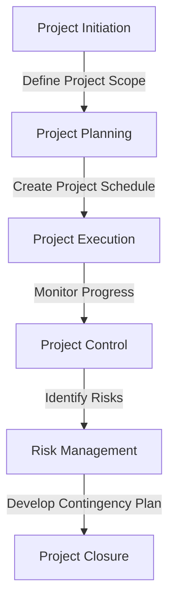

# Advanced Strategies for Achieving $100k as a Freelancer
In our previous article, we outlined the foundation for transitioning from freelance platforms like Upwork to working directly with high-paying clients. However, as you progress in your journey, you'll encounter more complex challenges that require advanced strategies. In this part, we'll dive into edge-cases, deeper architecture, and real-world case studies to help you overcome these obstacles and achieve $100,000 or more as a freelancer.

## Advanced Client Acquisition Techniques

To attract high-paying clients, you need to develop advanced client acquisition techniques. This includes leveraging your existing network, utilizing content marketing, and employing account-based marketing strategies. By doing so, you can increase your visibility, establish thought leadership, and attract potential clients who are willing to pay premium rates for your services.

## Deep Dive into Pricing Strategies

Pricing is a critical aspect of freelancing, and it's essential to develop a deep understanding of the market and your competitors. By analyzing market trends, competitor pricing, and the value you bring to clients, you can create a pricing strategy that reflects your worth and attracts high-paying clients.

## Advanced Project Management Techniques

Effective project management is crucial for delivering high-quality results and ensuring client satisfaction. By utilizing advanced project management techniques, such as agile methodologies and lean principles, you can streamline your workflow, reduce risks, and increase productivity.

## Real-World Case Studies

Let's take a look at some real-world case studies of freelancers who have successfully transitioned from Upwork to direct clients and achieved $100,000 or more in annual revenue. These case studies will provide valuable insights into the strategies and techniques that contributed to their success.

## Overcoming Common Obstacles

As a freelancer, you'll inevitably encounter obstacles that can hinder your progress. By developing a growth mindset, building a support network, and creating a contingency plan, you can overcome these challenges and stay focused on your goals.

## Visual Insights Gallery
## Visual Insights Gallery

