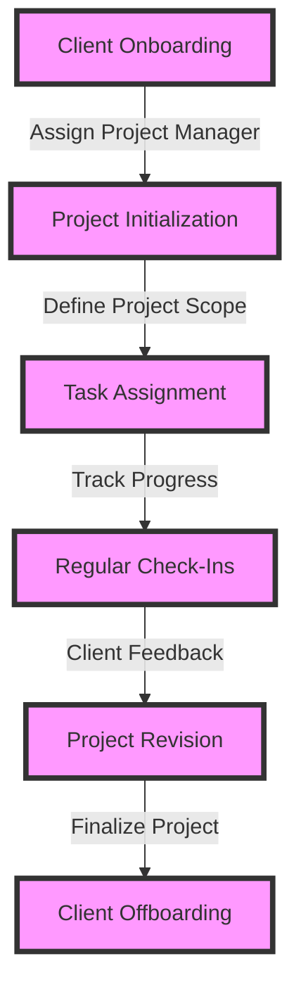

# Part 2: Advanced Strategies for Scaling a $100k Freelance Business
As a follow-up to our initial blueprint for achieving $100,000 or more as a freelancer by moving beyond platforms and securing direct clients, this article delves into advanced strategies for scaling your freelance business. We will explore edge cases, deeper architecture, and provide real-world case studies to help you navigate the complexities of high-end freelancing.

## Advanced Value Proposition Development

To further differentiate yourself in a competitive market, it's essential to continually refine and expand your value proposition. This involves conducting market research, analyzing competitor data, and identifying emerging trends in your industry. By doing so, you can tailor your services to meet the evolving needs of high-paying clients and stay ahead of the competition.

## Leveraging Technology for Efficient Client Management

Implementing efficient client management systems is critical for scaling your freelance business. This can involve leveraging technology such as project management tools, time tracking software, and client relationship management (CRM) systems. By streamlining your workflow and maintaining open communication channels, you can ensure high client satisfaction and increase the potential for repeat business and referrals.

## Navigating Complex Client Relationships

As you work with high-paying clients, you may encounter complex relationships involving multiple stakeholders, each with their own set of objectives and expectations. To navigate these situations effectively, it's essential to develop strong interpersonal skills, including active listening, conflict resolution, and negotiation. By doing so, you can build trust with your clients and facilitate successful project outcomes.

## Case Studies in Freelance Business Scaling
### Case Study 1: Scaling Through Specialization
A freelance developer specializing in artificial intelligence and machine learning was able to increase their earnings by 50% within a year by targeting high-paying clients in the tech industry. This was achieved through a combination of refining their value proposition, developing a strong online presence, and leveraging professional networks to secure referrals.

### Case Study 2: Scaling Through Strategic Partnerships
A freelance marketing consultant formed strategic partnerships with complementary service providers, such as designers and copywriters, to offer comprehensive solutions to clients. This approach enabled them to increase their project scope and earnings, while also providing more value to their clients.

## Visual Insights Gallery
### Image 1: Freelance Business Model Canvas

### Image 2: Client Acquisition Funnel

### Image 3: Freelance Project Management Workflow
