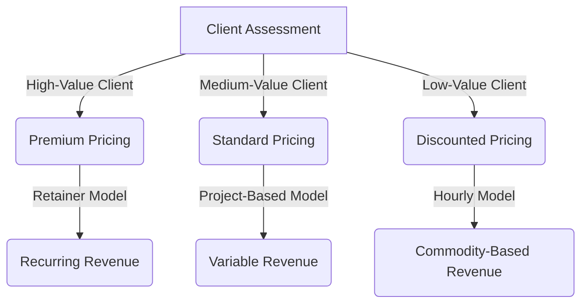

# Advanced Strategies for Scaling Your Freelance Business Beyond $100k
In the first part of this series, we explored the foundational elements of transitioning from freelance platforms to working directly with high-paying clients. Now, we'll delve into advanced strategies for scaling your freelance business beyond the $100,000 mark. This includes navigating complex client relationships, leveraging technology to streamline operations, and exploring new markets and services.

## Advanced Client Acquisition Strategies

To scale your business, you need to continually acquire new, high-paying clients. This requires a deep understanding of your target market, including their pain points, industry trends, and buying behaviors. Advanced client acquisition strategies involve leveraging data analytics, content marketing, and strategic networking to identify and pursue high-value opportunities.

## Leveraging Technology to Streamline Operations

As your business grows, so does the complexity of your operations. Leveraging technology, such as project management tools, time tracking software, and client relationship management (CRM) systems, can help streamline your workflow, improve productivity, and enhance the client experience.

## Navigating Complex Client Relationships

High-paying clients often come with complex relationships, involving multiple stakeholders, competing priorities, and high expectations. Navigating these relationships requires strong communication skills, emotional intelligence, and the ability to manage conflicting demands.

## Exploring New Markets and Services

To continue growing your business, you need to stay ahead of the curve and explore new markets and services. This might involve developing expertise in emerging technologies, pursuing international clients, or expanding your service offerings to meet evolving client needs.

## Advanced Pricing Strategies

```mermaid
flowchart TD
    A[Client Assessment] -->|High-Value Client| B(Premium Pricing)
    A -->|Medium-Value Client| C(Standard Pricing)
    A -->|Low-Value Client| D(Discounted Pricing)
    B -->|Retainer Model| E(Recurring Revenue)
    C -->|Project-Based Model| F(Variable Revenue)
    D -->|Hourly Model| G("Commodity-Based Revenue")
```
Advanced pricing strategies involve tailoring your pricing approach to the specific needs and value of each client. This might include premium pricing for high-value clients, standard pricing for medium-value clients, and discounted pricing for low-value clients. Additionally, you can explore different pricing models, such as retainer-based, project-based, or hourly-based, to optimize your revenue streams.

## Real-World Case Studies
### Case Study 1: Scaling a Freelance Writing Business
A freelance writer specializing in technology and software development was able to scale their business by leveraging content marketing, strategic networking, and advanced pricing strategies. By targeting high-value clients and offering premium services, they were able to increase their earnings by 50% within six months.

### Case Study 2: Expanding a Freelance Design Business into New Markets
A freelance designer specializing in user experience (UX) and user interface (UI) design was able to expand their business into new markets by developing expertise in emerging technologies, such as augmented reality (AR) and virtual reality (VR). By targeting clients in the gaming and entertainment industries, they were able to increase their earnings by 20% within three months.

## Visual Insights Gallery
### Image 1: Freelance Business Growth

### Image 2: Client Relationship Management

### Image 3: Emerging Technologies and Trends
