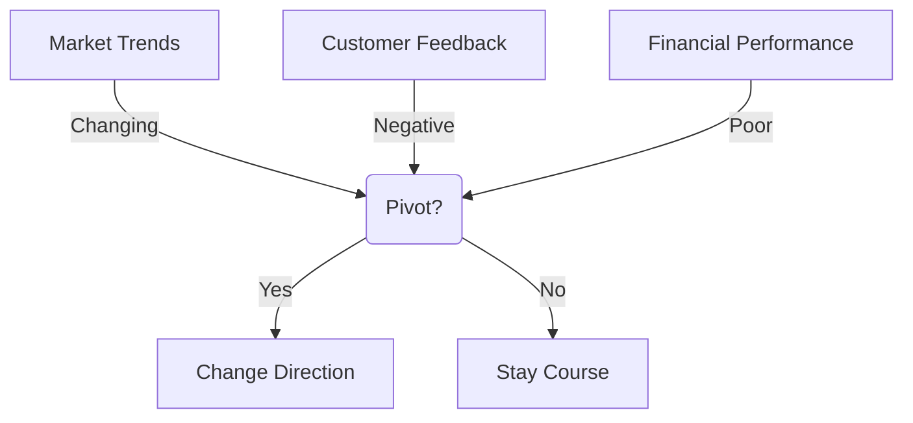
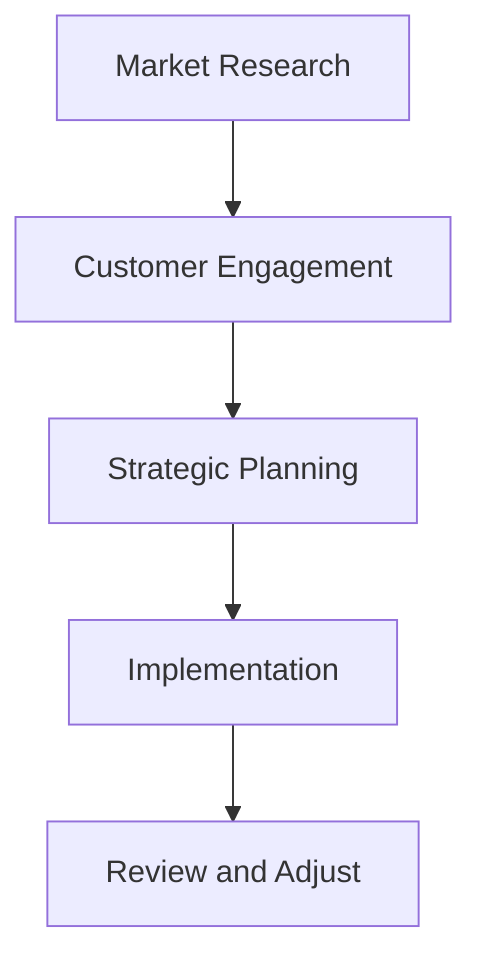

# The Art of Pivot: Knowing When to Change Direction
In the fast-paced and ever-changing world of startups and business, being able to adapt and pivot is crucial for success. Knowing when to change direction can be the difference between a company's survival and demise. In this article, we will delve into the art of pivot, exploring the signs that indicate it's time to change direction, strategies for successful pivoting, and the importance of maintaining a flexible mindset.

## Understanding the Pivot

A pivot in business refers to a significant change in direction or strategy. This can be in response to changes in the market, customer needs, or internal factors such as the company's mission or values. Pivoting can be a difficult and daunting task, but it can also be a necessary step towards growth and success.

## Signs That Indicate It's Time to Pivot

Some common signs that indicate it's time to pivot include:
- Changes in market trends or customer needs
- Negative customer feedback or poor sales
- Financial performance that is not meeting expectations
- A shift in the company's mission or values

## Strategies for Successful Pivoting

To successfully pivot, companies should:
- Conduct thorough market research to understand the new direction
- Engage with customers to validate the new strategy
- Develop a strategic plan for the pivot, including timelines and resource allocation
- Implement the new strategy, with a focus on flexibility and adaptability
- Continuously review and adjust the strategy as needed

## Maintaining a Flexible Mindset

Maintaining a flexible mindset is crucial for successful pivoting. This means being open to new ideas and perspectives, and being willing to adjust plans as circumstances change. Companies should foster a culture of flexibility and adaptability, encouraging employees to think creatively and be open to change.

## Overcoming the Challenges of Pivoting

| Challenge | Strategy |
| --- | --- |
| Resistance to Change | Communicate clearly with employees and stakeholders |
| Resource Constraints | Prioritize resource allocation and seek external support |
| Uncertainty | Develop a flexible plan and continuously review and adjust |

## Visual Insights Gallery
## Visual Insights Gallery

## Summary and Conclusion
In conclusion, knowing when to change direction is a critical skill for businesses and startups. By understanding the signs that indicate it's time to pivot, developing strategies for successful pivoting, and maintaining a flexible mindset, companies can navigate the challenges of change and come out stronger on the other side. Remember, pivoting is not a sign of failure, but rather a sign of adaptability and a willingness to grow and succeed.

## FAQ
Q: What is a pivot in business?
A: A pivot in business refers to a significant change in direction or strategy, often in response to changes in the market, customer needs, or internal factors.
Q: How do I know if it's time to pivot?
A: Common signs that indicate it's time to pivot include changes in market trends, negative customer feedback, poor financial performance, and a shift in the company's mission or values.
Q: What are the key components of a successful pivot?
A: The key components of a successful pivot include market research, customer engagement, strategic planning, implementation, and continuous review and adjustment.
Q: How can I maintain a flexible mindset during a pivot?
A: To maintain a flexible mindset, be open to new ideas and perspectives, and be willing to adjust plans as circumstances change. Foster a culture of flexibility and adaptability within your company.