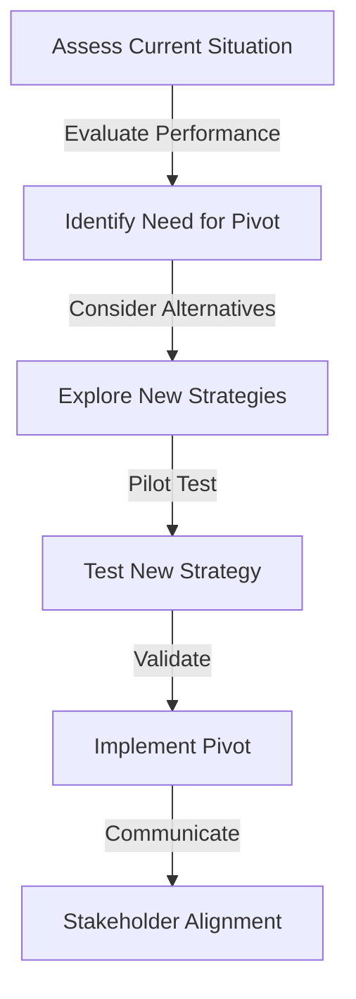

In the dynamic world of entrepreneurship and startups, adaptability is key to survival. One of the most crucial decisions a founder can make is knowing when to pivot their business strategy. Pivoting involves making significant changes to the direction or approach of your startup in response to new information, market conditions, or customer feedback. In this article, we'll delve into the art of pivoting, exploring when and how to make this critical decision.

## Understanding the Pivot

A pivot is not just a minor adjustment but a substantial shift in strategy that can make or break a startup. It requires a deep understanding of the market, customers, and the startup's own strengths and weaknesses. Recognizing the need for a pivot can be challenging, but there are several indicators that suggest it's time to re-evaluate your approach.

## Indicators for a Pivot
To determine if a pivot is necessary, consider the following factors:
- **Lack of Traction:** If your startup is not gaining the traction you anticipated, despite significant investment of time and resources.
- **Customer Feedback:** Consistent feedback from customers indicating that your product or service does not meet their needs as expected.
- **Market Shifts:** Changes in the market or industry that render your current strategy less effective or irrelevant.
- **Financial Constraints:** Financial struggles that could be alleviated by adjusting your business model or strategy.

```markdown
| Indicator | Description |
| --- | --- |
| Lack of Traction | Insufficient user engagement or sales |
| Customer Feedback | Repeated negative or constructive feedback |
| Market Shifts | Changes in industry trends or consumer behavior |
| Financial Constraints | Difficulty in sustaining operations financially |
```

## The Pivoting Process

Pivoting is not a one-size-fits-all solution. It involves a thorough analysis of your startup's current state, the reasons for the pivot, and the potential outcomes of the new strategy. Here is a step-by-step guide to the pivoting process:
1. **Assess Your Current Situation:** Evaluate your startup's performance, customer feedback, and market conditions.
2. **Identify the Need for a Pivot:** Determine if a pivot is necessary based on your assessment.
3. **Explore New Strategies:** Consider alternative approaches that could better align with your goals and market conditions.
4. **Test the New Strategy:** Pilot the new strategy to gauge its effectiveness before fully committing to it.
5. **Implement the Pivot:** Once the new strategy is validated, implement the pivot, ensuring all stakeholders are informed and aligned.



## Real-World Examples of Successful Pivots
> **Note:** Some of the most successful companies have pivoted at some point in their journey. For example, PayPal started as a platform for transferring money between PalmPilot devices before pivoting to online payments. Similarly, YouTube initially focused on video dating before shifting to a broader video-sharing platform.

## Overcoming the Challenges of Pivoting
> **Warning:** Pivoting can be risky and may not always lead to success. It's crucial to approach the pivot with a clear strategy, maintain open communication with your team and stakeholders, and be prepared for potential setbacks.

## Conclusion
Pivoting is an art that requires a combination of intuition, data-driven insights, and the courage to change course. By understanding the indicators for a pivot, following a structured pivoting process, and learning from real-world examples, entrepreneurs can navigate the challenges of pivoting and steer their startups toward success.

## Visual Insights Gallery


## Frequently Asked Questions
- **Q: What is pivoting in the context of startups?**
  A: Pivoting refers to the process of significantly changing the direction or strategy of a startup in response to new information, market conditions, or customer feedback.
- **Q: How do I know if my startup needs to pivot?**
  A: Indicators for a pivot include lack of traction, consistent negative customer feedback, market shifts, and financial constraints.
- **Q: What are the key steps in the pivoting process?**
  A: The pivoting process involves assessing your current situation, identifying the need for a pivot, exploring new strategies, testing the new strategy, implementing the pivot, and ensuring stakeholder alignment.