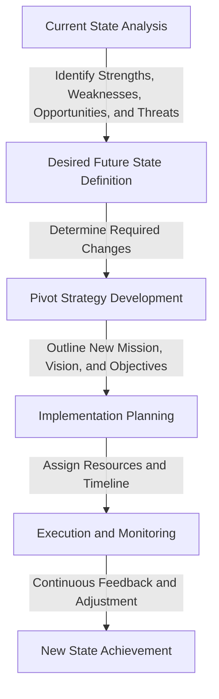

## Part 2: Advanced Pivoting Strategies - Navigating Complexities

In the ever-evolving landscape of entrepreneurship, mastering the art of pivoting is crucial for startups aiming to stay ahead of the curve. The first part of this series introduced the concept of pivoting, its importance, and key indicators that suggest a pivot is necessary. This follow-up article delves deeper into advanced pivoting strategies, exploring complex scenarios and providing insights into how startups can navigate these challenges effectively.

## Advanced Indicators for a Pivot
Beyond the basic indicators, there are more nuanced signs that may suggest a startup needs to pivot. These include:
- **Innovation Stall:** When a startup's innovation pipeline starts to dry up, and there's a lack of new ideas or significant improvements to existing products or services.
- **Talent Acquisition and Retention Challenges:** Difficulty in attracting or retaining top talent, which can be a sign of deeper issues with the company's mission, culture, or strategy.
- **Competitive Landscape Shifts:** Significant changes in the competitive landscape, such as new entrants, mergers, or acquisitions, that alter the dynamics of the market.

## Architecting a Pivot

Pivoting is not just about making a decision; it's about architecting a new path forward. This involves a thorough analysis of the startup's current state, the desired future state, and the steps needed to bridge the gap. The process can be visualized as follows:

This flowchart illustrates the systematic approach to pivoting, from analyzing the current state to executing and monitoring the new strategy.

## Case Studies in Pivoting
Real-world examples of successful pivots can provide valuable insights for startups facing similar challenges. For instance, PayPal started as a platform for transferring funds between PalmPilot devices but eventually pivoted to become an online payment system. Another example is Instagram, which began as a location-based app called Burbn but pivoted to focus on photo sharing.

## Overcoming Resistance to Change

One of the most significant challenges in pivoting is overcoming resistance to change within the organization. This can be addressed by:
- **Communicating Clearly:** Ensuring that all stakeholders understand the reasons behind the pivot and how it aligns with the company's overall vision.
- **Involving the Team:** Engaging the team in the pivoting process to foster a sense of ownership and commitment to the new direction.
- **Leading by Example:** Demonstrating a willingness to adapt and embrace change at the leadership level to inspire the rest of the organization.

## Visual Insights Gallery
Here are some additional visual insights related to pivoting strategies:
- 
- 
- 