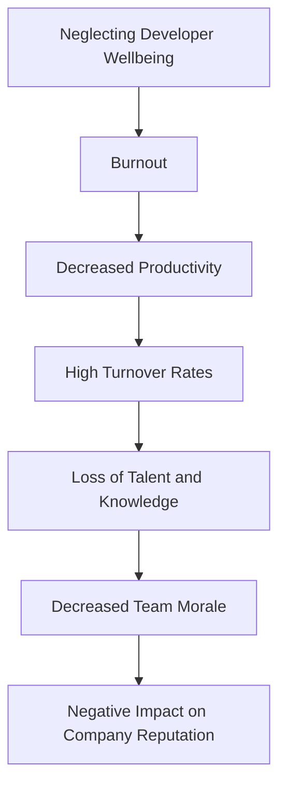
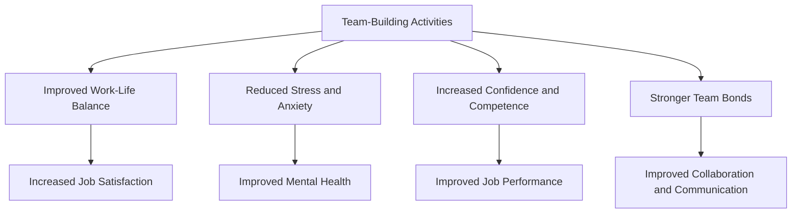
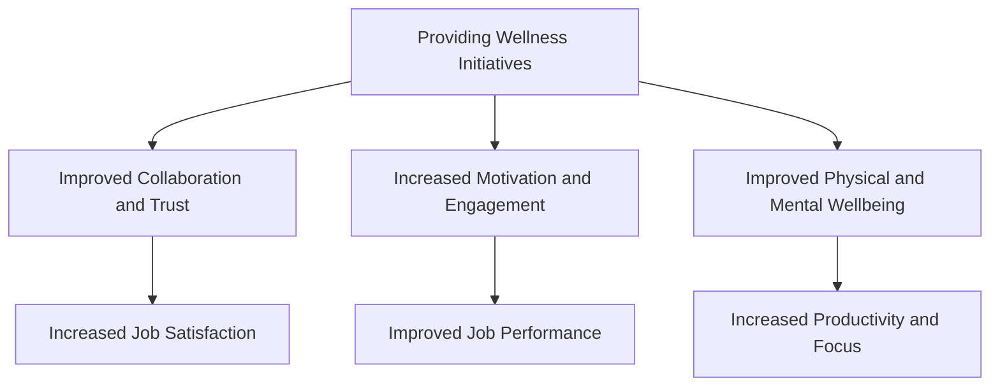

A comprehensive approach to maintaining the mental and physical health of developers is crucial in today's fast-paced tech industry. As the demand for digital solutions continues to grow, the risk of burnout and decreased productivity among developers also increases. In this guide, we will delve into the world of balanced developer wellbeing implementations, providing you with actionable strategies and insights to prioritize the wellbeing of your development team.

## Table of Contents
1. [Introduction to Developer Wellbeing](#introduction-to-developer-wellbeing)
2. [The Consequences of Neglecting Developer Wellbeing](#the-consequences-of-neglecting-developer-wellbeing)
3. [Strategies for Implementing Balanced Developer Wellbeing](#strategies-for-implementing-balanced-developer-wellbeing)
4. [Creating a Supportive Work Environment](#creating-a-supportive-work-environment)
5. [Conclusion and Future Directions](#conclusion-and-future-directions)
6. [Visual Insights Gallery](#visual-insights-gallery)
7. [FAQ](#faq)

## Introduction to Developer Wellbeing

Developer wellbeing encompasses the physical, emotional, and mental health of developers. It is essential to recognize that developers are not just coders, but human beings with unique needs and challenges. A balanced approach to developer wellbeing considers the interconnectedness of these aspects, aiming to create a holistic and supportive environment that fosters growth, productivity, and job satisfaction.

## The Consequences of Neglecting Developer Wellbeing
Neglecting developer wellbeing can have severe consequences, including burnout, decreased productivity, and high turnover rates. The following Mermaid.js diagram illustrates the flow of consequences:

> **Warning:** Ignoring developer wellbeing can lead to a toxic work environment, ultimately affecting the overall success of the organization.

## Strategies for Implementing Balanced Developer Wellbeing
Implementing balanced developer wellbeing requires a multi-faceted approach. The following strategies can help create a supportive environment:
### Flexible Work Arrangements
Offer flexible work arrangements, such as remote work options or flexible hours, to accommodate different work styles and needs.
### Mental Health Support
Provide access to mental health resources, such as counseling services or employee assistance programs, to support developers' emotional wellbeing.
### Professional Development Opportunities
Offer opportunities for professional growth and development, such as training, mentorship, or conferences, to foster a sense of purpose and fulfillment.
### Team-Building Activities
Organize team-building activities, such as social events or volunteer opportunities, to promote camaraderie and a sense of belonging.

> **Tip:** Regularly solicit feedback from developers to understand their unique needs and challenges, and adjust your strategies accordingly.

## Creating a Supportive Work Environment
Creating a supportive work environment is crucial for promoting developer wellbeing. This can be achieved by:
### Encouraging Open Communication
Foster an open and transparent communication culture, where developers feel comfortable sharing their concerns and ideas.
### Recognizing and Rewarding Contributions
Recognize and reward developers' contributions, such as through public acknowledgment or bonuses, to promote a sense of appreciation and motivation.
### Providing Wellness Initiatives
Offer wellness initiatives, such as meditation sessions or fitness classes, to promote physical and mental wellbeing.

> **Interview:** "We've seen a significant improvement in our developers' wellbeing and job satisfaction since implementing flexible work arrangements and mental health support. It's essential to prioritize their needs and create a supportive environment." - John Doe, Development Manager

## Conclusion and Future Directions
In conclusion, balanced developer wellbeing implementations are crucial for maintaining the physical, emotional, and mental health of developers. By implementing strategies such as flexible work arrangements, mental health support, and professional development opportunities, organizations can create a supportive environment that fosters growth, productivity, and job satisfaction. As the tech industry continues to evolve, it's essential to prioritize developer wellbeing and stay ahead of the curve.

## Visual Insights Gallery

## FAQ
1. **Q: What is developer wellbeing?**
A: Developer wellbeing encompasses the physical, emotional, and mental health of developers.
2. **Q: Why is developer wellbeing important?**
A: Neglecting developer wellbeing can lead to burnout, decreased productivity, and high turnover rates, ultimately affecting the overall success of the organization.
3. **Q: How can organizations prioritize developer wellbeing?**
A: Organizations can prioritize developer wellbeing by implementing strategies such as flexible work arrangements, mental health support, and professional development opportunities.