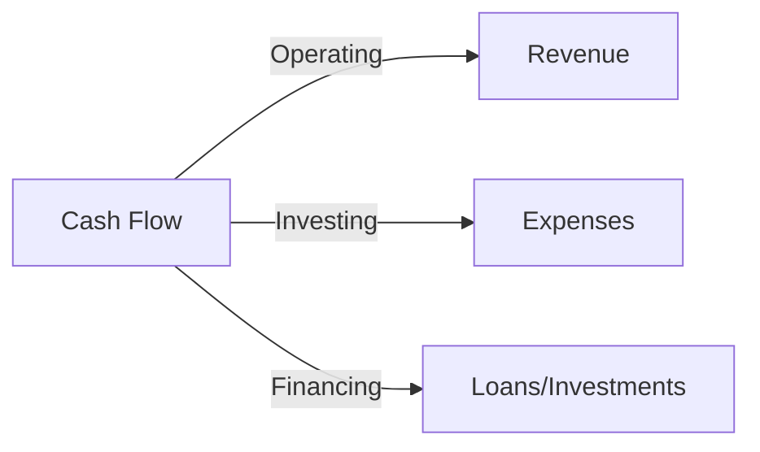
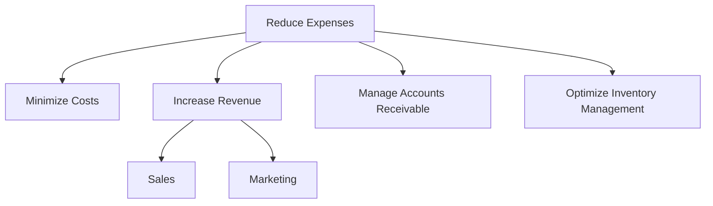

A well-planned cash flow strategy is crucial for the success of any startup, and bootstrapping is no exception. In this article, we will delve into the world of bootstrap-friendly cash flow implementations, providing you with the knowledge and tools necessary to propel your startup forward.

## Table of Contents
1. [Introduction to Bootstrapping](#introduction-to-bootstrapping)
2. [Understanding Cash Flow](#understanding-cash-flow)
3. [Bootstrap-friendly Cash Flow Strategies](#bootstrap-friendly-cash-flow-strategies)
4. [Implementing a Cash Flow Management System](#implementing-a-cash-flow-management-system)
5. [Visual Insights Gallery](#visual-insights-gallery)
6. [Summary and Conclusion](#summary-and-conclusion)
7. [FAQ](#faq)

## Introduction to Bootstrapping
Bootstrapping is a popular approach to startup financing, where entrepreneurs use their own savings, revenue, and cost-cutting measures to fund their business. This method allows startups to maintain control and avoid debt, but it also requires careful cash flow management.

## Understanding Cash Flow
Cash flow refers to the movement of money into or out of a business. It is essential to understand the different types of cash flow, including:
* Operating cash flow: the cash generated from daily operations
* Investing cash flow: the cash used for investments, such as purchasing assets
* Financing cash flow: the cash obtained from financing activities, such as loans or investments

## Bootstrap-friendly Cash Flow Strategies
To implement a bootstrap-friendly cash flow strategy, consider the following techniques:
* **Reduce expenses**: minimize unnecessary costs to conserve cash
* **Increase revenue**: focus on generating revenue through sales and marketing efforts
* **Manage accounts receivable**: ensure timely payment from customers
* **Optimize inventory management**: maintain an optimal level of inventory to avoid waste and excess costs

## Implementing a Cash Flow Management System
A cash flow management system is essential to track and manage your startup's cash flow. This system should include:
* **Cash flow forecasting**: predict future cash inflows and outflows
* **Cash flow monitoring**: track actual cash flow against forecasts
* **Cash flow optimization**: identify areas for improvement and implement changes
> **Tip:** Use a cash flow management tool, such as a spreadsheet or accounting software, to streamline your cash flow management process.

## Visual Insights Gallery
The following images provide a visual representation of the concepts discussed in this article.

## Summary and Conclusion
In conclusion, implementing a bootstrap-friendly cash flow strategy is crucial for the success of any startup. By understanding cash flow, reducing expenses, increasing revenue, managing accounts receivable, and optimizing inventory management, entrepreneurs can maintain a healthy cash flow and propel their business forward.

## FAQ
Q: What is bootstrapping?
A: Bootstrapping is a method of financing a startup using personal savings, revenue, and cost-cutting measures.
Q: Why is cash flow management important?
A: Cash flow management is essential to track and manage a startup's cash flow, ensuring that the business has sufficient funds to operate and grow.
Q: What are some bootstrap-friendly cash flow strategies?
A: Some strategies include reducing expenses, increasing revenue, managing accounts receivable, and optimizing inventory management.