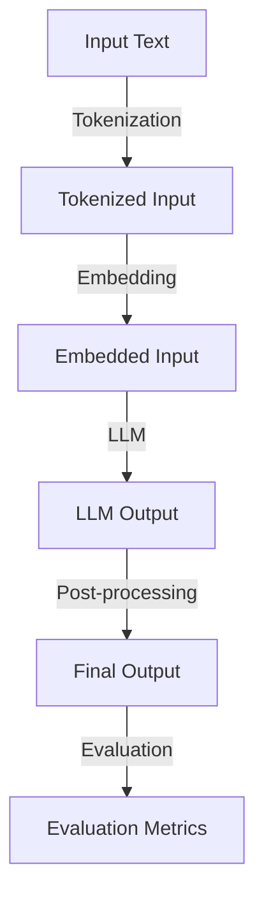
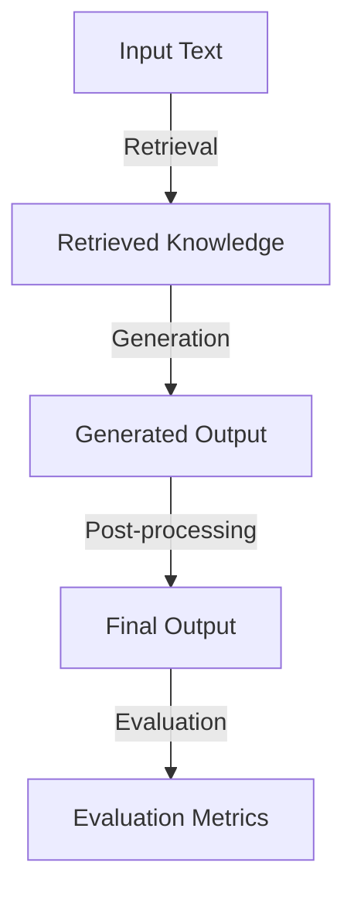

Cognitive LLM (Large Language Models) inference implementations have revolutionized the field of artificial intelligence, enabling machines to understand and generate human-like language. This comprehensive guide will delve into the depths of cognitive LLM inference implementations, exploring the latest advancements, strategies, and best practices for developers and researchers.

## Table of Contents
1. [Introduction to Cognitive LLM Inference](#introduction-to-cognitive-llm-inference)
2. [RAG and LLM Architectures](#rag-and-llm-architectures)
3. [Inference Strategies and Optimizations](#inference-strategies-and-optimizations)
4. [Real-World Applications and Use Cases](#real-world-applications-and-use-cases)
5. [Visual Insights Gallery](#visual-insights-gallery)
6. [Summary and Conclusion](#summary-and-conclusion)
7. [FAQ](#faq)

## Introduction to Cognitive LLM Inference
Cognitive LLM inference implementations are designed to mimic human cognition, enabling machines to process and generate language in a more human-like way. This is achieved through the use of large language models, which are trained on vast amounts of text data to learn patterns and relationships in language.

To illustrate the flow of cognitive LLM inference, the following Mermaid.js diagram can be used:

## RAG and LLM Architectures
RAG (Retrieval-Augmented Generation) and LLM architectures are two popular approaches to cognitive LLM inference implementations. RAG architectures use a combination of retrieval and generation to produce output, while LLM architectures rely solely on generation.

The following Mermaid.js diagram illustrates the architecture of a RAG model:

## Inference Strategies and Optimizations
Inference strategies and optimizations play a crucial role in improving the performance and efficiency of cognitive LLM inference implementations. Some popular strategies include knowledge distillation, pruning, and quantization.

> **Note:** Knowledge distillation is a technique used to transfer knowledge from a large pre-trained model to a smaller model, resulting in improved performance and reduced computational requirements.

The following table summarizes some popular inference strategies and optimizations:
| Strategy | Description | Benefits |
| --- | --- | --- |
| Knowledge Distillation | Transfer knowledge from a large model to a smaller model | Improved performance, reduced computational requirements |
| Pruning | Remove redundant or unnecessary model weights | Reduced computational requirements, improved performance |
| Quantization | Represent model weights and activations using lower-precision data types | Reduced memory requirements, improved performance |

## Real-World Applications and Use Cases
Cognitive LLM inference implementations have a wide range of real-world applications and use cases, including language translation, text summarization, and chatbots.

> **Tip:** Cognitive LLM inference implementations can be used to improve the performance and efficiency of language translation systems, enabling more accurate and natural-sounding translations.

## Visual Insights Gallery
The following images provide visual insights into the world of cognitive LLM inference implementations:

## Summary and Conclusion
In conclusion, cognitive LLM inference implementations are a powerful tool for enabling machines to understand and generate human-like language. By leveraging the latest advancements in RAG and LLM architectures, inference strategies, and optimizations, developers and researchers can create more efficient and effective language models.

## FAQ
Q: What is cognitive LLM inference?
A: Cognitive LLM inference refers to the process of using large language models to enable machines to understand and generate human-like language.
Q: What are RAG and LLM architectures?
A: RAG (Retrieval-Augmented Generation) and LLM architectures are two popular approaches to cognitive LLM inference implementations.
Q: What are some popular inference strategies and optimizations?
A: Some popular inference strategies and optimizations include knowledge distillation, pruning, and quantization.