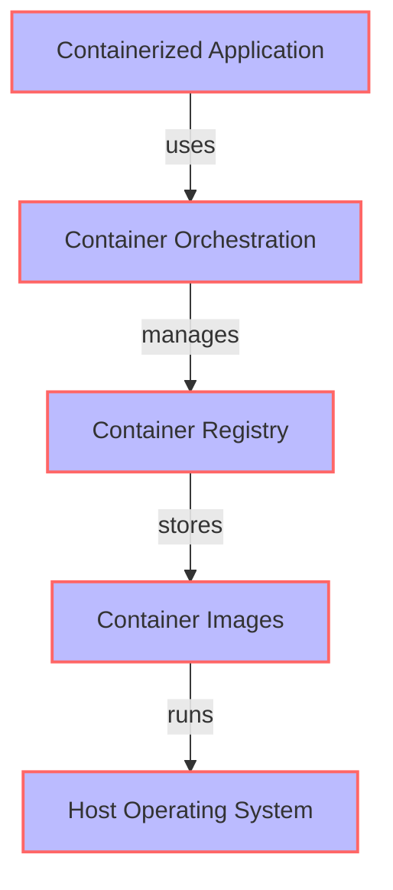
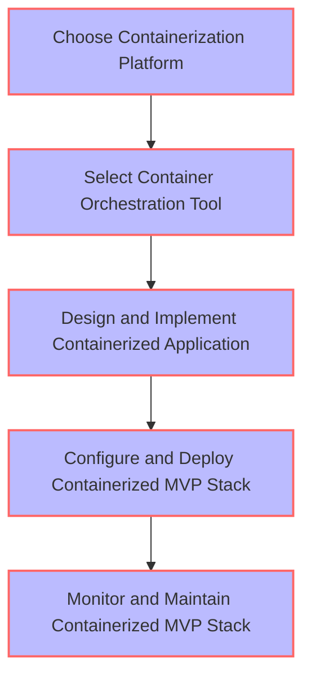

A well-structured approach to containerized MVP stack implementations can make all the difference in the success of your project. In this article, we will delve into the world of containerization, exploring the benefits, architecture, and best practices for implementing a robust and scalable MVP stack.

## Table of Contents
1. [Introduction to Containerization](#introduction-to-containerization)
2. [Benefits of Containerized MVP Stack](#benefits-of-containerized-mvp-stack)
3. [Architecture of Containerized MVP Stack](#architecture-of-containerized-mvp-stack)
4. [Implementation of Containerized MVP Stack](#implementation-of-containerized-mvp-stack)
5. [Best Practices for Containerized MVP Stack](#best-practices-for-containerized-mvp-stack)
6. [Visual Insights Gallery](#visual-insights-gallery)
7. [Summary/Conclusion](#summary/conclusion)
8. [FAQ](#faq)

## Introduction to Containerization
Containerization is a lightweight and portable way to deploy applications, allowing developers to package their code, dependencies, and configurations into a single container that can be run consistently across different environments. 

> **Note:** Containerization is different from virtualization, as it doesn't require a separate operating system for each container, making it more efficient and faster.

## Benefits of Containerized MVP Stack
The benefits of a containerized MVP stack are numerous, including:
* Improved scalability and flexibility
* Faster deployment and iteration
* Enhanced collaboration and consistency
* Better resource utilization and cost-effectiveness

## Architecture of Containerized MVP Stack
The architecture of a containerized MVP stack typically consists of the following components:

> **Tip:** Use a container orchestration tool like Kubernetes to manage and scale your containers.

## Implementation of Containerized MVP Stack
To implement a containerized MVP stack, follow these steps:
1. Choose a containerization platform (e.g., Docker)
2. Select a container orchestration tool (e.g., Kubernetes)
3. Design and implement your containerized application
4. Configure and deploy your containerized MVP stack

## Best Practices for Containerized MVP Stack
To ensure a successful containerized MVP stack implementation, follow these best practices:
* Use a consistent naming convention for your containers and images
* Implement monitoring and logging for your containers
* Use a container registry to store and manage your container images
* Implement security measures to protect your containers and data
> **Warning:** Don't forget to regularly update and patch your containers to prevent security vulnerabilities.

## Visual Insights Gallery
Here are some visual insights into containerized MVP stack implementations:

## Summary/Conclusion
In conclusion, a well-structured approach to containerized MVP stack implementations can make all the difference in the success of your project. By following the benefits, architecture, and best practices outlined in this article, you can ensure a robust and scalable containerized MVP stack that meets your needs and exceeds your expectations.

## FAQ
Q: What is containerization?
A: Containerization is a lightweight and portable way to deploy applications, allowing developers to package their code, dependencies, and configurations into a single container that can be run consistently across different environments.
Q: What are the benefits of a containerized MVP stack?
A: The benefits of a containerized MVP stack include improved scalability and flexibility, faster deployment and iteration, enhanced collaboration and consistency, and better resource utilization and cost-effectiveness.
Q: How do I implement a containerized MVP stack?
A: To implement a containerized MVP stack, choose a containerization platform, select a container orchestration tool, design and implement your containerized application, configure and deploy your containerized MVP stack, and monitor and maintain your containerized MVP stack.