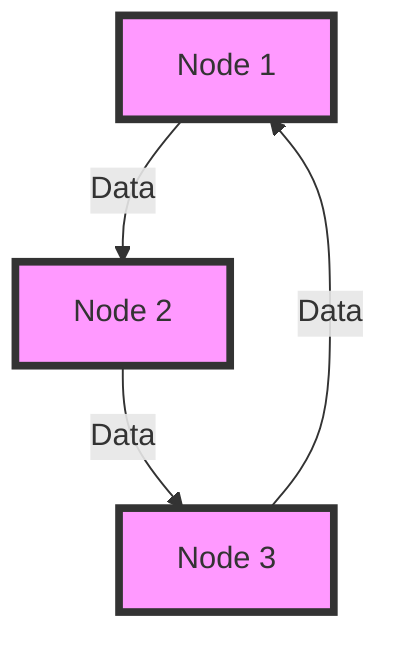
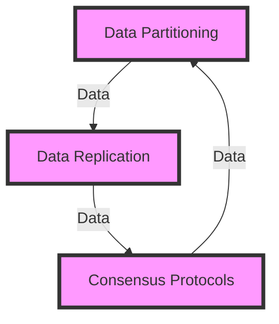

Decentralized vector databases have revolutionized the way we store and manage complex data, enabling innovative applications in fields like artificial intelligence, machine learning, and data science. In this comprehensive guide, we will delve into the world of decentralized vector database implementations, exploring their architecture, patterns, and strategies.

## Table of Contents
1. [Introduction to Decentralized Vector Databases](#introduction-to-decentralized-vector-databases)
2. [Architecture of Decentralized Vector Databases](#architecture-of-decentralized-vector-databases)
3. [Implementation Strategies](#implementation-strategies)
4. [Real-World Applications](#real-world-applications)
5. [Visual Insights Gallery](#visual-insights-gallery)
6. [Summary and Conclusion](#summary-and-conclusion)
7. [FAQ](#faq)

## Introduction to Decentralized Vector Databases
Decentralized vector databases are designed to store and manage large amounts of complex data in a distributed manner, enabling scalability, flexibility, and high performance. These databases use vector embeddings to represent data, allowing for efficient similarity searches and clustering.

## Architecture of Decentralized Vector Databases
The architecture of decentralized vector databases typically consists of multiple nodes, each responsible for storing and managing a portion of the overall data. The nodes communicate with each other through a peer-to-peer network, ensuring that data is consistently available and up-to-date.

### Key Components
The key components of a decentralized vector database architecture include:
* **Data Nodes**: Responsible for storing and managing data
* **Index Nodes**: Responsible for maintaining a global index of the data
* **Query Nodes**: Responsible for handling user queries and retrieving data

## Implementation Strategies
When implementing a decentralized vector database, there are several strategies to consider:
* **Data Partitioning**: Divide data into smaller chunks and distribute it across nodes
* **Data Replication**: Maintain multiple copies of data to ensure availability and durability
* **Consensus Protocols**: Implement protocols to ensure that nodes agree on the state of the data

> **Note:** Data partitioning and replication are critical components of a decentralized vector database implementation, as they enable scalability and high availability.

## Real-World Applications
Decentralized vector databases have a wide range of real-world applications, including:
* **Artificial Intelligence**: Enable efficient similarity searches and clustering for AI and machine learning models
* **Data Science**: Provide a scalable and flexible platform for data analysis and visualization
* **Recommendation Systems**: Enable personalized recommendations based on user behavior and preferences

## Visual Insights Gallery
## Visual Insights Gallery
The following images provide a visual representation of decentralized vector database implementations:

## Summary and Conclusion
In conclusion, decentralized vector databases offer a powerful platform for storing and managing complex data in a distributed manner. By understanding the architecture, patterns, and strategies of these databases, developers can build scalable and high-performance applications that enable innovative use cases in fields like artificial intelligence, machine learning, and data science.

## FAQ
* **What is a decentralized vector database?**: A decentralized vector database is a type of database that stores and manages complex data in a distributed manner, using vector embeddings to represent data.
* **What are the key components of a decentralized vector database architecture?**: The key components include data nodes, index nodes, and query nodes.
* **What are some real-world applications of decentralized vector databases?**: Decentralized vector databases have a wide range of real-world applications, including artificial intelligence, data science, and recommendation systems.