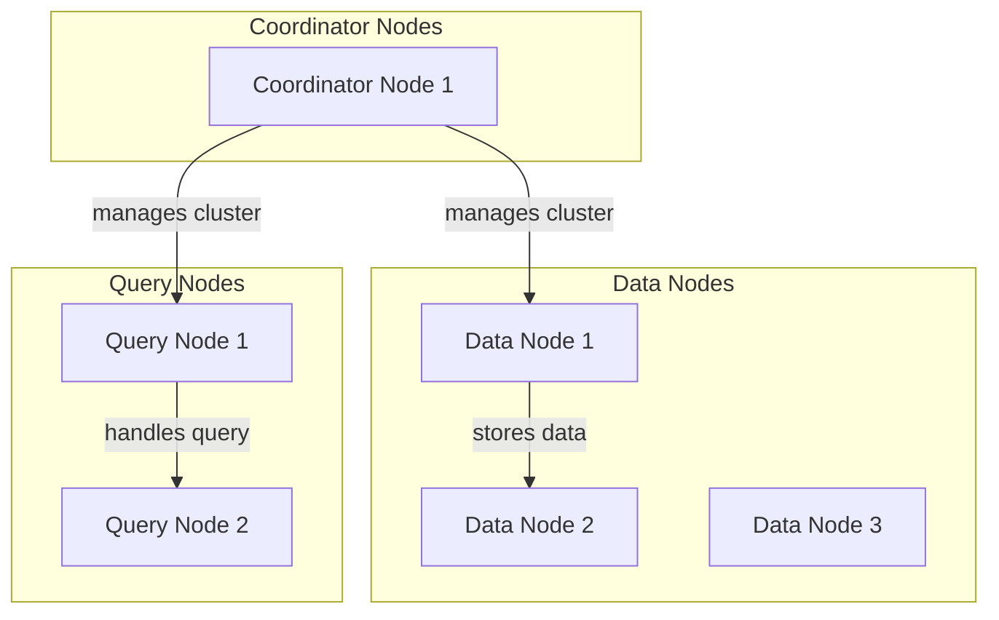

## Introduction to Advanced Decentralized Vector Databases
In the first part of this series, we introduced the concept of decentralized vector databases and explored their architecture, patterns, and strategies. In this advanced guide, we will delve deeper into the architecture, discussing edge-cases, and real-world applications.


## Deep Dive into Decentralized Vector Database Architecture
The architecture of decentralized vector databases can be further divided into several components, including:
* Data nodes: responsible for storing and managing data
* Query nodes: responsible for handling queries and searches
* Coordinator nodes: responsible for managing the overall cluster and ensuring data consistency

This architecture allows for scalability, flexibility, and high performance, making it suitable for a wide range of applications.

## Edge-Cases and Advanced Strategies
When implementing decentralized vector databases, several edge-cases and advanced strategies must be considered, including:
* Handling node failures: ensuring data consistency and availability in the event of node failures
* Managing data partitioning: ensuring that data is evenly distributed across nodes
* Implementing data replication: ensuring that data is duplicated across nodes to ensure availability


## Real-World Applications and Trends
Decentralized vector databases have a wide range of real-world applications, including:
* Artificial intelligence and machine learning: enabling efficient similarity searches and clustering
* Data science: enabling efficient data analysis and visualization
* IoT and edge computing: enabling efficient data processing and analysis at the edge
```mermaid
flowchart TD
    subgraph Artificial Intelligence
        AI1[Machine Learning]
        AI2[Deep Learning]
    end
    subgraph Data Science
        DS1[Data Analysis]
        DS2[Data Visualization]
    end
    subgraph IoT and Edge Computing
        IoT1[Data Processing]
        IoT2[Data Analysis]
    end
    AI1 -- uses --> Decentralized Vector Database
    DS1 -- uses --> Decentralized Vector Database
    IoT1 -- uses --> Decentralized Vector Database
```
These applications and trends are driving the adoption of decentralized vector databases, and are expected to continue to do so in the future.

## Visual Insights Gallery
The following images provide a visual representation of the concepts and strategies discussed in this guide:


## Summary and Conclusion
In this advanced guide, we delved deeper into the architecture and edge-cases of decentralized vector databases, exploring real-world applications and trends. By understanding these concepts and strategies, developers and organizations can unlock the full potential of decentralized vector databases, enabling innovative applications and use-cases. 

## FAQ
Q: What is a decentralized vector database?
A: A decentralized vector database is a type of database that stores and manages data in a distributed manner, using vector embeddings to represent data.
Q: What are the benefits of decentralized vector databases?
A: The benefits of decentralized vector databases include scalability, flexibility, and high performance, making them suitable for a wide range of applications.
Q: What are some real-world applications of decentralized vector databases?
A: Decentralized vector databases have a wide range of real-world applications, including artificial intelligence and machine learning, data science, and IoT and edge computing.