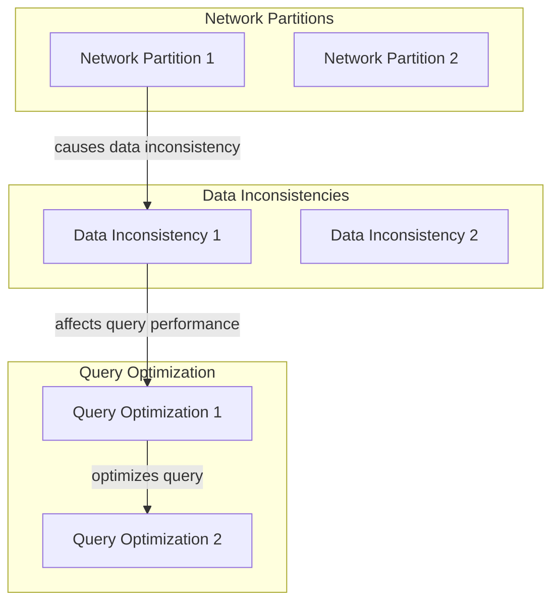
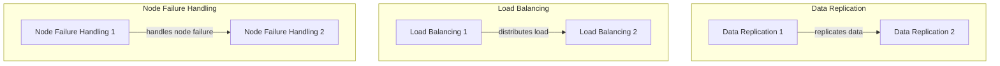
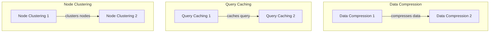

## Part 3: Expert Decentralized Vector Database Implementations - Advanced Edge-Cases and Architecture
In the previous parts of this series, we explored the fundamentals and advanced concepts of decentralized vector databases. In this expert guide, we will delve deeper into advanced edge-cases, architecture, and strategies for implementing decentralized vector databases.

## Advanced Edge-Cases in Decentralized Vector Databases
When dealing with large-scale decentralized vector databases, several advanced edge-cases must be considered, including:
* **Network partitions**: when a network failure occurs, causing a split in the cluster
* **Data inconsistencies**: when data is inconsistent across different nodes
* **Query optimization**: optimizing queries for performance and efficiency

These advanced edge-cases require careful consideration and planning to ensure the stability and performance of the decentralized vector database.

## Deeper Dive into Decentralized Vector Database Architecture
The architecture of decentralized vector databases can be further optimized by considering:
* **Data replication**: replicating data across multiple nodes for redundancy and availability
* **Load balancing**: distributing load across multiple nodes for improved performance
* **Node failure handling**: handling node failures and ensuring cluster stability

This optimized architecture allows for improved performance, availability, and stability in decentralized vector databases.

## Real-World Applications and Trends
Decentralized vector databases have numerous real-world applications, including:
* **Artificial intelligence**: decentralized vector databases can be used to store and manage AI models and data
* **Internet of Things (IoT)**: decentralized vector databases can be used to store and manage IoT device data
* **Blockchain**: decentralized vector databases can be used to store and manage blockchain data

## Advanced Strategies for Decentralized Vector Databases
To further optimize decentralized vector databases, several advanced strategies can be employed, including:
* **Data compression**: compressing data to reduce storage requirements
* **Query caching**: caching query results to improve performance
* **Node clustering**: clustering nodes to improve performance and availability

These advanced strategies can significantly improve the performance, efficiency, and availability of decentralized vector databases.

## Visual Insights Gallery
The following images provide a visual representation of the concepts and strategies discussed in this article:
* 
* 
* 