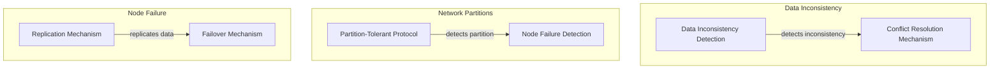
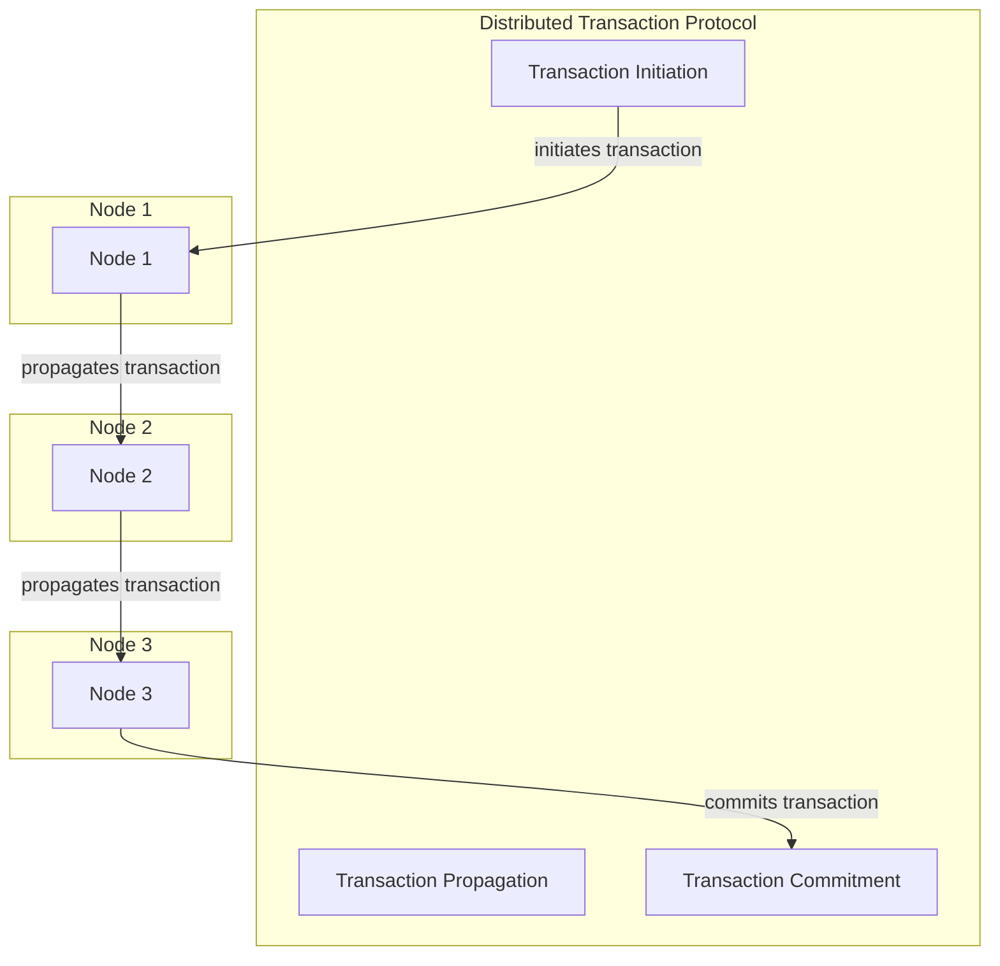

## Part 3: Expert Edge-Cases and Deep Architecture in Decentralized Vector Databases
In the previous parts of this series, we explored the fundamentals and advanced concepts of decentralized vector databases. In this expert guide, we will delve into the most complex edge-cases and deep architecture, providing a comprehensive understanding of the subject.

## Advanced Edge-Cases in Decentralized Vector Databases
When dealing with large-scale decentralized vector databases, several advanced edge-cases must be considered, including:
* **Data inconsistency**: Ensuring data consistency across the cluster is crucial. This can be achieved through the use of distributed transactions and conflict resolution mechanisms.
* **Network partitions**: Network partitions can occur when a subset of nodes in the cluster become disconnected from the rest. This can be mitigated through the use of partition-tolerant protocols and node failure detection mechanisms.
* **Node failure**: Node failure can occur due to hardware or software issues. This can be mitigated through the use of replication and failover mechanisms.

## Deep Architecture: Distributed Transaction Protocol
A distributed transaction protocol is essential for ensuring data consistency in decentralized vector databases. This protocol ensures that multiple nodes can agree on the outcome of a transaction, even in the presence of network failures.

## Expert Strategies for Optimizing Decentralized Vector Databases
Several expert strategies can be employed to optimize decentralized vector databases, including:
* **Data compression**: Compressing data can reduce storage requirements and improve query performance.
* **Indexing**: Indexing can improve query performance by allowing nodes to quickly locate relevant data.
* **Caching**: Caching can improve query performance by reducing the number of requests made to nodes.

## Visual Insights Gallery
The following images provide a visual representation of the concepts discussed in this article:
* [Decentralized Vector Database Architecture](https://picsum.photos/seed/decentralized-vector-database-architecture/800/400)
* [Distributed Transaction Protocol](https://picsum.photos/seed/distributed-transaction-protocol/800/400)
* [Optimizing Decentralized Vector Databases](https://picsum.photos/seed/optimizing-decentralized-vector-databases/800/400)