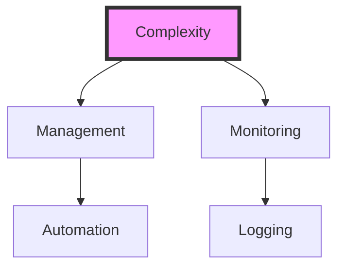
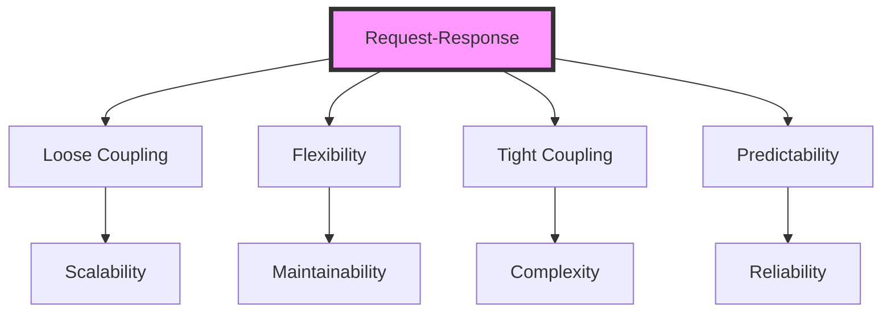
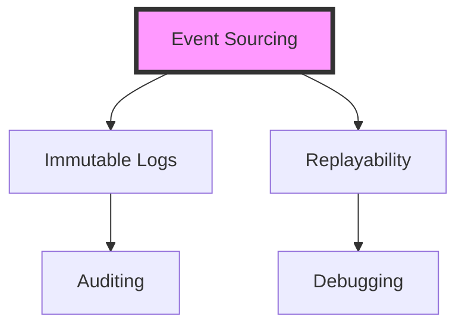

A decoupled microservices system is an architectural approach that structures an application as a collection of small, independent services. Each service is responsible for a specific business capability and can be developed, tested, and deployed independently. This guide provides a comprehensive overview of decoupled microservices system implementations, including their benefits, challenges, and best practices.

## Table of Contents
1. [Introduction to Decoupled Microservices](#introduction-to-decoupled-microservices)
2. [Benefits of Decoupled Microservices](#benefits-of-decoupled-microservices)
3. [Challenges of Decoupled Microservices](#challenges-of-decoupled-microservices)
4. [Decoupled Microservices Architecture Patterns](#decoupled-microservices-architecture-patterns)
5. [Service Discovery and Communication](#service-discovery-and-communication)
6. [Data Consistency and Integrity](#data-consistency-and-integrity)
7. [Deployment and Scaling](#deployment-and-scaling)

## Introduction to Decoupled Microservices
Decoupled microservices are an evolution of the traditional monolithic architecture, where a single application is broken down into smaller, independent services. Each service is designed to perform a specific task and can be developed, tested, and deployed independently. This approach enables greater flexibility, scalability, and maintainability.


## Benefits of Decoupled Microservices
The benefits of decoupled microservices include:
* **Improved scalability**: Each service can be scaled independently, allowing for more efficient use of resources.
* **Increased flexibility**: Services can be developed using different programming languages and frameworks.
* **Enhanced maintainability**: Services can be updated or replaced independently, reducing the risk of affecting other parts of the system.
* **Better fault tolerance**: If one service experiences issues, it will not affect the entire system.
```markdown
| Benefit | Description |
| --- | --- |
| Scalability | Scale services independently |
| Flexibility | Use different programming languages and frameworks |
| Maintainability | Update or replace services independently |
| Fault Tolerance | Isolate faults to individual services |
```
> **Note:** Decoupled microservices require a high degree of automation, monitoring, and logging to ensure smooth operation.

## Challenges of Decoupled Microservices
The challenges of decoupled microservices include:
* **Complexity**: Decoupled microservices introduce additional complexity, requiring more sophisticated management and monitoring.
* **Communication overhead**: Services must communicate with each other, introducing additional latency and overhead.
* **Data consistency**: Ensuring data consistency across services can be challenging.
* **Security**: Securing decoupled microservices requires careful consideration of authentication, authorization, and encryption.


## Decoupled Microservices Architecture Patterns
Decoupled microservices can be implemented using various architecture patterns, including:
* **Event-driven architecture**: Services communicate through events, allowing for loose coupling and greater flexibility.
* **Request-response architecture**: Services communicate through requests and responses, providing a more traditional approach.
* **Microkernel architecture**: A central microkernel provides core functionality, with services plugging in to provide additional features.


## Service Discovery and Communication
Service discovery and communication are critical components of decoupled microservices. Service discovery allows services to find and communicate with each other, while communication protocols define how services exchange data.
* **Service registries**: Services register themselves with a central registry, allowing other services to discover and communicate with them.
* **API gateways**: API gateways provide a single entry point for services, handling requests and routing them to the appropriate service.
```markdown
| Protocol | Description |
| --- | --- |
| HTTP | Request-response protocol |
| gRPC | High-performance RPC protocol |
| MQTT | Lightweight messaging protocol |
```
> **Tip:** Use a combination of service registries and API gateways to provide flexible and scalable service discovery and communication.

## Data Consistency and Integrity
Ensuring data consistency and integrity is crucial in decoupled microservices. This can be achieved through:
* **Event sourcing**: Services store events, allowing for reconstruction of the current state.
* **CQRS**: Command Query Responsibility Segregation separates write and read operations, ensuring data consistency.
* **Transactional boundaries**: Services define transactional boundaries, ensuring data integrity across multiple services.


## Deployment and Scaling
Deployment and scaling are critical aspects of decoupled microservices. Services can be deployed using:
* **Containerization**: Services are packaged in containers, providing a lightweight and portable deployment option.
* **Serverless computing**: Services are deployed on serverless platforms, providing automatic scaling and cost optimization.
* **Kubernetes**: Kubernetes provides a comprehensive platform for deploying, scaling, and managing services.
```markdown
| Deployment Option | Description |
| --- | --- |
| Containerization | Lightweight and portable |
| Serverless Computing | Automatic scaling and cost optimization |
| Kubernetes | Comprehensive platform for deployment and management |
```
> **Interview:** "Decoupled microservices require a deep understanding of the underlying architecture and technology stack. It's essential to have a strong team with expertise in multiple areas, including development, operations, and security."

## Visual Insights Gallery


## Summary and Conclusion
Decoupled microservices offer a powerful approach to building scalable, flexible, and maintainable systems. However, they also introduce additional complexity, requiring careful consideration of service discovery, communication, data consistency, and deployment. By understanding the benefits, challenges, and best practices of decoupled microservices, developers can create robust and efficient systems that meet the needs of modern applications.

## FAQ
Q: What are decoupled microservices?
A: Decoupled microservices are an architectural approach that structures an application as a collection of small, independent services.
Q: What are the benefits of decoupled microservices?
A: The benefits of decoupled microservices include improved scalability, increased flexibility, enhanced maintainability, and better fault tolerance.
Q: What are the challenges of decoupled microservices?
A: The challenges of decoupled microservices include complexity, communication overhead, data consistency, and security.
Q: How do services communicate in decoupled microservices?
A: Services can communicate through events, requests, and responses, using protocols such as HTTP, gRPC, and MQTT.