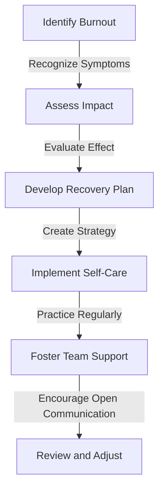
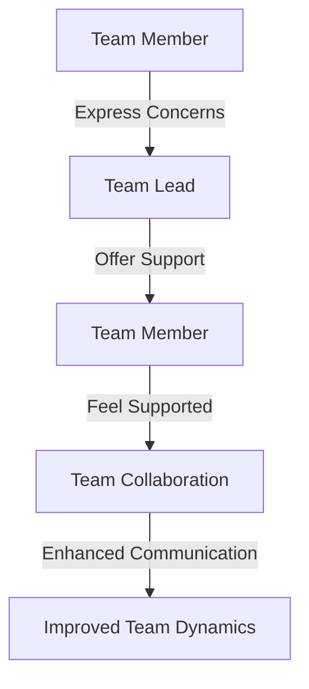

A comprehensive approach to recognizing, addressing, and overcoming burnout, focusing on empathetic strategies for enhanced well-being and productivity in the modern workplace.

## Introduction to Burnout and Its Implications
Burnout is a state of emotional, mental, and physical exhaustion caused by excessive and prolonged stress. It occurs frequently in the modern workplace, especially among individuals who are deeply invested in their work and the well-being of others. Recognizing the signs of burnout—such as chronic fatigue, cynicism, and reduced performance—is crucial for implementing effective recovery strategies.


## Understanding Empathetic Burnout Recovery
Empathetic burnout recovery focuses on addressing the emotional and psychological aspects of burnout, emphasizing empathy, self-care, and support. This approach recognizes that burnout is not just an individual issue but also affects the overall team and organizational dynamics.


### The Role of Leadership in Burnout Prevention
Leaders play a critical role in preventing and addressing burnout. They can foster a culture of empathy, encourage open communication, and implement policies that support work-life balance and employee well-being.
```markdown
| Leadership Strategies | Description |
| --- | --- |
| Regular Feedback | Encourage open communication to identify early signs of burnout |
| Flexible Work Arrangements | Offer flexible schedules and remote work options to improve work-life balance |
| Wellness Programs | Implement programs that promote physical and mental health |
```

## Implementing Empathetic Burnout Recovery Strategies
Empathetic burnout recovery involves a multi-faceted approach that includes self-care, team support, and organizational changes. Here is a high-level overview of the recovery process:


### Self-Care Practices for Burnout Recovery
Self-care is essential for burnout recovery. It involves practices that promote physical, emotional, and mental well-being, such as mindfulness, exercise, and hobbies.
> **Tip:** Start with small, manageable self-care practices and gradually increase their intensity and frequency.

### Team Support and Collaboration
Team support is vital for burnout recovery. Encouraging open communication, empathy, and collaboration among team members can help alleviate feelings of isolation and promote a sense of community.


## Overcoming Challenges in Burnout Recovery
Burnout recovery can be challenging, especially when faced with resistance to change or lack of support. Here are some strategies to overcome common challenges:
- **Resistance to Change:** Encourage open dialogue and involve stakeholders in the recovery process.
- **Lack of Support:** Seek external resources, such as counseling services or support groups.

> **Warning:** Burnout recovery is a long-term process. Be patient and persistent, and celebrate small victories along the way.

## Visual Insights Gallery
This section provides a visual representation of key concepts related to empathetic burnout recovery.


## Conclusion and Summary
Empathetic burnout recovery is a holistic approach that addresses the emotional, psychological, and organizational aspects of burnout. By recognizing the signs of burnout, implementing empathetic strategies, and fostering a culture of support and empathy, individuals and organizations can overcome burnout and promote well-being and productivity.

## Frequently Asked Questions
1. **What are the common signs of burnout?**
   - Chronic fatigue, cynicism, and reduced performance are common signs of burnout.
2. **How can leaders prevent burnout in the workplace?**
   - Leaders can prevent burnout by fostering a culture of empathy, encouraging open communication, and implementing policies that support work-life balance and employee well-being.
3. **What role does self-care play in burnout recovery?**
   - Self-care is essential for burnout recovery, as it promotes physical, emotional, and mental well-being.