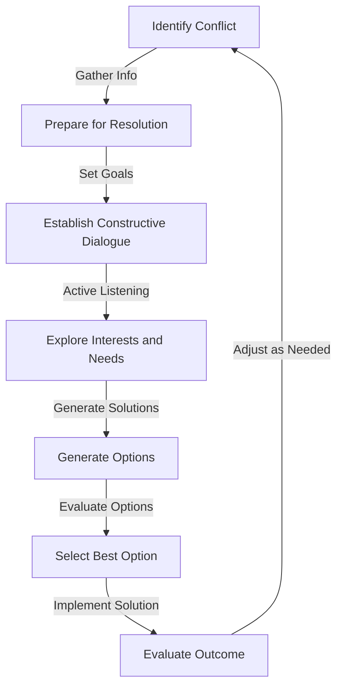
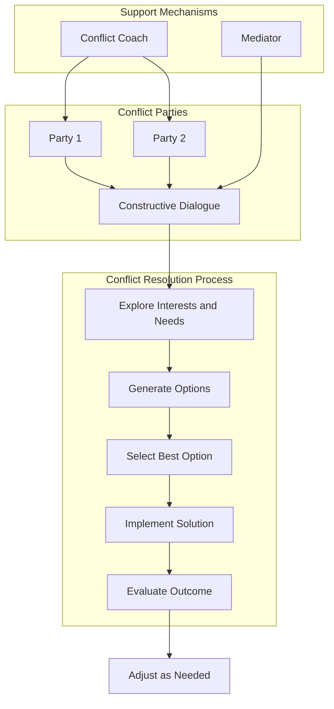

In today's fast-paced and often high-stress work environments, conflict is inevitable. However, it's how we manage and resolve these conflicts that sets successful organizations apart from those that struggle. Empathetic conflict resolution is a powerful approach that focuses on understanding and addressing the emotional and psychological aspects of conflicts, leading to more sustainable and harmonious resolutions. In this comprehensive guide, we will delve into the world of empathetic conflict resolution, exploring its principles, strategies, and implementations.

## Understanding Empathetic Conflict Resolution

Empathetic conflict resolution is built on the foundation of empathy, which is the ability to understand and share the feelings of another person. This approach recognizes that conflicts often involve not just rational interests but also emotional and psychological needs. By acknowledging and addressing these needs, empathetic conflict resolution seeks to create a safe, respectful, and constructive dialogue that fosters mutual understanding and cooperation.

### Key Principles of Empathetic Conflict Resolution
To implement empathetic conflict resolution effectively, several key principles must be understood and applied:
- **Active Listening**: The ability to fully concentrate on and comprehend the perspectives, needs, and emotions of all parties involved.
- **Non-Judgmental Attitude**: Approaching the conflict without preconceptions or biases, ensuring that all parties feel heard and respected.
- **Empathy**: The capacity to understand and acknowledge the feelings and needs of others, which is crucial for building trust and rapport.

## Implementing Empathetic Conflict Resolution

Implementing empathetic conflict resolution involves a structured approach that can be tailored to the specific needs and contexts of different conflicts. The following steps provide a general framework:
1. **Preparation**: Before engaging in conflict resolution, prepare by gathering information about the conflict, identifying the key parties involved, and setting clear goals for the resolution process.
2. **Establishing a Constructive Dialogue**: Create a safe and respectful environment where all parties feel comfortable expressing their thoughts, feelings, and needs. Active listening and empathy are crucial at this stage.
3. **Exploring Interests and Needs**: Go beyond the surface-level positions and explore the underlying interests, needs, and fears of each party. This helps in identifying potential areas of agreement and creative solutions.
4. **Generating Options**: Collaboratively generate a range of potential solutions that address the needs and interests of all parties. Encourage creativity and openness during this process.
5. **Evaluating and Selecting Options**: Evaluate the generated options against the needs, interests, and criteria established during the process. Select the option(s) that best meet the needs of all parties.

### Mermaid.js Diagram: Conflict Resolution Flow

## Advanced Strategies for Empathetic Conflict Resolution
For more complex or entrenched conflicts, advanced strategies may be necessary. These can include:
- **Mediation**: Involving a neutral third party to facilitate the conflict resolution process.
- **Negotiation**: A process where parties engage in direct discussion to reach a mutually acceptable agreement.
- **Conflict Coaching**: Working with individuals to develop their conflict resolution skills and strategies.

### Mermaid.js Diagram: Conflict Resolution Architecture

## Visual Insights Gallery
### Image 1: Team Collaboration

### Image 2: Conflict Resolution Strategies

### Image 3: Empathetic Communication

## Summary and Conclusion
Empathetic conflict resolution offers a powerful and sustainable approach to managing conflicts in personal and professional settings. By understanding the principles and strategies outlined in this guide, individuals and organizations can foster more constructive and respectful dialogues, leading to stronger relationships and more effective conflict resolutions. Remember, empathetic conflict resolution is not just about resolving conflicts but about building a culture of empathy, respect, and understanding.

## FAQ
- **Q: What is empathetic conflict resolution?**
  A: Empathetic conflict resolution is an approach to conflict resolution that focuses on understanding and addressing the emotional and psychological aspects of conflicts.
- **Q: How can I apply empathetic conflict resolution in my team?**
  A: Start by fostering a culture of empathy and respect, encourage active listening, and approach conflicts with a non-judgmental attitude.
- **Q: What if the conflict is too complex for internal resolution?**
  A: Consider seeking the help of a mediator or conflict coach who can provide neutral guidance and support.