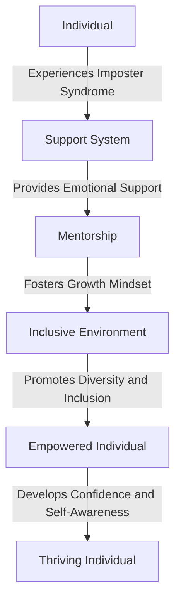
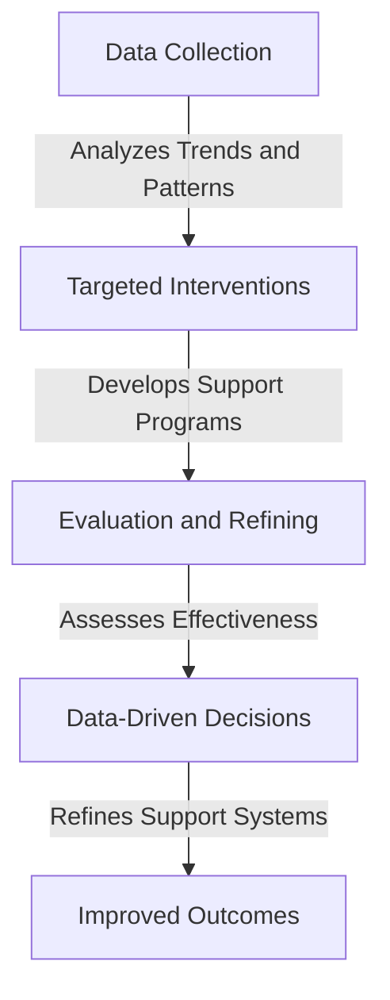

Imposter syndrome is a pervasive phenomenon that affects individuals from all walks of life, manifesting as a deep-seated feeling of inadequacy and self-doubt. As we navigate the complexities of remote work, productivity, and mental health, it's essential to develop empathetic strategies to mitigate the effects of imposter syndrome. In this article, we'll delve into the world of imposter syndrome, exploring its causes, consequences, and implementations, with a focus on empathetic approaches to foster a healthier and more supportive environment.

## Understanding Imposter Syndrome
Imposter syndrome is a psychological pattern where individuals doubt their accomplishments and feel like frauds, despite their evident successes. This phenomenon was first identified in 1978 by psychologists Pauline Clance and Suzanne Imes, who noted that high-achieving women often attributed their success to luck rather than their abilities. Today, we recognize that imposter syndrome affects people across various demographics, professions, and industries.

## The Causes of Imposter Syndrome
Several factors contribute to the development of imposter syndrome, including:
* **Social and cultural pressures**: Unrealistic expectations and the cult of perfectionism can create an environment where individuals feel inadequate.
* **Lack of representation and diversity**: Being part of an underrepresented group can exacerbate feelings of self-doubt and imposterism.
* **Trauma and past experiences**: Adverse childhood experiences, bullying, or previous failures can shape an individual's self-perception and contribute to imposter syndrome.

## Empathetic Implementations for Mitigating Imposter Syndrome
To create a supportive environment that fosters growth and well-being, it's essential to implement empathetic strategies that address the root causes of imposter syndrome. Some approaches include:

### 1. **Open Communication Channels**
Establishing open and honest communication channels is crucial for creating a safe space where individuals feel comfortable sharing their concerns and fears. This can be achieved through regular check-ins, anonymous feedback mechanisms, and dedicated support groups.

### 2. **Mentorship and Sponsorship**
Pairing individuals with experienced mentors or sponsors can help them develop a growth mindset, build confidence, and navigate challenging situations. This mentorship can be particularly effective when paired with a culture of constructive feedback and continuous learning.

### 3. **Inclusive and Diverse Work Environment**
Fostering an inclusive and diverse work environment can help individuals feel more comfortable and valued. This can be achieved by promoting diversity, equity, and inclusion initiatives, as well as creating opportunities for underrepresented groups to share their experiences and perspectives.

## Architecture for Empathetic Imposter Syndrome Mitigation
The following Mermaid.js diagram illustrates a potential architecture for mitigating imposter syndrome:

## Data-Driven Approach to Imposter Syndrome
A data-driven approach can help organizations better understand the prevalence and impact of imposter syndrome. By collecting and analyzing data on imposter syndrome, organizations can:
* **Identify trends and patterns**: Recognize common characteristics and experiences among individuals who struggle with imposter syndrome.
* **Develop targeted interventions**: Create tailored support programs and initiatives that address the specific needs and concerns of affected individuals.
* **Evaluate the effectiveness of interventions**: Assess the impact of implemented strategies and make data-driven decisions to refine and improve support systems.

> **Note:** A data-driven approach requires careful consideration of data privacy, security, and ethics to ensure that individual confidentiality is maintained and protected.

## Visual Insights Gallery
Here are some additional visual insights into the world of imposter syndrome and empathetic implementations:

## Summary and Conclusion
Imposter syndrome is a pervasive and complex phenomenon that affects individuals from all walks of life. By developing empathetic strategies and implementations, we can create a more supportive and inclusive environment that fosters growth, well-being, and success. Remember that addressing imposter syndrome requires a multifaceted approach that incorporates open communication, mentorship, inclusive work environments, and data-driven decision-making.

## FAQ
* Q: What is imposter syndrome, and how does it affect individuals?
A: Imposter syndrome is a psychological pattern where individuals doubt their accomplishments and feel like frauds, despite their evident successes. It can lead to feelings of anxiety, self-doubt, and inadequacy.
* Q: How can organizations support individuals struggling with imposter syndrome?
A: Organizations can support individuals by establishing open communication channels, providing mentorship and sponsorship opportunities, and fostering an inclusive and diverse work environment.
* Q: What role does data play in addressing imposter syndrome?
A: Data can help organizations better understand the prevalence and impact of imposter syndrome, identify trends and patterns, and develop targeted interventions to support affected individuals.