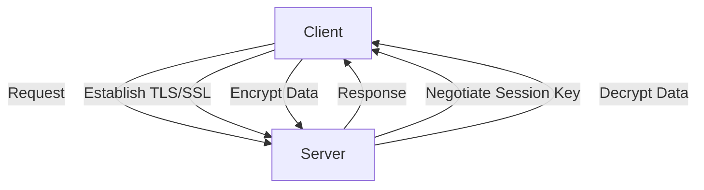
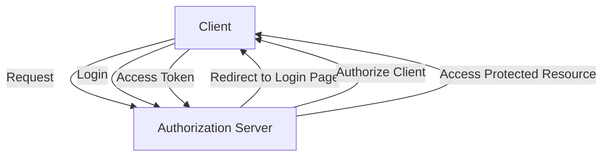

In today's digital landscape, security is a top priority for organizations and individuals alike. One crucial aspect of security is the implementation of encrypted secure sessions, which ensures that data exchanged between a client and a server remains confidential and tamper-proof. This comprehensive guide will delve into the world of encrypted secure session implementations, exploring the concepts, architectures, and best practices for securing online interactions.

## Table of Contents
1. [Introduction to Encrypted Secure Sessions](#introduction-to-encrypted-secure-sessions)
2. [Understanding Encryption Protocols](#understanding-encryption-protocols)
3. [Secure Session Architecture](#secure-session-architecture)
4. [Implementing OAuth for Secure Authentication](#implementing-oauth-for-secure-authentication)
5. [Best Practices for Secure Session Management](#best-practices-for-secure-session-management)
6. [Visual Insights Gallery](#visual-insights-gallery)
7. [Summary and Conclusion](#summary-and-conclusion)
8. [FAQ](#faq)

## Introduction to Encrypted Secure Sessions
Encrypted secure sessions are the backbone of secure online interactions. They ensure that data exchanged between a client and a server is protected from eavesdropping, tampering, and other forms of cyber threats. The most commonly used protocol for establishing encrypted secure sessions is Transport Layer Security (TLS), which is the successor to Secure Sockets Layer (SSL).


## Understanding Encryption Protocols
Encryption protocols are the foundation of secure online interactions. They ensure that data is encrypted and decrypted securely, using complex algorithms and keys. Some of the most commonly used encryption protocols include:
- **TLS (Transport Layer Security)**: A cryptographic protocol that provides secure communication between a client and a server.
- **SSL (Secure Sockets Layer)**: A deprecated cryptographic protocol that has been replaced by TLS.
- **IPSec (Internet Protocol Security)**: A suite of protocols that provides secure communication between two endpoints.
```markdown
| Protocol | Description | Status |
| --- | --- | --- |
| TLS | Transport Layer Security | Active |
| SSL | Secure Sockets Layer | Deprecated |
| IPSec | Internet Protocol Security | Active |
```
## Secure Session Architecture
A secure session architecture typically consists of the following components:
- **Client**: The entity that initiates the secure session.
- **Server**: The entity that responds to the client's request.
- **TLS/SSL**: The encryption protocol used to establish the secure session.
- **Session Key**: A symmetric key used to encrypt and decrypt data.

## Implementing OAuth for Secure Authentication
OAuth is an authorization framework that provides secure authentication for online interactions. It allows a client to access a protected resource on behalf of a resource owner, without sharing the resource owner's credentials.

> **Tip:** Implementing OAuth requires a deep understanding of the authorization framework and its various components, including the client, authorization server, and resource server.

## Best Practices for Secure Session Management
Secure session management is critical to ensuring the security of online interactions. Some best practices include:
- **Using secure encryption protocols**: Such as TLS and IPSec.
- **Implementing secure authentication mechanisms**: Such as OAuth and OpenID Connect.
- **Managing session keys securely**: Using secure key exchange protocols and storing keys securely.
- **Monitoring and auditing secure sessions**: To detect and respond to security incidents.

## Visual Insights Gallery
The following images provide visual insights into encrypted secure session implementations:


## Summary and Conclusion
In conclusion, encrypted secure session implementations are a critical aspect of online security. By understanding encryption protocols, secure session architecture, and best practices for secure session management, organizations can ensure the security and integrity of online interactions. Implementing OAuth for secure authentication and using secure encryption protocols, such as TLS and IPSec, can provide an additional layer of security.

## FAQ
- **Q: What is the difference between TLS and SSL?**
  A: TLS is the successor to SSL and provides more secure encryption and authentication mechanisms.
- **Q: How does OAuth provide secure authentication?**
  A: OAuth provides secure authentication by allowing a client to access a protected resource on behalf of a resource owner, without sharing the resource owner's credentials.
- **Q: What are some best practices for secure session management?**
  A: Some best practices include using secure encryption protocols, implementing secure authentication mechanisms, managing session keys securely, and monitoring and auditing secure sessions.