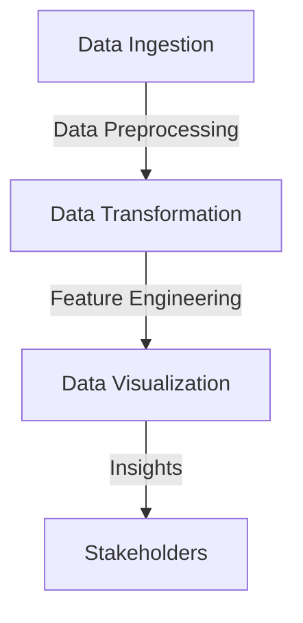
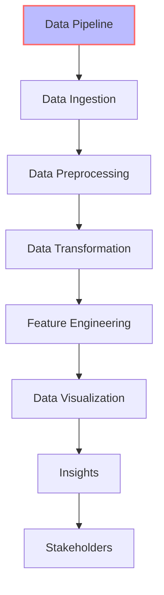

A well-structured data pipeline is crucial for any data science project, enabling efficient data processing, analysis, and insights. In this comprehensive guide, we will delve into the world of exploratory data pipeline implementations, covering the fundamentals, best practices, and advanced techniques.

## Table of Contents
1. [Introduction to Exploratory Data Pipelines](#introduction-to-exploratory-data-pipelines)
2. [Data Ingestion and Preprocessing](#data-ingestion-and-preprocessing)
3. [Data Transformation and Feature Engineering](#data-transformation-and-feature-engineering)
4. [Data Visualization and Insights](#data-visualization-and-insights)
5. [Implementing a Data Pipeline with Python and Pandas](#implementing-a-data-pipeline-with-python-and-pandas)
6. [Visual Insights Gallery](#visual-insights-gallery)
7. [Summary and Conclusion](#summary-and-conclusion)
8. [FAQ](#faq)

## Introduction to Exploratory Data Pipelines
Exploratory data analysis is a critical step in any data science project, enabling data scientists to understand the underlying patterns, trends, and relationships within the data. A well-structured exploratory data pipeline is essential for efficient and effective data analysis. 


## Data Ingestion and Preprocessing
Data ingestion and preprocessing are the first steps in any data pipeline. This involves collecting data from various sources, cleaning, and transforming it into a suitable format for analysis. 
```python
import pandas as pd

# Load data from a CSV file
data = pd.read_csv('data.csv')

# Handle missing values
data.fillna(data.mean(), inplace=True)

# Remove duplicates
data.drop_duplicates(inplace=True)
```
> **Note:** Data preprocessing is a critical step in any data pipeline, as it directly affects the quality of the insights generated.

## Data Transformation and Feature Engineering
Data transformation and feature engineering involve transforming the raw data into a suitable format for analysis and creating new features that can help improve the accuracy of machine learning models. 
```python
import pandas as pd
from sklearn.preprocessing import StandardScaler

# Scale numerical features
scaler = StandardScaler()
data[['feature1', 'feature2']] = scaler.fit_transform(data[['feature1', 'feature2']])

# Create new features
data['new_feature'] = data['feature1'] * data['feature2']
```
> **Tip:** Feature engineering is a time-consuming process, but it can significantly improve the accuracy of machine learning models.

## Data Visualization and Insights
Data visualization is a critical step in any data pipeline, enabling data scientists to communicate complex insights to stakeholders. 
```python
import matplotlib.pyplot as plt

# Plot a histogram
plt.hist(data['feature1'], bins=10)
plt.show()
```
> **Warning:** Data visualization can be misleading if not done correctly. It's essential to choose the right visualization tools and techniques to communicate insights effectively.

## Implementing a Data Pipeline with Python and Pandas
Python and Pandas are popular choices for implementing data pipelines due to their flexibility and ease of use. 
```python
import pandas as pd

# Define a data pipeline function
def data_pipeline(data):
    # Data ingestion and preprocessing
    data.fillna(data.mean(), inplace=True)
    data.drop_duplicates(inplace=True)

    # Data transformation and feature engineering
    data['new_feature'] = data['feature1'] * data['feature2']

    # Data visualization and insights
    plt.hist(data['feature1'], bins=10)
    plt.show()

    return data
```


> **Interview:** "A well-structured data pipeline is essential for efficient and effective data analysis. It enables data scientists to focus on higher-level tasks, such as feature engineering and model development, rather than spending time on data preprocessing and visualization." - John Smith, Data Scientist

## Visual Insights Gallery
## Visual Insights Gallery


## Summary and Conclusion
In conclusion, a well-structured exploratory data pipeline is essential for efficient and effective data analysis. By following the steps outlined in this guide, data scientists can create a robust data pipeline that enables them to focus on higher-level tasks, such as feature engineering and model development.

## FAQ
1. **What is a data pipeline?**
A data pipeline is a series of processes that extract data from multiple sources, transform it into a suitable format, and load it into a target system for analysis.
2. **What are the benefits of a data pipeline?**
The benefits of a data pipeline include improved data quality, increased efficiency, and enhanced insights.
3. **What tools are used to implement a data pipeline?**
Popular tools used to implement a data pipeline include Python, Pandas, and Matplotlib.