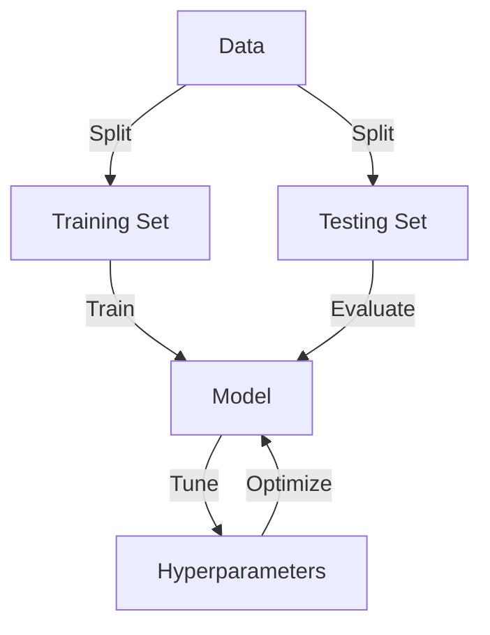
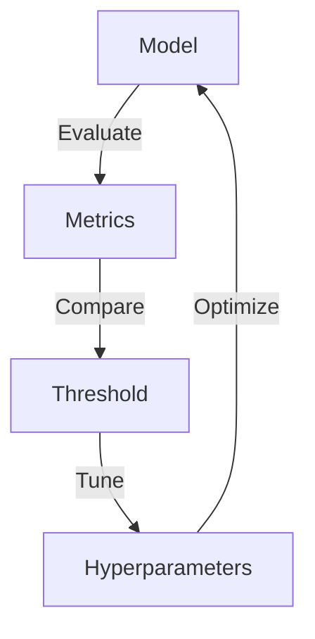

Exploratory machine learning is a crucial step in the data science workflow, allowing practitioners to understand the underlying patterns and relationships within a dataset. In this guide, we will delve into the world of exploratory machine learning model implementations, providing a comprehensive overview of the techniques, tools, and best practices for uncovering hidden insights in your data.

## Table of Contents
1. [Introduction to Exploratory Machine Learning](#introduction-to-exploratory-machine-learning)
2. [Data Preprocessing and Feature Engineering](#data-preprocessing-and-feature-engineering)
3. [Model Selection and Implementation](#model-selection-and-implementation)
4. [Model Evaluation and Hyperparameter Tuning](#model-evaluation-and-hyperparameter-tuning)
5. [Visual Insights and Interpretation](#visual-insights-and-interpretation)
6. [Case Study: Implementing Exploratory Machine Learning in Python](#case-study-implementing-exploratory-machine-learning-in-python)
7. [Visual Insights Gallery](#visual-insights-gallery)
8. [Summary and Conclusion](#summary-and-conclusion)
9. [FAQ](#faq)

## Introduction to Exploratory Machine Learning
Exploratory machine learning is an iterative process that involves applying various machine learning algorithms to a dataset to identify patterns, relationships, and correlations. This approach enables data scientists to gain a deeper understanding of the data, identify potential biases, and develop more accurate predictive models.


> **Note:** Exploratory machine learning is a critical step in the data science workflow, as it allows practitioners to refine their understanding of the data and develop more effective predictive models.

## Data Preprocessing and Feature Engineering
Data preprocessing and feature engineering are essential steps in the exploratory machine learning process. These steps involve cleaning, transforming, and selecting the most relevant features from the dataset to improve model performance.
```python
import pandas as pd
from sklearn.preprocessing import StandardScaler

# Load the dataset
df = pd.read_csv('data.csv')

# Preprocess the data
scaler = StandardScaler()
df[['feature1', 'feature2']] = scaler.fit_transform(df[['feature1', 'feature2']])
```
> **Tip:** Feature engineering can significantly improve model performance by reducing dimensionality and removing irrelevant features.

## Model Selection and Implementation
The next step in the exploratory machine learning process is to select and implement a suitable machine learning algorithm. This involves choosing from a range of algorithms, including linear regression, decision trees, random forests, and neural networks.

> **Warning:** Overfitting and underfitting are common issues in machine learning. Regularization techniques, such as L1 and L2 regularization, can help mitigate these problems.

## Model Evaluation and Hyperparameter Tuning
Evaluating the performance of a machine learning model is crucial in the exploratory machine learning process. This involves using metrics such as accuracy, precision, recall, and F1 score to assess the model's performance.

> **Interview:** "Hyperparameter tuning is an essential step in the machine learning process. It allows us to refine the model's performance and improve its accuracy." - Data Scientist

## Visual Insights and Interpretation
Visualizing the results of the exploratory machine learning process is critical for gaining insights into the data. This involves using techniques such as dimensionality reduction, clustering, and visualization to identify patterns and relationships in the data.


## Case Study: Implementing Exploratory Machine Learning in Python
In this case study, we will implement an exploratory machine learning model using Python and the scikit-learn library. We will use a sample dataset to demonstrate the process of data preprocessing, feature engineering, model selection, and hyperparameter tuning.
```python
from sklearn.ensemble import RandomForestClassifier
from sklearn.model_selection import train_test_split

# Load the dataset
df = pd.read_csv('data.csv')

# Preprocess the data
X = df.drop('target', axis=1)
y = df['target']

# Split the data into training and testing sets
X_train, X_test, y_train, y_test = train_test_split(X, y, test_size=0.2, random_state=42)

# Train a random forest classifier
rf = RandomForestClassifier(n_estimators=100, random_state=42)
rf.fit(X_train, y_train)

# Evaluate the model
y_pred = rf.predict(X_test)
print('Accuracy:', accuracy_score(y_test, y_pred))
```
## Visual Insights Gallery
### Image 1: Data Preprocessing

### Image 2: Feature Engineering

### Image 3: Model Evaluation


## Summary and Conclusion
In this guide, we have provided a comprehensive overview of the exploratory machine learning process, including data preprocessing, feature engineering, model selection, and hyperparameter tuning. We have also demonstrated the implementation of an exploratory machine learning model using Python and the scikit-learn library.

## FAQ
1. What is exploratory machine learning?
	* Exploratory machine learning is an iterative process that involves applying various machine learning algorithms to a dataset to identify patterns, relationships, and correlations.
2. What is the importance of data preprocessing in exploratory machine learning?
	* Data preprocessing is essential in exploratory machine learning, as it involves cleaning, transforming, and selecting the most relevant features from the dataset to improve model performance.
3. How do I evaluate the performance of a machine learning model?
	* Evaluating the performance of a machine learning model involves using metrics such as accuracy, precision, recall, and F1 score to assess the model's performance.