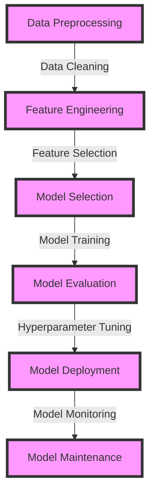

## Part 2: Advanced Exploratory Machine Learning Model Implementations
### Introduction to Advanced Exploratory Machine Learning
In the first part of this series, we introduced the concept of exploratory machine learning and its importance in the data science workflow. We also discussed the various techniques, tools, and best practices for implementing exploratory machine learning models. In this article, we will delve deeper into advanced edge-cases and explore deeper architectures for exploratory machine learning.

## Advanced Edge-Cases in Exploratory Machine Learning
Exploratory machine learning is not without its challenges. In this section, we will discuss some of the advanced edge-cases that data scientists may encounter when implementing exploratory machine learning models.


### Handling Imbalanced Datasets
Imbalanced datasets can be a significant challenge in exploratory machine learning. When the classes in the dataset are imbalanced, the model may be biased towards the majority class, resulting in poor performance on the minority class.
```python
from sklearn.utils import class_weight
from sklearn.preprocessing import StandardScaler
from imblearn.over_sampling import RandomOverSampler

# Calculate class weights
class_weights = class_weight.compute_class_weight('balanced', np.unique(y_train), y_train)

# Oversample the minority class
ros = RandomOverSampler(random_state=42)
X_res, y_res = ros.fit_resample(X_train, y_train)
```
### Handling Missing Values
Missing values can also be a challenge in exploratory machine learning. When there are missing values in the dataset, the model may not be able to learn effectively, resulting in poor performance.
```python
from sklearn.impute import SimpleImputer
from sklearn.compose import ColumnTransformer

# Define the preprocessing pipeline
numerical_features = X_train.select_dtypes(include=['int64', 'float64']).columns
categorical_features = X_train.select_dtypes(include=['object']).columns

numerical_transformer = SimpleImputer(strategy='mean')
categorical_transformer = SimpleImputer(strategy='constant', fill_value='missing')

preprocessor = ColumnTransformer(
    transformers=[
        ('num', numerical_transformer, numerical_features),
        ('cat', categorical_transformer, categorical_features)
    ]
)
```
## Deeper Architectures for Exploratory Machine Learning
In this section, we will discuss some of the deeper architectures that can be used for exploratory machine learning.


### Autoencoders
Autoencoders are a type of neural network that can be used for dimensionality reduction and anomaly detection.
```python
from tensorflow.keras.models import Model
from tensorflow.keras.layers import Input, Dense

# Define the autoencoder model
input_dim = X_train.shape[1]
encoding_dim = 32

input_layer = Input(shape=(input_dim,))
encoder = Dense(encoding_dim, activation='relu')(input_layer)
decoder = Dense(input_dim, activation='sigmoid')(encoder)

autoencoder = Model(inputs=input_layer, outputs=decoder)
autoencoder.compile(optimizer='adam', loss='mean_squared_error')
```
### Generative Adversarial Networks (GANs)
GANs are a type of neural network that can be used for generative modeling and data augmentation.
```python
from tensorflow.keras.models import Model
from tensorflow.keras.layers import Input, Dense, Reshape, Flatten
from tensorflow.keras.layers import BatchNormalization, LeakyReLU
from tensorflow.keras.layers import Conv2D, Conv2DTranspose

# Define the generator model
generator_input = Input(shape=(100,))
x = Dense(7*7*128)(generator_input)
x = Reshape((7, 7, 128))(x)
x = BatchNormalization()(x)
x = LeakyReLU()(x)
x = Conv2DTranspose(64, (5, 5), strides=(1, 1), padding='same')(x)
x = BatchNormalization()(x)
x = LeakyReLU()(x)
x = Conv2DTranspose(1, (5, 5), strides=(2, 2), padding='same', activation='tanh')(x)

generator = Model(inputs=generator_input, outputs=x)

# Define the discriminator model
discriminator_input = Input(shape=(28, 28, 1))
x = Conv2D(64, (5, 5), strides=(2, 2), padding='same')(discriminator_input)
x = LeakyReLU()(x)
x = Dropout(0.3)(x)
x = Conv2D(128, (5, 5), strides=(2, 2), padding='same')(x)
x = LeakyReLU()(x)
x = Dropout(0.3)(x)
x = Flatten()(x)
x = Dense(1, activation='sigmoid')(x)

discriminator = Model(inputs=discriminator_input, outputs=x)
```
## Advanced Mermaid.js Diagram

## Advanced Visual Insights


## Visual Insights Gallery
### Image 1: Data Distribution

### Image 2: Feature Correlation

### Image 3: Model Performance
