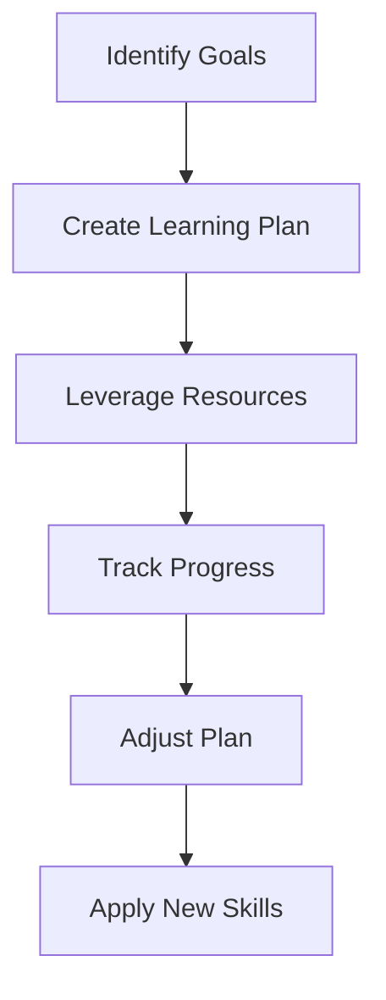
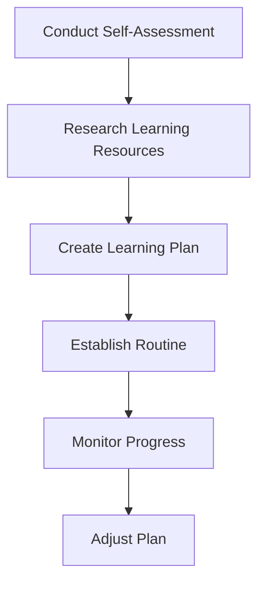

In today's fast-paced and ever-evolving professional landscape, acquiring new skills is crucial for career growth and success. Focused skill acquisition implementations enable individuals to systematically develop the skills they need to stay ahead in their careers. In this comprehensive guide, we will delve into the world of focused skill acquisition, exploring its benefits, strategies, and best practices.

## Table of Contents
1. [Introduction to Focused Skill Acquisition](#introduction-to-focused-skill-acquisition)
2. [Benefits of Focused Skill Acquisition](#benefits-of-focused-skill-acquisition)
3. [Strategies for Focused Skill Acquisition](#strategies-for-focused-skill-acquisition)
4. [Implementing a Focused Skill Acquisition Plan](#implementing-a-focused-skill-acquisition-plan)
5. [Overcoming Obstacles in Focused Skill Acquisition](#overcoming-obstacles-in-focused-skill-acquisition)
6. [Visual Insights Gallery](#visual-insights-gallery)
7. [Summary and Conclusion](#summary-and-conclusion)
8. [FAQ](#faq)

## Introduction to Focused Skill Acquisition
Focused skill acquisition is the process of intentionally developing specific skills to achieve career goals or enhance professional capabilities. This approach involves identifying key areas for improvement, creating a tailored learning plan, and dedicating time and effort to skill development.


> **Note:** Focused skill acquisition is a deliberate and systematic process that requires commitment, persistence, and patience.

## Benefits of Focused Skill Acquisition
The benefits of focused skill acquisition are numerous and significant. Some of the most notable advantages include:
* Enhanced career prospects and opportunities
* Increased confidence and self-efficacy
* Improved job performance and productivity
* Expanded professional network and reputation
* Greater adaptability and resilience in a rapidly changing work environment
```markdown
| Benefit | Description |
| --- | --- |
| Career Advancement | Focused skill acquisition can lead to promotions, new job opportunities, and increased earning potential. |
| Confidence Boost | Developing new skills can enhance self-confidence and self-efficacy, leading to greater overall well-being. |
| Job Performance | Focused skill acquisition can improve job performance, productivity, and efficiency, making individuals more valuable to their organizations. |
```


## Strategies for Focused Skill Acquisition
Several strategies can facilitate effective focused skill acquisition, including:
* Setting clear and specific goals
* Creating a tailored learning plan
* Identifying and leveraging relevant resources and support systems
* Tracking progress and adjusting the learning plan as needed
* Practicing active learning and applying new skills in real-world contexts



## Implementing a Focused Skill Acquisition Plan
To implement a focused skill acquisition plan, individuals should:
1. Conduct a self-assessment to identify areas for improvement and skill gaps.
2. Research and explore relevant learning resources, such as online courses, workshops, and conferences.
3. Create a detailed learning plan, including specific goals, objectives, and timelines.
4. Establish a routine and schedule for learning and practice.
5. Monitor progress, adjust the plan as needed, and celebrate achievements.



## Overcoming Obstacles in Focused Skill Acquisition
Common obstacles to focused skill acquisition include:
* Lack of motivation and accountability
* Insufficient time and resources
* Fear of failure and self-doubt
* Inadequate support systems and networks
To overcome these obstacles, individuals can:
* Find a learning buddy or accountability partner
* Set realistic goals and celebrate small wins
* Seek feedback and guidance from mentors or coaches
* Leverage technology and online resources to access learning materials and support
> **Tip:** Breaking down large goals into smaller, manageable tasks can help build momentum and overcome obstacles.

## Visual Insights Gallery


## Summary and Conclusion
Focused skill acquisition is a powerful tool for career growth, professional development, and personal fulfillment. By understanding the benefits, strategies, and best practices of focused skill acquisition, individuals can create a tailored plan to achieve their goals and realize their full potential.

## FAQ
Q: What is focused skill acquisition?
A: Focused skill acquisition is the process of intentionally developing specific skills to achieve career goals or enhance professional capabilities.
Q: How do I create a focused skill acquisition plan?
A: To create a focused skill acquisition plan, conduct a self-assessment, research learning resources, set clear goals, and establish a routine and schedule for learning and practice.
Q: What are common obstacles to focused skill acquisition?
A: Common obstacles to focused skill acquisition include lack of motivation and accountability, insufficient time and resources, fear of failure and self-doubt, and inadequate support systems and networks.