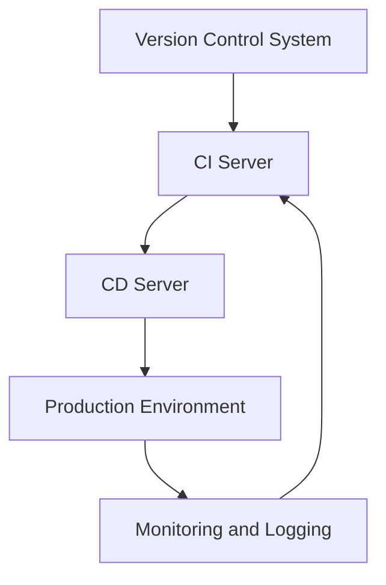
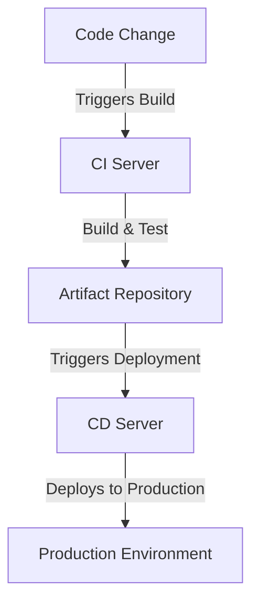

In the realm of modern software development, the pursuit of high availability is paramount. As applications grow in complexity and user base, ensuring that they remain accessible and functional at all times becomes a critical challenge. One of the key strategies in achieving high availability is through the implementation of a robust deployment pipeline. This guide delves into the intricacies of designing and implementing high-availability deployment pipelines, exploring the concepts, tools, and best practices that underpin successful DevOps and cloud computing initiatives.

## Table of Contents
1. [Introduction to High-Availability Deployment Pipelines](#introduction-to-high-availability-deployment-pipelines)
2. [Key Components of a High-Availability Deployment Pipeline](#key-components-of-a-high-availability-deployment-pipeline)
3. [Designing for High Availability](#designing-for-high-availability)
4. [Implementing Continuous Integration and Continuous Deployment (CI/CD)](#implementing-continuous-integration-and-continuous-deployment-cicd)
5. [Monitoring and Feedback Loops](#monitoring-and-feedback-loops)
6. [Security Considerations](#security-considerations)
7. [Conclusion](#conclusion)
8. [Visual Insights Gallery](#visual-insights-gallery)
9. [FAQ](#faq)

## Introduction to High-Availability Deployment Pipelines

High-availability deployment pipelines are designed to ensure that software applications are always accessible to users, with minimal downtime, even in the face of failures or maintenance. This is achieved through a combination of automated testing, continuous integration, and deployment strategies that minimize the risk of human error and reduce the time it takes to recover from failures.

## Key Components of a High-Availability Deployment Pipeline

A high-availability deployment pipeline typically includes several key components:
- **Version Control System (VCS):** The foundation of any deployment pipeline, where all code changes are tracked.
- **Continuous Integration (CI) Tools:** Automate the build, test, and validation of code changes.
- **Continuous Deployment (CD) Tools:** Automatically deploy validated code changes to production.
- **Monitoring and Logging Tools:** Provide real-time insights into application performance and health.

## Designing for High Availability

Designing a high-availability deployment pipeline involves several considerations, including:
- **Automated Rollbacks:** The ability to quickly revert to a previous version of the application in case of deployment failures.
- **Blue-Green Deployments:** Running two identical production environments, where the new version is deployed to the inactive environment, and then traffic is routed to it once validated.
- **Canary Releases:** Deploying a new version to a small subset of users to test for issues before rolling it out more widely.

## Implementing Continuous Integration and Continuous Deployment (CI/CD)

Implementing CI/CD involves choosing the right tools for your pipeline, such as Jenkins, GitLab CI/CD, or GitHub Actions, and configuring them to automate your build, test, and deployment processes.

## Monitoring and Feedback Loops

Monitoring your application and pipeline, and implementing feedback loops, is crucial for maintaining high availability. This includes setting up metrics and logs to monitor application performance, and automating the collection and analysis of this data to identify potential issues before they cause downtime.

## Security Considerations

Security is a critical aspect of any high-availability deployment pipeline. This includes securing your pipeline tools and infrastructure, implementing secure deployment practices such as immutable infrastructure, and ensuring that your application and its dependencies are kept up to date with the latest security patches.

> **Note:** Implementing security best practices throughout your pipeline is not just about compliance; it's about protecting your users and your business from potential threats.

## Conclusion
In conclusion, building a high-availability deployment pipeline is a complex task that requires careful planning, the right tools, and a deep understanding of DevOps and cloud computing principles. By following the guidelines and best practices outlined in this guide, you can create a robust and reliable pipeline that ensures your application is always available to your users.

## Visual Insights Gallery

## FAQ
1. **What is a high-availability deployment pipeline?**
   - A high-availability deployment pipeline is designed to ensure that software applications are always accessible to users, with minimal downtime.
2. **What are the key components of a high-availability deployment pipeline?**
   - The key components include a version control system, CI tools, CD tools, and monitoring and logging tools.
3. **How do I implement CI/CD in my pipeline?**
   - Implementing CI/CD involves choosing the right tools and configuring them to automate your build, test, and deployment processes.
4. **Why is security important in a high-availability deployment pipeline?**
   - Security is critical to protect your application, users, and business from potential threats and to ensure compliance with regulatory requirements.