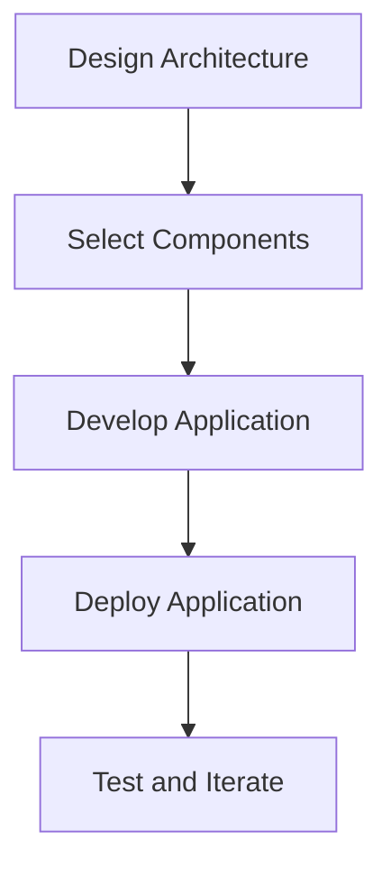

A well-structured MVP (Minimum Viable Product) stack is crucial for the success of any software development project. In this article, we will delve into the world of interactive MVP stack implementations, exploring the best practices, architectures, and strategies for building scalable and efficient software systems.

## Table of Contents
1. [Introduction to MVP Stack](#introduction-to-mvp-stack)
2. [Architecture of an Interactive MVP Stack](#architecture-of-an-interactive-mvp-stack)
3. [Key Components of an MVP Stack](#key-components-of-an-mvp-stack)
4. [Implementing an Interactive MVP Stack](#implementing-an-interactive-mvp-stack)
5. [Best Practices for MVP Stack Development](#best-practices-for-mvp-stack-development)
6. [Visual Insights Gallery](#visual-insights-gallery)
7. [Summary and Conclusion](#summary-and-conclusion)
8. [FAQ](#faq)

## Introduction to MVP Stack
The term "MVP" stands for Minimum Viable Product, which refers to the most basic version of a product that still provides value to its users. An MVP stack, therefore, is the set of technologies and tools used to build and deploy this minimal product. 

## Architecture of an Interactive MVP Stack
The architecture of an interactive MVP stack typically consists of several layers, including the presentation layer, application layer, data access layer, and infrastructure layer. 

## Key Components of an MVP Stack
The key components of an MVP stack include the frontend framework, backend framework, database management system, and infrastructure platform. 

> **Note:** The choice of these components depends on the specific requirements of the project and the preferences of the development team.

## Implementing an Interactive MVP Stack
Implementing an interactive MVP stack involves several steps, including designing the architecture, selecting the components, and deploying the application. 

## Best Practices for MVP Stack Development
Some best practices for MVP stack development include keeping the architecture simple, using agile development methodologies, and continuously testing and iterating the application. 

> **Tip:** Use version control systems like Git to manage code changes and collaborate with team members.

## Visual Insights Gallery
## Visual Insights Gallery
Here are some additional visual insights into the world of interactive MVP stack implementations:

## Summary and Conclusion
In conclusion, building an interactive MVP stack requires careful planning, design, and implementation. By following best practices and using the right components, developers can create scalable and efficient software systems that meet the needs of their users.

## FAQ
1. **What is an MVP stack?**
An MVP stack refers to the set of technologies and tools used to build and deploy a minimum viable product.
2. **What are the key components of an MVP stack?**
The key components of an MVP stack include the frontend framework, backend framework, database management system, and infrastructure platform.
3. **How do I implement an interactive MVP stack?**
Implementing an interactive MVP stack involves designing the architecture, selecting the components, developing the application, deploying the application, and testing and iterating the application.