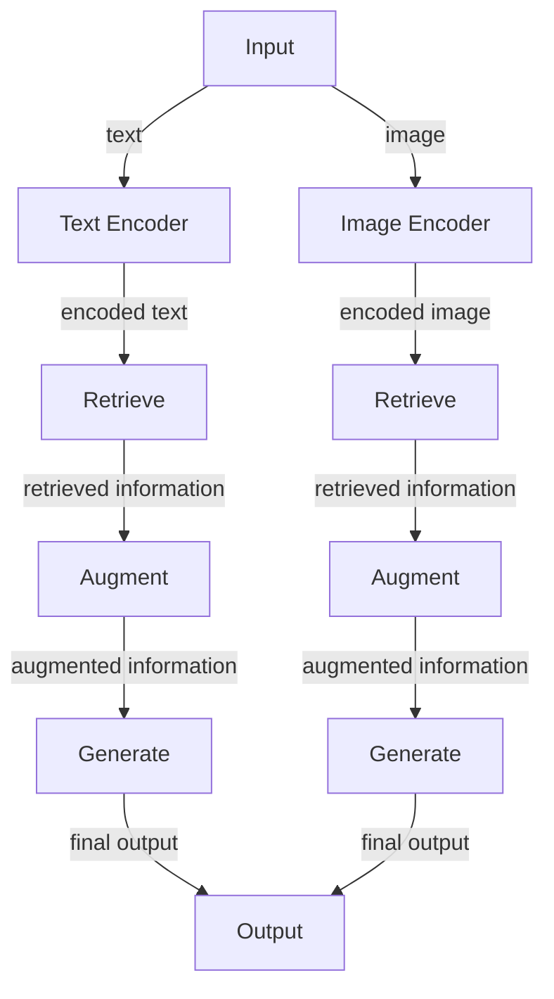

A comprehensive guide to understanding and implementing multimodal RAG pipelines, enabling machines to perceive and interact with their environment in a more human-like way.

## Introduction to Multimodal RAG Pipelines
Multimodal RAG (Retrieve, Augment, Generate) pipelines are a type of AI architecture that enables machines to process and generate multiple forms of data, such as text, images, and audio. This technology has the potential to revolutionize the way we interact with machines, enabling them to perceive and respond to their environment in a more human-like way.

## Table of Contents
1. [Introduction to Multimodal RAG Pipelines](#introduction-to-multimodal-rag-pipelines)
2. [Architecture of Multimodal RAG Pipelines](#architecture-of-multimodal-rag-pipelines)
3. [Implementation of Multimodal RAG Pipelines](#implementation-of-multimodal-rag-pipelines)
4. [Applications of Multimodal RAG Pipelines](#applications-of-multimodal-rag-pipelines)
5. [Visual Insights Gallery](#visual-insights-gallery)
6. [Summary/Conclusion](#summary/conclusion)
7. [FAQ](#faq)

## Architecture of Multimodal RAG Pipelines
The architecture of multimodal RAG pipelines consists of three main components: Retrieve, Augment, and Generate. The Retrieve component is responsible for retrieving relevant information from a knowledge base or database. The Augment component is responsible for augmenting the retrieved information with additional context or features. The Generate component is responsible for generating the final output based on the augmented information.

## Implementation of Multimodal RAG Pipelines
Implementing multimodal RAG pipelines requires a deep understanding of the underlying architecture and the ability to integrate multiple components seamlessly. The following diagram illustrates the implementation of a multimodal RAG pipeline using a flowchart:

> **Note:** The implementation of multimodal RAG pipelines requires the integration of multiple components, including text and image encoders, retrieve and augment components, and generate components.

## Applications of Multimodal RAG Pipelines
Multimodal RAG pipelines have a wide range of applications, including chatbots, virtual assistants, and content generation. The following table illustrates some of the potential applications of multimodal RAG pipelines:
| Application | Description |
| --- | --- |
| Chatbots | Multimodal RAG pipelines can be used to build chatbots that can understand and respond to multiple forms of input, such as text and images. |
| Virtual Assistants | Multimodal RAG pipelines can be used to build virtual assistants that can understand and respond to multiple forms of input, such as voice and text. |
| Content Generation | Multimodal RAG pipelines can be used to generate content, such as text and images, based on a given prompt or topic. |

## Visual Insights Gallery
The following images illustrate the potential applications of multimodal RAG pipelines:

## Summary/Conclusion
In conclusion, multimodal RAG pipelines are a powerful technology that enables machines to process and generate multiple forms of data. The architecture of multimodal RAG pipelines consists of three main components: Retrieve, Augment, and Generate. Implementing multimodal RAG pipelines requires a deep understanding of the underlying architecture and the ability to integrate multiple components seamlessly. The potential applications of multimodal RAG pipelines are vast, including chatbots, virtual assistants, and content generation.

## FAQ
1. **What is a multimodal RAG pipeline?**
A multimodal RAG pipeline is a type of AI architecture that enables machines to process and generate multiple forms of data, such as text, images, and audio.
2. **What are the components of a multimodal RAG pipeline?**
The components of a multimodal RAG pipeline include Retrieve, Augment, and Generate.
3. **What are the potential applications of multimodal RAG pipelines?**
The potential applications of multimodal RAG pipelines include chatbots, virtual assistants, and content generation.