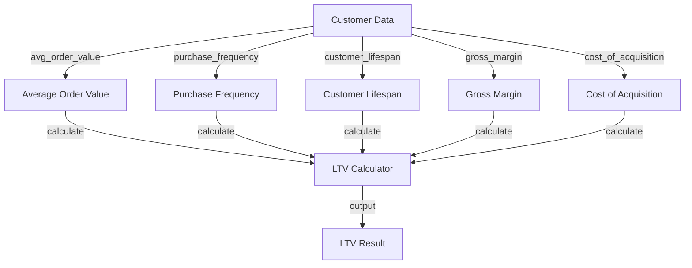
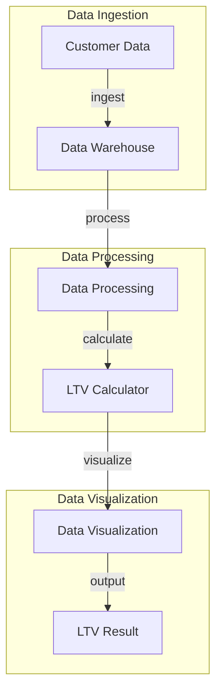

A well-implemented LTV (Lifetime Value) calculator is crucial for businesses, especially SaaS companies and startups, to understand their customer's worth and make informed decisions. In this article, we will delve into the world of LTV calculators, exploring their importance, key components, and optimized implementation strategies.

## Table of Contents
1. [Introduction to LTV Calculators](#introduction-to-ltv-calculators)
2. [Key Components of an LTV Calculator](#key-components-of-an-ltv-calculator)
3. [Optimized Implementation Strategies](#optimized-implementation-strategies)
4. [Common Challenges and Solutions](#common-challenges-and-solutions)
5. [Visual Insights Gallery](#visual-insights-gallery)
6. [Summary and Conclusion](#summary-and-conclusion)
7. [FAQ](#faq)

## Introduction to LTV Calculators

LTV calculators are essential tools for businesses to calculate the total value a customer is expected to bring to their company over their lifetime. This value helps businesses to determine how much they should spend on acquiring new customers and retaining existing ones. A well-implemented LTV calculator can provide valuable insights into customer behavior, revenue streams, and growth opportunities.

## Key Components of an LTV Calculator
To build an effective LTV calculator, several key components must be considered:
- Average Order Value (AOV)
- Purchase Frequency
- Customer Lifespan
- Gross Margin
- Cost of Acquisition (COA)
```markdown
| Component | Description |
| --- | --- |
| AOV | The average amount spent by a customer in a single transaction |
| Purchase Frequency | The number of times a customer makes a purchase within a given timeframe |
| Customer Lifespan | The duration of time a customer remains active and continues to make purchases |
| Gross Margin | The difference between revenue and the cost of goods sold |
| COA | The cost of acquiring a new customer |
```
## Optimized Implementation Strategies
### Flowchart for LTV Calculation

### Architecture for LTV Calculator Implementation

## Common Challenges and Solutions
> **Note:** One common challenge businesses face when implementing LTV calculators is data quality issues. To overcome this, it's essential to ensure that customer data is accurate, complete, and up-to-date.
> **Tip:** Regularly review and update customer data to maintain its integrity and accuracy.

## Visual Insights Gallery
## Visual Insights Gallery


## Summary and Conclusion
In conclusion, a well-implemented LTV calculator is a vital tool for businesses to understand their customer's worth and make informed decisions. By considering key components, optimized implementation strategies, and common challenges, businesses can unlock the full potential of their LTV calculators and drive growth.

## FAQ
1. What is an LTV calculator?
An LTV calculator is a tool used to calculate the total value a customer is expected to bring to a business over their lifetime.
2. What are the key components of an LTV calculator?
The key components of an LTV calculator include Average Order Value, Purchase Frequency, Customer Lifespan, Gross Margin, and Cost of Acquisition.
3. How can businesses overcome data quality issues when implementing LTV calculators?
Businesses can overcome data quality issues by ensuring that customer data is accurate, complete, and up-to-date, and by regularly reviewing and updating customer data.