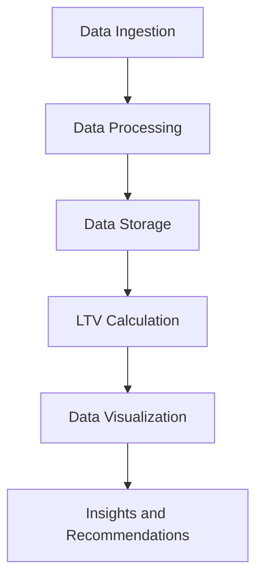

## Part 2: Advanced LTV Calculator Implementations and Edge Cases

In the first part of this series, we explored the fundamentals of LTV calculators, their importance, key components, and optimized implementation strategies. In this article, we will delve deeper into advanced LTV calculator implementations, edge cases, and real-world examples.

## Advanced LTV Calculator Components
In addition to the basic components, advanced LTV calculators may include:
- **Customer Segmentation**: Dividing customers into distinct groups based on their behavior, demographics, or firmographics to calculate LTV for each segment.
- **Churn Rate**: The rate at which customers stop doing business with a company, which can significantly impact LTV calculations.
- **Upsell and Cross-Sell Opportunities**: Identifying opportunities to increase revenue from existing customers through upselling and cross-selling.
- **Seasonal Fluctuations**: Accounting for seasonal changes in customer behavior and purchase frequency.

## Edge Cases in LTV Calculations
Edge cases can significantly impact the accuracy of LTV calculations. Some common edge cases include:
- **Non-Linear Customer Lifecycles**: Customers who do not follow a traditional linear lifecycle, such as those who make frequent purchases in the beginning but then decrease their purchase frequency over time.
- **High-Value Customers**: Customers who have a significantly higher LTV than the average customer, such as enterprise clients or high-spending individuals.
- **Low-Value Customers**: Customers who have a significantly lower LTV than the average customer, such as those who make only one purchase and then churn.

## Real-World Examples of Advanced LTV Calculator Implementations
Let's take a look at a few real-world examples of advanced LTV calculator implementations:
- **E-commerce Company**: An e-commerce company uses customer segmentation to calculate LTV for different customer groups. They find that customers who purchase frequently have a higher LTV than those who purchase infrequently.
- **SaaS Company**: A SaaS company uses churn rate and upsell and cross-sell opportunities to calculate LTV. They find that customers who are at risk of churning have a lower LTV than those who are not.

## Architecture of an Advanced LTV Calculator
The architecture of an advanced LTV calculator may include the following components:

In this architecture, data is ingested from various sources, processed and stored, and then used to calculate LTV. The results are then visualized and used to provide insights and recommendations to stakeholders.

## Advanced LTV Calculator Formula
The advanced LTV calculator formula may include the following components:
- **Average Order Value (AOV)**: The average amount spent by a customer in a single transaction.
- **Purchase Frequency**: The number of times a customer makes a purchase within a given time period.
- **Customer Lifespan**: The length of time a customer remains active with a company.
- **Gross Margin**: The difference between revenue and the cost of goods sold.
- **Cost of Acquisition (COA)**: The cost of acquiring a new customer.
- **Churn Rate**: The rate at which customers stop doing business with a company.
- **Upsell and Cross-Sell Opportunities**: The opportunities to increase revenue from existing customers through upselling and cross-selling.

## Visual Insights Gallery
Here are a few visual insights that can be gained from an advanced LTV calculator:

These visual insights can help stakeholders understand customer behavior, identify opportunities to increase revenue, and make data-driven decisions to drive business growth.